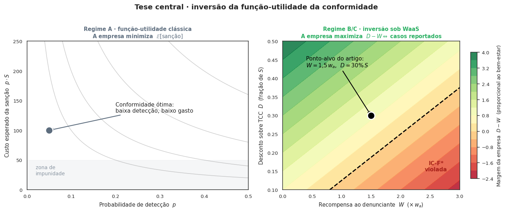

# waas-antitrust

[](LICENSE)
[](https://www.python.org/)
[](https://mesa.readthedocs.io/)
[](https://colab.research.google.com/github/freirelucas/waas-antitrust/blob/main/notebooks/WaaS_demo.ipynb)

**E se a própria empresa pagasse seus funcionários para denunciarem as infrações que ela comete — e isso saísse mais barato para ela do que esconder?** Este projeto desenha esse mecanismo (*Whistleblower-as-a-Service*, WaaS) e usa um **modelo baseado em agentes** + **análise de sensibilidade de Sobol** para testar, em simulação, se ele melhora o combate a abusos de poder de mercado (antitruste) no Brasil.



**Por quê.** A leniência clássica combate *cartéis* (empresas concorrentes que se combinam) porque um conspirador pode delatar o outro. Em mercados digitais, muito do abuso é *unilateral* — uma empresa dominante sozinha, sem cúmplice para delatar. Quem sabe o que acontece são os funcionários.

**Como.** Se a empresa for investigada, ela ganha um desconto na multa ao ressarcir as vítimas — e pode usar a recompensa paga aos denunciantes como parte desse ressarcimento. Quando o desconto $D$ supera a recompensa $W$, colaborar vira negócio. Em simulação, isso **deter** a violação (Regimes B/C) e o cenário atual (A) não.

📖 **Site com resultados, limitações e glossário:** <https://freirelucas.github.io/waas-antitrust/> · 🚀 **[Rodar no Colab](https://colab.research.google.com/github/freirelucas/waas-antitrust/blob/main/notebooks/WaaS_demo.ipynb)** (caderno-demo, ~1 min).

Núcleo computacional do artigo *"Rescaling Leniency Programs for Digital Markets: A Whistleblower-as-a-Service Mechanism"* (em elaboração).

## Início rápido

Requer **Python 3.12+** (`mesa>=3.5`).

```bash
# Clonar e instalar em modo desenvolvimento
git clone https://github.com/freirelucas/waas-antitrust.git
cd waas-antitrust
pip install -e ".[dev]"
```

Para usar apenas como biblioteca, sem clonar:

```bash
pip install "waas-antitrust @ git+https://github.com/freirelucas/waas-antitrust.git"
```

Em seguida:

```bash
pytest                                   # testes
jupyter lab notebooks/WaaS_demo.ipynb    # caderno-demo (ou abra no Colab pelo badge acima)

# Varredura Sobol completa (paper-grade) e figuras
python scripts/run_sobol_full.py --n-base 1024 --jobs -1 --out results/sobol_full.parquet
waas-figuras --out figuras/ --formato todos
```

## Documentação

- **Site**: <https://freirelucas.github.io/waas-antitrust/> — gerado com MkDocs Material e publicado pelo workflow `docs.yml` (requer GitHub Pages habilitado no repositório).
- **Caderno no Colab**: [abrir](https://colab.research.google.com/github/freirelucas/waas-antitrust/blob/main/notebooks/WaaS_demo.ipynb) — instala as dependências automaticamente no ambiente do Colab.
- **Paper**: `paper/main.tex` (rascunho) — compilado a PDF pelo workflow `paper.yml`.
- **Backlog de pesquisa**: `docs/DECISIONS.md` (itens R01–R06 rumo ao camera-ready).

## Estrutura

```
waas-antitrust/
├── src/waas_antitrust/        # Pacote Python instalável
│   ├── agents.py              # Três classes de agentes (MBA)
│   ├── model.py               # WaaSModel + parâmetros
│   ├── viz/                   # viz como módulo: inversão e fase (demais no caderno)
│   ├── sobol/                 # Varredura paramétrica
│   └── calibracao/            # Dados CADE e Brasscom
├── tests/                     # pytest + nbval
├── notebooks/                 # Caderno reprodutível
├── scripts/                   # Execuções longas (Sobol assíncrono)
├── figuras/                   # PNG + SVG versionados
├── paper/                     # LaTeX + bib
└── docs/                      # ODD, análise jurídica, referências
```

## Citação

Veja `CITATION.cff` para metadados estruturados (Zenodo-compatível).

```
L. (2026). waas-antitrust: agent-based model for Whistleblower-as-a-Service
in digital antitrust enforcement (v1.0) [Software]. Zenodo. https://doi.org/...
```

## Licença

Código e documentação sob [Creative Commons Atribuição-CompartilhaIgual 4.0 Internacional](LICENSE) (CC BY-SA 4.0).

## Articulação institucional

Este repositório é mantido independentemente da posição institucional do autor (IPEA/DIEST/COGIT). As opiniões aqui expressas não comprometem o IPEA.
