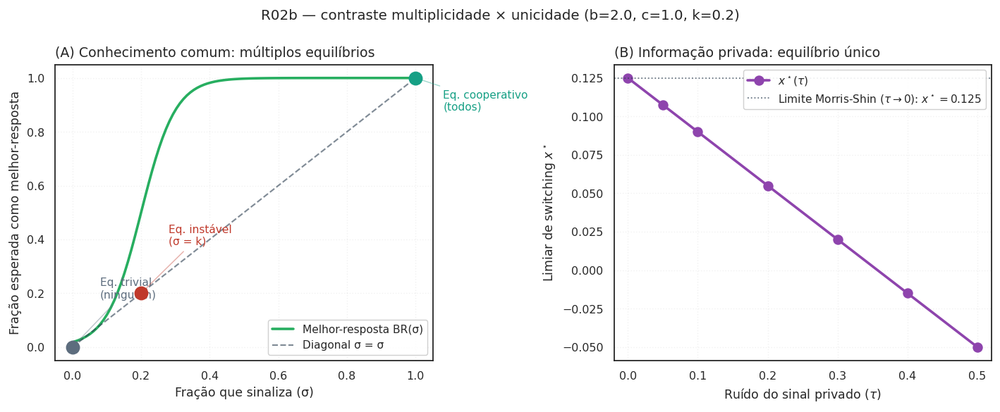

# Protocolo ODD do modelo WaaS

Documentação seguindo Grimm, Railsback, Vincenot et al. (*JASSS* 23(2):7, 2020).

## 1. Visão geral

### 1.1 Propósito e padrões

Quantificar a taxa de denúncia, taxa de verdadeiros positivos, taxa de falsos positivos e bem-estar social gerado pelo mecanismo WaaS sob três regimes institucionais brasileiros.

Padrões-alvo para calibração:

- CADE: 109 acordos de leniência cumulativos em 20 anos.
- CADE: 349 TCCs em 7,5 anos (média 47/ano), conforme Saito 2021.
- Dyck-Morse-Zingales (2010): aproximadamente 19% das fraudes corporativas grandes nos EUA são descobertas por funcionários.

### 1.2 Entidades, variáveis de estado, escalas

Três populações:

1. **Trabalhadores** — arquétipos heterogêneos (Hokamp & Pickhardt 2010): ético (15%), imitativo (35%), racional (40%), aleatório (10%). Estado: arquétipo, w_a, k_pessoal, observou, sinaliza_agora.
2. **Empresas** — parametrizadas por (σ, fatia_mercado, R_receita, eh_violadora).
3. **Autoridade** — capacidade κ e acurácia ρ.

Escalas: 1 tique = 1 trimestre; horizonte = 40 tiques (10 anos). Dimensão "espacial" = rede intra-firma (Watts-Strogatz pequeno-mundo).

### 1.3 Visão geral do processo

Por tique:

- **P0** — dissuasão endógena (R01): atualiza detecção percebida `p` e re-decide
  quem viola; firmas com cláusula de vesting acelerado (R07) recebem desconto
  preventivo em `g_i` (Hirschman antes mesmo de qualquer denúncia).
- **P1** — cada trabalhador observador amostra `s_i = σ + ε_i` e decide `a_i ∈ {0, 1}`.
- **P2** — agregador conta `Σ_i a_i` na rede intra-firma; dispara se `≥ k`.
- **P2.5** — sob `modo_corrida=True` (R20/LCMC): para cada firma que atingiu
  `n_cooperadores ≥ q_min × n_trabalhadores` na janela `Δt`, registra na
  `FilaLeniencia` global e atribui `posicao_fila_leniencia`. Os cooperadores
  internos já têm `posicao_corrida_interna` atribuída em P1 via
  `FilaInternaCooperacao`.
- **P3** — empresa decide pagar denunciantes. (i) sob modo histórico: IC-F\*
  ampliada por Hirschman (`D + custo_exodo > W`); (ii) sob `modo_corrida=True`:
  IC-F\* com decaimento de posição — `W_total < D_Saito(pos_firma) · S`, onde
  `W_total = Σ decaimento_W(pos_trabalhador, W_base)` consome o gradiente Saito
  normalizado.
- **P4** — autoridade recebe caso (com restrição de capacidade κ).
- **P5** — coleta de estado.

## 2. Conceitos de desenho

- **Princípios básicos**: PBE; seleção **inspirada em** jogo global (Morris-Shin 1998) e difusão **aproximando** contágio complexo (Centola-Macy 2007). *Nota: o código usa limiares heurísticos (sinal privado ruidoso; imitação por fração de vizinhos no tique anterior), não o equilíbrio do jogo global nem um modelo formal de contágio — ver §3.3 e os submódulos.*
- **Pressuposto de homogeneidade (Morris-Shin)**: o resultado de unicidade do jogo global de Morris-Shin (1998), aplicado em P2 e na Proposição 2, **supõe homogeneidade dos agentes** — mesmo *payoff*, mesma estrutura informacional. O ABM, em contraste, tem **arquétipos heterogêneos** (ético/imitativo/racional/aleatório) e, com R08, **papéis heterogêneos** com `observabilidade` diferente por par (papel, conduta). Não há, hoje, resultado fechado conhecido de unicidade do equilíbrio sob essa heterogeneidade; a Proposição 2 deve ser lida como conjectura aberta neste regime.
- **Emergência**: taxa macro de denúncia a partir de limiares micro e topologia de rede.
- **Sensoriamento**: trabalhadores observam σ com ruído; plataforma observa Σa exatamente mas só publica gatilho binário.
- **Estocasticidade**: ε_i, arquétipo, detecção, represália.
- **Acoplamento por conhecimento comum**: P(massa crítica) cresce com σ por (i) `q(σ)` crescente e (ii) atualização de crenças de ordem superior.

### 2.1 Diagnóstico Ostrom — 8 design principles (R21 sob reframe)

Após a crítica do Sociólogo na x10 v2, a leitura do mecanismo deslocou-se de
"bem quase-público à Samuelson" para "capital social organizacional com risco
de erosão endógena" (Coleman 1990). Ostrom (1990, *Governing the Commons*,
cap. 3) propôs **8 design principles** para governança sustentável de bens
coletivos. Cruzá-los com o desenho atual do WaaS revela quais princípios o
modelo satisfaz, quais ignora silenciosamente, e quais abrem pendências
explícitas.

| # | Princípio Ostrom | Status no WaaS | Reporter/parâmetro |
|---|---|---|---|
| **P1** | Fronteiras claras: quem participa do commons | **Atendido** — rede intra-firma observável a CADE via auditoria | `papel`, `condutas.observabilidade` |
| **P2** | Congruência entre regras e condições locais | **Ausente** — não há proporcionalidade da recompensa ao dano sofrido pelo trabalhador | pendência R-novo |
| **P3** | Arenas de escolha coletiva | **Ausente** — trabalhadores não participam do desenho da recompensa | pendência R-novo |
| **P4** | Monitoramento por agentes responsáveis | **Atendido** — `kappa_capacidade` e `rho_acuracia` da AutoridadeAgent | reporter `n_empresas_notif` |
| **P5** | Sanções graduadas | **Atendido** — gradiente Saito (43,43% → 34,51% → 20,22%) por posição na fila | `corrida.decaimento_D`, `decaimento_W` |
| **P6** | Mecanismos baratos de resolução de conflito | **Ausente** — denunciante v. firma é judicial-caro (R$ honorários) | `custo_legal_uw` |
| **P7** | Reconhecimento mínimo do direito de auto-organização | **Ausente** — vedado por dever de lealdade contratual brasileira (Art. 482 CLT) | pendência D03 + R-novo |
| **P8** | Empreendimentos aninhados (governança multinível) | **Silencioso** — coordenação CADE-MPF-MPT é institucionalmente inexistente | cenário `eixo_jurisdicao_concorrente` (R25) |

**Saldo**: 3 atendidos (P1, P4, P5), 1 silencioso (P8), 4 ausentes (P2, P3,
P6, P7). O WaaS é, no vocabulário de Ostrom, um *commons imposto de cima*
(top-down), não governado de baixo. A teoria prevê degradação por erosão
endógena (Coleman 1990); o reporter `capital_social_residual_firma`
(R26) é o instrumento de medida proposto.

## 3. Detalhes

### 3.1 Inicialização

- Número de empresas, tamanho médio (calibrado contra 30–50 mil empregados em subsidiárias de big tech no Brasil).
- Fração violadoras: 30%.
- Salário base: R$ 180.000 (Brasscom 2024).
- Rede: Watts-Strogatz com `k = 2% de n_firm`.

### 3.2 Entrada

Não há entrada externa em tempo real. Calibração ex post.

### 3.3 Submodelos

Ver `src/waas_antitrust/agents.py` e `src/waas_antitrust/model.py`.

## Proposições com esboços de prova

### Proposição 1 — Viabilidade IC do caminho "empresa paga"

Sob Regime B, existem parâmetros no interior do espaço factível em que IC-F* (D > W) e IR-W são satisfeitas estritamente.

*Esboço*: a jurisprudência da Res. 21/2018 permite D até 50% da multa esperada; para uma grande empresa de tecnologia com receita R no setor afetado e multa típica em [1%, 20%]·R, D ∈ [0,5%·R, 10%·R]. Pagamentos por trabalhador da ordem de 3·w_a com n ≤ 20 trabalhadores disparados ainda mantêm D > W. IR-W requer W ≥ r·(L_carreira + T·w_a/12); com r = 0,15, T = 8 meses, L = 2·w_a, o limiar é ≈ 0,4·w_a, bem abaixo da recompensa proposta. IC-T satisfeita pelo Art. 340 CP. □

> **Status (v0.1.0):** a desigualdade D > W no ponto-alvo é verificada por teste de regressão (`tests/test_model.py`); as faixas jurídicas do esboço (multa, D ≤ 50%) são ilustrativas, não calibradas.

> **Reformulação sob LCMC (R20):** sob `modo_corrida=True`, a Proposição 1 se transforma: **existe número finito $n^\star$ de firmas** que satisfazem a IC-F\* na fila inter-firma. Para a 1ª firma na fila, $D_\text{total}(1) \approx 43\% \cdot S$ (gradiente Saito); para a 4ª, $D_\text{total}(4) \approx 18\% \cdot S$; para a ≥ 9ª (ou nenhuma cooperação interna), cai ao piso de 15%. O esboço novo é: o número de firmas que correm é finito e calibrado contra Saito (2021). Firmas que chegam tarde recaem em TCC clássico — **Vetor D (corrida vazia)** torna isso explícito quando nenhuma firma atinge $q_\text{min}$ na janela. Teste direcional em `tests/test_corrida.py`. **Status: conjectura aberta** até calibração formal contra TCCs de conduta unilateral (E04 + R03b).

### Proposição 2 — Unicidade do equilíbrio de coordenação

No limite τ → 0 do subjogo de jogo global, há equilíbrio único de switching `s*` para cada (k, W, r) na região relevante.

*Esboço*: aplicação direta do Teorema 1 de Morris-Shin (1998) ao jogo binário com complementaridades estratégicas. □

> **Status (atualizado — R02 exploratório):** o módulo `waas_antitrust.jogo_global` deriva o limiar de switching **único** do subgame estilizado e mostra sua convergência quando τ → 0 (`tests/test_jogo_global.py`) — a seleção de equilíbrio único que a proposição afirma. **Ressalva:** é um subgame estilizado (ganho linear na severidade, massa crítica constante), **não** integrado à dinâmica de arquétipos do ABM; o contraste formal com a multiplicidade sob conhecimento comum e a generalização seguem em aberto. **Sob heterogeneidade (arquétipos × papéis, ver R08), a unicidade do equilíbrio é conjectura aberta** — não há, no nosso conhecimento, resultado fechado de Morris-Shin generalizado para esse mix; ver §2 (Pressuposto de homogeneidade).

> **Reformulação sob LCMC (R20):** sob `modo_corrida=True`, o limiar $x^\star$ ganha dimensão temporal. Cada trabalhador tem $x^\star(t)$ porque a recompensa esperada cai com a posição na fila (próprio decaimento $f_W(k)$ é decrescente). Esboço novo: o limiar de cooperação é único em cada instante; a sequência $\{x^\star(t)\}_t$ é decrescente sob informação privada e converge ao limiar estático no caso degenerado. **Status: conjectura aberta** — a integração formal do `limiar_switching_temporal` ao racional sob `modo_corrida` é trabalho de R02b/R20 ainda não escrito.

#### R02b — Contraste numérico multiplicidade × unicidade (balanço 360° item #5)

O contraste central de Morris-Shin (1998) é entre **conhecimento comum**
(múltiplos equilíbrios; resultado clássico de jogos de coordenação) e
**informação privada** (equilíbrio único; resultado de Morris-Shin).
A figura abaixo exibe os dois ramos explicitamente:

<figure markdown>
  { .figura-conceitual }
  <figcaption>
    R02b — contraste explicit. <strong>(A)</strong> Conhecimento comum: melhor-resposta em formato S admite 3 equilíbrios (trivial, intermediário instável, cooperativo). <strong>(B)</strong> Informação privada: limiar $x^\star(\tau)$ converge ao limite Morris-Shin quando $\tau \to 0$, selecionando equilíbrio único. <strong>Caveat</strong> (Mat A v2): sob LCMC com fila inter-firma, Angeletos-Hellwig-Pavan (2007) mostraram que sinal público correlacionado pode restaurar multiplicidade; a figura ilustra apenas o subgame estilizado homogêneo.
  </figcaption>
</figure>

A figura é o "ponto de fé" da Proposição 2 que estava ausente antes do
balanço 360°: ela mostra visualmente que **a unicidade Morris-Shin
não é evidência sem o contraste com a multiplicidade que ela seleciona**.
Sob heterogeneidade (R02c) e sob LCMC dinâmica (R20), a generalização
deste contraste segue como conjectura aberta.

### Proposição 3 — Dominância de bem-estar do Regime B sobre o Regime A

Para um conjunto de medida positiva de (W, D, σ), o bem-estar social esperado é estritamente maior sob Regime B do que sob Regime A.

*Esboço*: a diferença se decompõe em três canais — dissuasão (Regime B eleva p_detecção), substituição (alguns trabalhadores que silenciariam passam a denunciar) e custo (recompensa privadamente financiada). □

> **Status (atualizado — R01 implementado):** o canal de **dissuasão é endógeno**: cada firma viola enquanto sua atratividade $g_i$ = ganho/sanção supera a detecção percebida $p$, que sobe por expectativa adaptativa quando o canal WaaS opera. Em simulação, os Regimes B/C reduzem as violadoras ativas a zero enquanto o Regime A as faz crescer — sustentando a **direção** da proposição (a prova formal segue como conjectura). Com **R05**, o `bem_estar` passou a ser baseado em **dano** (= −(dano + β·FP)), creditando a prevenção — os Regimes B/C superam o Regime A. Pesos provisórios; calibração formal em R03.

> **Adicional (R07, exploratório):** a Hirschman exit-with-equity adiciona um **segundo canal de dissuasão** ortogonal ao WaaS — firmas com cláusulas contratuais de vesting acelerado por gatilho de ação coletiva enfrentam custo crível de êxodo do capital humano. A IC-F* da firma se amplia para `D + custo_exodo > W`, e o `g_i` preventivo recebe desconto proporcional a `peso_hirschman · p_perc`. Teste end-to-end em `tests/test_hirschman.py` confirma que firmas com cláusula cooperam mais (mais TCCs assinados) ou geram menos dano em comparação ao baseline. Parâmetros financeiros (substituição, equity, vesting) seguem padrões YC documentados; calibração formal em R03.

> **Reformulação sob LCMC (R20):** sob `modo_corrida=True`, a dominância de B sobre A ganha **terceiro canal**: a **competição inter-firma acelera a detecção**. Em Regime A, dissuasão é nula. Em Regime B/C com modo_corrida, três canais: (i) R01 (detecção endógena via `p_perc`); (ii) Hirschman (R07); (iii) canal-corrida (firmas se apressam a cooperar antes da concorrente para garantir posição 1 = 43% de desconto). A dominância é mais forte, mas a calibração precisa medir os três canais separadamente. Reporters em `model.py`: `n_firmas_atingiram_massa_critica_interna`, `custo_recompensa_corrida_acum`. **Status: conjectura aberta** com testes direcionais em `tests/test_corrida.py`.
