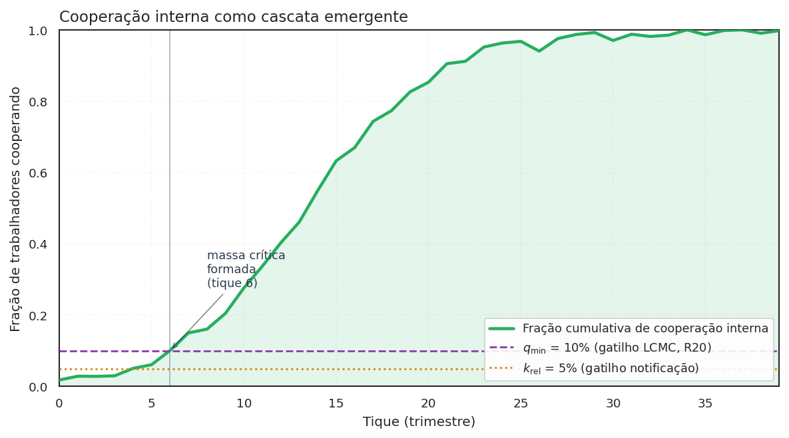
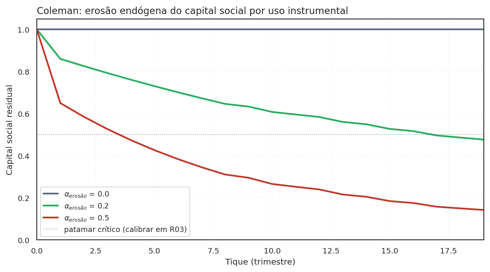

# Bem coletivo, capital social, instrumentos de internalização

- WaaS **Recompensa via TCC** — firma → trabalhador, sob Art. 12 da Res. 21/2018. Reserva ordinária. Implementado em `model.py` P3.

- Hirschman **Vesting acelerado** — firma (via equity) → trabalhador. Reserva Cₜ trabalhista. Implementado em `hirschman.py`.

- Tributário **Crédito tributário** — Estado → trabalhador (renúncia fiscal). Reserva Cᵩ tributária (LC + LRF). Stub declarativo (R22).

- Criminal **Leniência criminal individual** — Estado → trabalhador (não-persecução). Reserva Cₚ penal estrita. Stub declarativo (R23).

Esta página é o **anexo conceitual** do projeto. Ela responde a uma
pergunta que o leitor curioso faz depois do [Ato 2](mecanismo.md): de
que tipo de coisa é "massa crítica de cooperação interna" — e por que
a recompensa via TCC é apenas **um** instrumento incremental?

!!! warning "Atualização — correção radical pós-`aprendizados_v3.md`"

    A leitura "capital social com risco de erosão endógena" (Coleman 1990)
    abaixo é **moldura analítica secundária** sob a versão corrigida do
    mecanismo. O **mecanismo central** é o **canal de depósito condicional
    (information escrow)** operado pelo CADE — Ayres & Unkovic (2012,
    *Michigan Law Review* 111:145), análogo prático Callisto (callisto.org).
    O canal resolve Olson 1965 **direto na estrutura** (sub-iniciação
    eliminada por construção), sem precisar que capital social pré-exista.

    - Detalhamento da correção: ver §"A analogia conceitual correta" em
      [aprendizados_v3.md](aprendizados_v3.md).
    - Forma canônica dos termos ("depósito condicional", "escrow",
      "canal"): ver [terminologia canônica](TERMINOLOGIA.md).
    - As duas leituras abaixo (Samuelson e Coleman) servem para
      **diagnosticar fragilidades** (bem coletivo difícil de
      internalizar; erosão por uso instrumental), **não** para sustentar
      o mecanismo.

## A leitura primária correta — information escrow (Ayres & Unkovic 2012)

A categoria correta para o mecanismo proposto é **information escrow**: um
depósito de informação revelada condicionalmente, sob regra estabelecida
*ex-ante* por um terceiro confiável. Ayres & Unkovic (2012) formalizaram a
ideia em direito; a aplicação prática mais conhecida é o **Callisto**
([callisto.org](https://www.callisto.org)), plataforma usada em campus
universitário para denúncia de assédio sexual: identidade da vítima é
revelada ao mesmo agressor apenas se duas ou mais denúncias coincidirem.

Sob LCMC corrigida, o CADE opera o escrow. O trabalhador deposita uma
denúncia com cláusula de abertura condicional. As denúncias ficam em
escrow até `q_min · n` co-depósitos do mesmo setor/firma. Quando o gatilho
é atingido, todas se abrem simultaneamente.

A vantagem estrutural: o problema clássico de Olson (1965) — sub-iniciação,
"ninguém quer ser o primeiro" — é resolvido **direto no canal**, sem
precisar modelar capital social pré-existente, sem precisar dogmática
constitutiva nova, e sem precisar instrumento monetário.

## Leituras secundárias (úteis como lente, não como mecanismo)

!!! note "Como ler as duas seções abaixo"

    As duas leituras — Samuelson (bem quase-público) e Coleman (capital
    social com risco de erosão) — não sustentam o **desenho** do
    mecanismo. Elas servem para **diagnosticar fragilidades** sob duas
    perspectivas distintas:

    - **Samuelson** ajuda a entender *por que* a cooperação interna é
      difícil de internalizar via mercados (não-excluível parcialmente,
      não-rival entre autoridades). Útil como ponte didática para
      leitores com background em economia clássica.
    - **Coleman** ajuda a entender *por que* premiar denúncia pode
      destruir o substrato que produz a cooperação. Motiva a
      Proposição 5 candidata (R26), falsificável via `alpha_erosao`.

    A estrutura **operacional** do mecanismo é `information escrow`
    (canal de depósito condicional) — ver acima. As leituras abaixo
    são **diagnósticas**, não constitutivas.

A resposta tem duas camadas, e é importante começar pela segunda — não
pela primeira.

<figure markdown>
  { .figura-conceitual }
  <figcaption>
    A cooperação interna emerge por cascata. A curva mostra a fração cumulativa de trabalhadores cooperando ao longo de 40 trimestres; quando ela cruza o gatilho <code>q_min</code> (LCMC, R20), a firma atinge massa crítica interna e ganha posição na fila de leniência. O pagamento via TCC vem <strong>depois</strong> desta cascata — não antes. Esta é a leitura sob reframe.
  </figcaption>
</figure>

### Bem quase-público (Samuelson 1954) — ponte didática

> Esta seção é uma **moldura analítica secundária**. Não descreve o
> mecanismo proposto; serve para situar o problema na linguagem
> econômica clássica antes de passar para Coleman e, depois, para o
> mecanismo correto (canal de depósito condicional).

A leitura econômica clássica seria classificar a cooperação interna
como **bem quase-público** à Samuelson (*Pure Theory of Public
Expenditure*, 1954). Em dois eixos:

- **Rivalidade no consumo** — o consumo por A reduz o disponível para B?
- **Excluibilidade** — é possível impedir B de consumir mesmo sem pagar?

Massa crítica de cooperação interna seria, sob Samuelson, **não-rival**
(o CADE pode reconhecer a cooperação sem reduzir a capacidade de o MPF
ou MPT também reconhecerem) e **parcialmente excluível** (só observável
a quem tem acesso à rede intra-firma).

A leitura é útil para entender *por que* o mercado tende a sub-prover
essa cooperação — mas **não explica como remediar**. A correção via
information escrow (canal de depósito condicional) opera por mecanismo
estruturalmente diferente: não internaliza o bem, **resolve o jogo de
coordenação que torna sua provisão difícil**.

### Capital social com risco de erosão (Coleman 1990) — diagnóstico da Proposição 5 candidata

> Esta seção é uma **moldura analítica secundária** que diagnostica uma
> fragilidade do mecanismo. Não descreve o mecanismo proposto; descreve
> *por que* qualquer instrumento monetário acoplado ao canal de
> depósito condicional pode ter custo oculto (erosão do substrato
> cooperativo informal).

<figure markdown>
  { .figura-empirica }
  <figcaption>
    Trajetórias de <code>capital_social_residual</code> para três valores de <code>alpha_erosao</code> (R26). Sem erosão (preto, $\alpha=0$), o capital social fica constante em 1.0. Com erosão moderada (verde, $\alpha=0.2$), degrada lentamente. Com erosão forte (vermelho, $\alpha=0.5$), colapsa em poucos tiques. A Proposição 5 candidata afirma que existe $\alpha^\star$ tal que para $\alpha > \alpha^\star$, o Regime B colapsa em A após N tiques.
  </figcaption>
</figure>

A crítica x10 v2 (Sociólogo) trouxe a reformulação que originou esta
moldura. Sob v2, capital social era apresentado como **eixo central** do
projeto. Sob v3 (correção radical do autor — ver
[aprendizados_v3.md](aprendizados_v3.md)), permanece como **diagnóstico
de um risco residual**, não como mecanismo.
Coleman (*Foundations of Social Theory*, 1990, cap. 12) define **capital
social** como bem coletivo **produzido como subproduto de relações de
obrigação** entre pessoas que se conhecem e dependem umas das outras.

A cooperação interna que o WaaS tenta liberar não é uma mercadoria
quase-pública — é capital social organizacional. A diferença é material
por uma razão central: Coleman previu que **o capital social pode ser
destruído pela sua própria instrumentalização**. Quando a confiança
horizontal entre colegas vira moeda regulatória, a moeda corrói a
confiança que a produziu.

Por isso o reframe correto não é "massa crítica é bem quase-público"
puro; é:

> **Massa crítica de cooperação interna é capital social organizacional cuja internalização institucional tem risco de erosão endógena.**

A consequência prática: qualquer instrumento de internalização (recompensa
via TCC, vesting acelerado, crédito tributário, leniência criminal) precisa
ser desenhado considerando o que sua *contínua aplicação* faz ao próprio
substrato que ele explora.

## A leitura jurídica — interesse público em detecção e cessação

A crítica x10 v2 (Adv A) acrescentou um ângulo dogmático brasileiro: no
direito sancionador administrativo BR, "bem público de detecção" não tem
ancoragem legal. A categoria disponível é **interesse público em detecção
e cessação** (Lei 9.784/99 Art. 2º, parágrafo único, IV e XIII) — princípio
de finalidade que pode sustentar atenuação sem criar categoria nova.

O **precedente brasileiro mais relevante**, que estava ausente nas
versões anteriores do projeto, é a **Lei 12.846/2013 (LAC), Art. 7º,
VII-VIII**: a existência de programa de integridade interno conta como
atenuante na dosimetria. Esse é exatamente o tipo de reconhecimento
institucional que o WaaS busca para a cooperação intra-firma. A LAC já
trata mecanismos de detecção interna como bem juridicamente relevante;
a tese do WaaS é uma extensão analógica defensável a partir desse
precedente.

## Os instrumentos de internalização

Sob a tese reformulada, o WaaS deixa de ser "a reforma" e passa a ser
**um instrumento entre vários** de internalização do capital social/
interesse público. Cada instrumento tem reserva constitucional distinta
e regime jurídico próprio.

| Instrumento | O que internaliza | Reserva constitucional | Regime mínimo | Status no código |
|---|---|---|---|---|
| **Recompensa via TCC (WaaS)** | parte do valor da cooperação como ressarcimento extrajudicial | Art. 22 I (lei ordinária) | B (Resolução) ou C | implementado em `model.py` P3 |
| **Vesting Hirschman** | custo de êxodo coletivo como ameaça crível pré-denúncia | Art. 22 I (cláusula contratual padrão exige lei) | **Cₜ trabalhista** | `hirschman.py` (R07) |
| **Crédito tributário** | retorno público ao denunciante via renúncia fiscal | Art. 146 LC (IRPJ/CSLL) + Art. 150 §6º (benefício) + LRF Art. 14 | **Cᵩ tributária-LC** | stub (R22, novo) |
| **Leniência criminal individual** | redução do risco de tipificação como partícipe | Art. 5º XXXIX (penal estrita) | **Cₚ penal** | stub (R23, novo) |

A decomposição do **Regime C** em três sub-regimes (Cₜ, Cᵩ, Cₚ) atende
à crítica do Adv B: "exigir lei" não é categoria homogênea no direito
constitucional brasileiro.

## Caveats — onde Olson e Ostrom falham para este caso

A crítica x10 v2 (Sociólogo) identificou cinco dos oito *design principles*
de Ostrom (*Governing the Commons*, 1990) que o WaaS **não** satisfaz:

- **P2 (congruência regras-condições locais)**: não há regra de proporcionalidade da recompensa ao dano sofrido pelo trabalhador individual.
- **P3 (arenas de escolha coletiva)**: trabalhadores não participam do desenho do mecanismo.
- **P6 (mecanismos baratos de resolução de conflito)**: denunciante v. firma é judicial-caro.
- **P7 (reconhecimento mínimo do direito de auto-organização)**: vedado por dever de lealdade contratual brasileira.
- **P8 (empreendimentos aninhados)**: coordenação CADE-MPF-MPT é institucionalmente inexistente.

O WaaS é, no vocabulário de Ostrom, um *commons imposto de cima*
(top-down), não governado de baixo. A teoria prevê degradação. O reframe
não esconde isso; explicita que esse é o eixo de pesquisa aberto e
documenta como falsificadores futuros.

## Onde ler mais

- [Mecanismo](mecanismo.md) — a aritmética dos instrumentos no Ato 2.
- [Modelo (ODD)](ODD.md) — diagnóstico Ostrom como subseção; Proposições reformuladas sob LCMC + bem coletivo.
- [Análise institucional](INSTITUTIONAL.md) — Lei 9.784/99 + LAC Art. 7º VII-VIII como precedente; decomposição Cₜ/Cᵩ/Cₚ.
- [Crítica x10 v2](critica_x10_v2.md) — Sociólogo e Cientista Político como personas que validaram o reframe.
- [Referências](REFERENCES.md) §"Coordenação coletiva e bens coletivos" — Olson, Ostrom, Coleman, Hardin, Heller.
