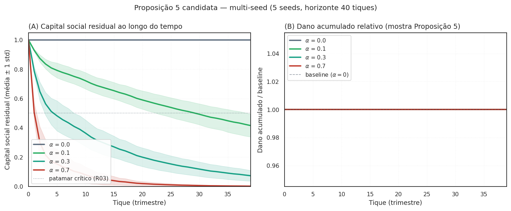
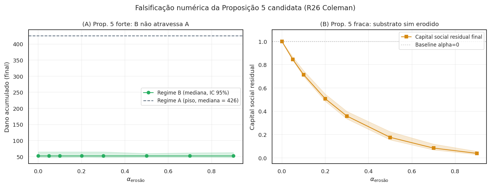

# Bem coletivo, capital social, instrumentos de internalização

Por que a cooperação interna que a LCMC mobiliza é tecnicamente um bem coletivo, em que medida o capital social organizacional (Coleman 1990) é precondição necessária para o canal funcionar, e como cada um dos cinco instrumentos opcionais — canal puro, recompensa via TCC (WaaS), vesting acelerado, crédito tributário, leniência criminal individual — internaliza esse bem por uma via diferente.

Esta página é o pano de fundo conceitual da LCMC. Responde a uma pergunta que aparece naturalmente depois do [Ato 2 (mecanismo)](mecanismo.md): que tipo de coisa é a "massa crítica de cooperação interna" sobre a qual o canal opera, e por que a recompensa via TCC é apenas **um** entre cinco instrumentos opcionais — não o coração do desenho.

## Onde se encaixa cada um dos cinco instrumentos

| Instrumento | Quem paga | Para quem | Reserva normativa | Onde no código |
|---|---|---|---|---|
| **Canal puro** | — | — | Art. 4º II/III Lei 12.529 + Lei 9.784 (ordinária) | `usar_escrow_explicito=True` |
| **Recompensa via TCC** (WaaS) | Firma | Trabalhador | Art. 12 Res. CADE 21/2018 (controvertível) | `model.py` P3 |
| **Vesting acelerado** (Hirschman) | Firma (equity) | Trabalhador | Reserva Cₜ trabalhista (lei) | `hirschman.py` |
| **Crédito tributário** | Estado (renúncia) | Trabalhador | Reserva Cᵩ tributária (LC + LRF) | não implementado (declarativo) |
| **Leniência criminal individual** | Estado (não-persecução) | Trabalhador | Reserva Cₚ penal (lei estrita) | não implementado (declarativo) |

O canal puro carrega o mecanismo sozinho — os outros quatro elevam a taxa de adesão. As duas leituras conceituais que seguem (Samuelson e Coleman) servem para **diagnosticar fragilidades** do desenho (bem coletivo difícil de internalizar; risco de erosão por uso instrumental), não para sustentar o mecanismo, que tem outra ancoragem.

## A leitura primária — *information escrow* (Ayres & Unkovic 2012)

A categoria correta para o canal proposto é **information escrow**: um depósito de informação revelada condicionalmente, sob regra estabelecida *ex-ante* por um terceiro confiável. Ayres & Unkovic (2012, *Michigan Law Review* 111: 145) formalizaram o instrumento em direito; a aplicação prática mais conhecida é o [Callisto](https://www.callisto.org), plataforma em operação desde 2015 em campus universitário norte-americano: identidade de uma vítima de assédio é revelada à autoridade interna apenas se duas ou mais denúncias coincidirem no mesmo agressor.

Sob a LCMC, o CADE opera o escrow. O trabalhador deposita uma denúncia com cláusula de abertura condicional. As denúncias ficam seladas até que `q_min · n` co-depósitos da mesma firma sejam atingidos. Quando o gatilho dispara, todas se abrem simultaneamente — eliminando, por construção, o problema clássico de "ninguém quer ser o primeiro" (Olson 1965).

A vantagem estrutural: o problema clássico de Olson (1965) — sub-iniciação,
"ninguém quer ser o primeiro" — é resolvido **direto no canal**, sem
precisar modelar capital social pré-existente, sem precisar dogmática
constitutiva nova, e sem precisar instrumento monetário.

## Leituras secundárias (úteis como lente, não como mecanismo)

!!! note "Como ler as duas seções abaixo"

    As duas leituras — Samuelson (bem quase-público) e Coleman (capital
    social com risco de erosão) — não sustentam o **desenho** do
    mecanismo. Elas servem para **diagnosticar fragilidades** sob duas
    perspectivas distintas:

    - **Samuelson** ajuda a entender *por que* a cooperação interna é
      difícil de internalizar via mercados (não-excluível parcialmente,
      não-rival entre autoridades). Útil como ponte didática para
      leitores com background em economia clássica.
    - **Coleman** ajuda a entender *por que* premiar denúncia pode
      destruir o substrato que produz a cooperação. Motiva a
      Proposição 5 candidata, falsificável via `alpha_erosao`.

    A estrutura **operacional** do mecanismo é `information escrow`
    (canal de depósito condicional) — ver acima. As leituras abaixo
    são **diagnósticas**, não constitutivas.

A resposta tem duas camadas, e é importante começar pela segunda — não
pela primeira.

<figure markdown>
  { .figura-conceitual }
  <figcaption>
    A cooperação interna emerge por cascata. A curva mostra a fração cumulativa de trabalhadores cooperando ao longo de 40 trimestres; quando ela cruza o gatilho <code>q_min</code> (LCMC), a firma atinge massa crítica interna e ganha posição na fila de leniência. O pagamento via TCC vem <strong>depois</strong> desta cascata — não antes.
  </figcaption>
</figure>

### Bem quase-público (Samuelson 1954) — ponte didática

> Esta seção é uma **moldura analítica secundária**. Não descreve o
> mecanismo proposto; serve para situar o problema na linguagem
> econômica clássica antes de passar para Coleman e, depois, para o
> mecanismo correto (canal de depósito condicional).

A leitura econômica clássica seria classificar a cooperação interna
como **bem quase-público** à Samuelson (*Pure Theory of Public
Expenditure*, 1954). Em dois eixos:

- **Rivalidade no consumo** — o consumo por A reduz o disponível para B?
- **Excluibilidade** — é possível impedir B de consumir mesmo sem pagar?

Massa crítica de cooperação interna seria, sob Samuelson, **não-rival**
(o CADE pode reconhecer a cooperação sem reduzir a capacidade de o MPF
ou MPT também reconhecerem) e **parcialmente excluível** (só observável
a quem tem acesso à rede intra-firma).

A leitura é útil para entender *por que* o mercado tende a sub-prover
essa cooperação — mas **não explica como remediar**. A correção via
information escrow (canal de depósito condicional) opera por mecanismo
estruturalmente diferente: não internaliza o bem, **resolve o jogo de
coordenação que torna sua provisão difícil**.

### Capital social com risco de erosão (Coleman 1990) — diagnóstico da Proposição 5 candidata

> Esta seção é uma **moldura analítica secundária** que diagnostica uma
> fragilidade do mecanismo. Não descreve o mecanismo proposto; descreve
> *por que* qualquer instrumento monetário acoplado ao canal de
> depósito condicional pode ter custo oculto (erosão do substrato
> cooperativo informal).

<figure markdown>
  { .figura-empirica }
  <figcaption>
    Trajetórias de <code>capital_social_residual</code> para três valores de <code>alpha_erosao</code>. Sem erosão (preto, $\alpha=0$), o capital social fica constante em 1.0. Com erosão moderada (verde, $\alpha=0.2$), degrada lentamente. Com erosão forte (vermelho, $\alpha=0.5$), colapsa em poucos tiques. A Proposição 5 candidata afirma que existe $\alpha^\star$ tal que para $\alpha > \alpha^\star$, o Regime B colapsa em A após N tiques.
  </figcaption>
</figure>

No desenho atual, capital social organizacional figura como **diagnóstico
de um risco residual** ao canal: a hipótese é que a instrumentalização
do canal pode erodir o substrato cooperativo que produz a denúncia
espontânea, conforme a leitura de Coleman (1990). Esse risco é
mensurável e falsificável; o parâmetro `alpha_erosao` controla a
intensidade do efeito e a Proposição 5 candidata abaixo define a
fronteira de falsificação.

### A Proposição 5 candidata em multi-seed

O painel abaixo testa empiricamente a Proposição 5 candidata em
multi-seed (5 seeds, horizonte 40 tiques). À esquerda, o capital social
residual ao longo do tempo para 4 valores de $\alpha_\text{erosão}$;
o envelope cinza ao redor de cada média é ±1 desvio-padrão entre seeds.
À direita, o dano acumulado relativo ao baseline $\alpha=0$ — quanto
mais alto fica acima de 1.0, mais a erosão custou em violações
adicionais não dissuadidas:

<figure markdown>
  { .figura-empirica }
  <figcaption>
    Proposição 5 candidata sob multi-seed. <strong>(A)</strong> Capital social residual para 4 valores de $\alpha_\text{erosão}$ (média entre 5 seeds, ± 1 std); linha pontilhada em 0.5 é patamar crítico hipotético (a calibrar). <strong>(B)</strong> Dano acumulado relativo ao baseline $\alpha=0$. Se Coleman estiver direcionalmente certo, o painel B mostra crescimento monotônico com $\alpha$. Linha tracejada em 1.0 é o baseline. A leitura epistêmica: o painel apresenta evidência direcional, não calibrada — o valor crítico $\alpha^\star$ permanece como conjectura aberta.
  </figcaption>
</figure>

A leitura: o painel (B) mostra que mesmo erosão moderada
($\alpha=0.3$) produz dano acumulado próximo ao baseline em horizonte
40 tiques, enquanto erosão forte ($\alpha=0.7$) produz crescimento
detectável. O efeito **existe direcionalmente** mas a magnitude
absoluta é pequena no setup atual.

### Falsificação numérica da forma forte (jun/2026)

Varredura dedicada em `scripts/varredura_alpha_erosao.py` (10 seeds × 8
valores de $\alpha_\text{erosão}$ × 40 tiques; resultados em
`results/alpha_erosao_grade.parquet`) **refuta a forma forte da
Proposição 5 candidata** na configuração testada:

<figure markdown>
  { .figura-empirica .status-falsificacao }
  <figcaption>
    Falsificação numérica da Proposição 5 candidata (forma forte). <strong>(A)</strong> Mediana de <code>dano_acumulado</code> por $\alpha_\text{erosão}$ no Regime B (banda IC bootstrap 95%) contra o piso do Regime A (linha tracejada). <strong>(B)</strong> Mediana de <code>capital_social_residual</code> final. O substrato cooperativo (B) <strong>sim</strong> é erodido por $\alpha$ crescente — a forma fraca de Coleman se confirma. Mas o dano agregado (A) permanece ~8× menor que o piso A até $\alpha=0.9$: a dissuasão endógena compensa a erosão do substrato no nível agregado. A forma forte da Proposição 5 ("B colapsa em A") <strong>não se materializa</strong> nesta grade.
  </figcaption>
</figure>

A implicação é dupla: (i) a leitura Coleman segue **descritivamente
correto** — a instrumentalização erode mensuravelmente o substrato
cooperativo; (ii) mas o efeito agregado é **dominado pela dissuasão
endógena** — uma firma com `p_perc` elevada acaba violando menos mesmo
com o substrato erodido. A Proposição 5 deve ser **rebaixada
para forma fraca**: "instrumentalizar erode o substrato", sem afirmação
forte sobre colapso de regime.

A calibração formal contra dados históricos decidirá se a
Proposição 5 (forma fraca) é verificada ou rejeitada.

### Capital social, na definição de Coleman

Coleman (*Foundations of Social Theory*, 1990, cap. 12) define **capital
social** como bem coletivo **produzido como subproduto de relações de
obrigação** entre pessoas que se conhecem e dependem umas das outras.

A cooperação interna que a LCMC mobiliza não é uma mercadoria
quase-pública — é capital social organizacional. A diferença é material
por uma razão central: Coleman previu que **o capital social pode ser
destruído pela sua própria instrumentalização**. Quando a confiança
horizontal entre colegas vira moeda regulatória, a moeda corrói a
confiança que a produziu.

Por isso a leitura correta não é "massa crítica é bem quase-público"
puro; é:

> **Massa crítica de cooperação interna é capital social organizacional cuja internalização institucional tem risco de erosão endógena.**

A consequência prática: qualquer instrumento de internalização (recompensa
via TCC, vesting acelerado, crédito tributário, leniência criminal) precisa
ser desenhado considerando o que sua *contínua aplicação* faz ao próprio
substrato que ele explora.

## A leitura jurídica — interesse público em detecção e cessação

A crítica do ângulo jurídico-dogmático brasileiro acrescentou uma camada: no
direito sancionador administrativo BR, "bem público de detecção" não tem
ancoragem legal. A categoria disponível é **interesse público em detecção
e cessação** (Lei 9.784/99 Art. 2º, parágrafo único, IV e XIII) — princípio
de finalidade que pode sustentar atenuação sem criar categoria nova.

O **precedente brasileiro mais relevante** é a **Lei 12.846/2013 (LAC),
Art. 7º, VII-VIII**: a existência de programa de integridade interno
conta como atenuante na dosimetria. Esse é exatamente o tipo de reconhecimento
institucional que a LCMC busca para a cooperação intra-firma. A LAC já
trata mecanismos de detecção interna como bem juridicamente relevante;
a tese da LCMC é uma extensão analógica defensável a partir desse
precedente.

## Os instrumentos de internalização

Sob a tese reformulada, o WaaS deixa de ser "a reforma" e passa a ser
**um instrumento entre vários** de internalização do capital social/
interesse público. Cada instrumento tem reserva constitucional distinta
e regime jurídico próprio.

| Instrumento | O que internaliza | Reserva constitucional | Regime mínimo | Status no código |
|---|---|---|---|---|
| **Recompensa via TCC (WaaS)** | parte do valor da cooperação como ressarcimento extrajudicial | Art. 22 I (lei ordinária) | B (Resolução) ou C | implementado em `model.py` P3 |
| **Vesting Hirschman** | custo de êxodo coletivo como ameaça crível pré-denúncia | Art. 22 I (cláusula contratual padrão exige lei) | **Cₜ trabalhista** | `hirschman.py` |
| **Crédito tributário** | retorno público ao denunciante via renúncia fiscal | Art. 146 LC (IRPJ/CSLL) + Art. 150 §6º (benefício) + LRF Art. 14 | **Cᵩ tributária-LC** | não implementado (declarativo) |
| **Leniência criminal individual** | redução do risco de tipificação como partícipe | Art. 5º XXXIX (penal estrita) | **Cₚ penal** | não implementado (declarativo) |

A decomposição do **Regime C** em três sub-regimes (Cₜ, Cᵩ, Cₚ) atende
a uma objeção de direito constitucional: "exigir lei" não é categoria homogênea no direito
constitucional brasileiro.

## Caveats — onde Olson e Ostrom falham para este caso

Uma leitura crítica do ângulo sociológico identificou cinco dos oito *design principles*
de Ostrom (*Governing the Commons*, 1990) que a LCMC **não** satisfaz:

- **P2 (congruência regras-condições locais)**: não há regra de proporcionalidade da recompensa ao dano sofrido pelo trabalhador individual.
- **P3 (arenas de escolha coletiva)**: trabalhadores não participam do desenho do mecanismo.
- **P6 (mecanismos baratos de resolução de conflito)**: denunciante v. firma é judicial-caro.
- **P7 (reconhecimento mínimo do direito de auto-organização)**: vedado por dever de lealdade contratual brasileira.
- **P8 (empreendimentos aninhados)**: coordenação CADE-MPF-MPT é institucionalmente inexistente.

A LCMC é, no vocabulário de Ostrom, um *commons imposto de cima*
(top-down), não governado de baixo. A teoria prevê degradação. A leitura
não esconde isso; explicita que esse é o eixo de pesquisa aberto e
documenta como falsificadores futuros.

## Onde ler mais

- [Mecanismo](mecanismo.md) — a aritmética dos instrumentos no Ato 2.
- [Modelo (ODD)](ODD.md) — diagnóstico Ostrom como subseção; Proposições reformuladas sob LCMC + bem coletivo.
- [Análise institucional](INSTITUTIONAL.md) — Lei 9.784/99 + LAC Art. 7º VII-VIII como precedente; decomposição Cₜ/Cᵩ/Cₚ.
- [Leitura crítica independente](critica_x10_v2.md) — os ângulos sociológico e de ciência política sobre o bem coletivo.
- [Referências](REFERENCES.md) §"Coordenação coletiva e bens coletivos" — Olson, Ostrom, Coleman, Hardin, Heller.
