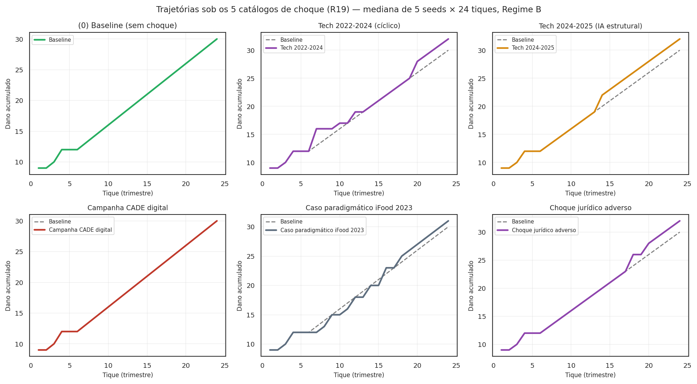

<span class="ato-chip">Anexo · R19 expandido</span>

# Choques institucionais e a hipótese "layoffs IA como oportunidade"

<p class="sublinha-tese"><em>O modelo absorve choques exógenos discretos. Cinco catálogos canônicos cobrem layoffs tech (cíclico 2022-2024 vs estrutural 2024-2025 por IA), campanhas regulatórias do CADE, casos paradigmáticos e choques jurisprudenciais adversos. A pesquisa de fundo 2026 calibra magnitudes e causalidade declarada — incluindo a hipótese substantiva do autor: <strong>layoffs por reestruturação de IA podem virar oportunidade de denúncia</strong>, porque o ex-funcionário tem represália efetiva reduzida e mantém capacidade de sinalizar.</em></p>

## O que é um choque no modelo

R19 implementa **eventos discretos no tempo**, inspirados na tradição Eurace@Unibi (Dawid et al.) de ABM macro. Quatro tipos canônicos com semântica controlada:

| Tipo | O que faz | Magnitude | Parâmetro afetado |
|---|---|---|---|
| `layoff` | Converte fração de trabalhadores em `status="ex_funcionario"` | ∈ [0, 1] | `r_represalia` efetivo × `fator_represalia_ex_funcionario` (default 0,2) |
| `caso_paradigmatico` | Pulso em `p_perc` global (efeito Schelling) | ∈ [0, 1] | `max(p_perc, magnitude)` |
| `campanha_cade` | Pulso em `rho_acuracia` da autoridade | adicionado, clipado a 0,99 | `autoridade.rho` |
| `choque_juridico` | Pulso em `p_anulacao_tcc` (falsificador F6 ativado) | adicionado, clipado a 1,0 | `p_anulacao_tcc` |

Implementação em `src/waas_antitrust/choques.py` com `Choque` (dataclass frozen) validada em `__post_init__` (tipo, tique ≥ 1, magnitude em [0, 1]).

## Os cinco catálogos canônicos

### 1. `CHOQUES_TECH_2022_2024` — causalidade cíclica

Duas ondas grandes de layoff tech globais em 2022-2024, com causalidade declarada como **cíclica**:

| Tique | Magnitude | Causa declarada | Descrição |
|---|---|---|---|
| 4 | 6% | `overhiring_pandemico` | Onda jan/2023: Meta 11k (13%), Google 12k (6%), Amazon 10k, Microsoft 10k (5%) — subsidiárias BR atingidas |
| 8 | 4% | `aperto_monetario` | Onda jan/2024: continuação da contração; ajuste pós-bolha de contratação 2021 |

Pesquisa de fundo: ~579 mil demissões globais 2022-2024 (165 + 262 + 152 mi por ano). Brasscom 2024 indica **expansão líquida do setor TIC BR** (+4,5% formal), mas com cortes específicos em iFood, PicPay, Loft, Neon, C6, PagSeguro.

### 2. `CHOQUES_TECH_2024_2025_AI_RESTRUCTURING` — causalidade estrutural ⭐

A novidade da pesquisa de fundo 2026. Duas ondas com causalidade declarada **estrutural** (IA-eficiência + pivot estratégico):

| Tique | Magnitude | Causa declarada | Descrição |
|---|---|---|---|
| 12 | 5% | `ai_efficiency` | Onda Q4/2024 — primeiras demissões explicitamente atribuídas a IA-eficiência: Salesforce 8k, SAP até 8k + €2bi/ano em IA, Intel 15k (~15%), Cisco 4k (~5%). **40% das vagas não são reabertas** (AlixPartners 2025) |
| 16 | 4% | `pivot_estrategico` | Onda 2025-26: pivot estratégico Meta Reality Labs → IA hardware; reestruturação por capacidade de modelo. Atinge engenharia de pesquisa e produto sênior |

**Hipótese substantiva do autor**: o trabalhador demitido por IA-eficiência tem **mais conhecimento técnico de algoritmos e dados** → qualidade de prova potencialmente maior. Não-trivial empiricamente.

### 3. `CHOQUES_CAMPANHA_CADE_DIGITAL` — pulso institucional

| Tique | Magnitude | Descrição |
|---|---|---|
| 6 | +0,15 em `rho` | Inflexão DEE/CADE DT-003/2022 (aprendizado de máquina e antitruste) + ramp de prioridade digital pós-2024 |

### 4. `CHOQUES_CASO_PARADIGMATICO_IFOOD_2023` — efeito Schelling

| Tique | Magnitude | Descrição |
|---|---|---|
| 5 | piso 0,35 em `p_perc` | TCC iFood 2023 com exclusividade — cobertura ampla na imprensa elevou a percepção de risco no setor de marketplaces BR |

### 5. `CHOQUES_JURIDICO_ADVERSO` — falsificador F6 disparado

| Tique | Magnitude | Descrição |
|---|---|---|
| 10 | +0,30 em `p_anulacao_tcc` | Decisão hipotética do STJ desautorizando a re-caracterização da recompensa como ressarcimento (falsificador F6 ativado) |

## Visualização — os 5 catálogos contra baseline

<figure markdown>
  { .figura-empirica .status-direcional }
  <figcaption>
    Trajetórias sob os 5 catálogos de choque (R19), mediana de 5 seeds × 24 tiques em Regime B. Cada painel compara o dano acumulado contra o baseline sem choque (linha tracejada). A leitura comparativa: o choque IA estrutural (painel 2) e os layoffs cíclicos (painel 1) ambos PRODUZEM ex-funcionários — com represália efetiva reduzida pelo <code>fator_represalia_ex_funcionario</code> default 0,2. A campanha CADE (painel 3) e o caso paradigmático iFood (painel 4) elevam <code>rho</code> e <code>p_perc</code> respectivamente. O choque jurídico adverso (painel 5) ativa o falsificador F6 — o único onde a trajetória pode RUIM contra o baseline.
  </figcaption>
</figure>

## Como rodar

```python
from waas_antitrust.choques import (
    CHOQUES_TECH_2024_2025_AI_RESTRUCTURING,
    CHOQUES_JURIDICO_ADVERSO,
    listar_catalogos,
)
from waas_antitrust.model import WaaSModel, WaaSParametros

# Comparar baseline vs IA restructuring
for nome, catalogo in (("baseline", ()),
                       ("IA restructuring", CHOQUES_TECH_2024_2025_AI_RESTRUCTURING)):
    params = WaaSParametros(
        n_empresas=15, tam_medio_empresa=150, n_tiques=24,
        seed=11, regime="B", choques=catalogo,
    )
    df = WaaSModel(params).executar()
    print(f"{nome}: dano={df['dano_acumulado'].iloc[-1]:.1f}, "
          f"ex-funcionarios={df['n_ex_funcionarios'].iloc[-1]:.0f}")

# Listar os 5 catálogos disponíveis
for nome, catalogo in listar_catalogos().items():
    print(f"{nome}: {len(catalogo)} choques")
```

## Caveats da pesquisa de fundo

A calibração formal das magnitudes está em **R03 (em aberto)** — em particular:

1. `layoff` deveria ser ancorado em layoffs.fyi para a série mensal/anual em **tech BR especificamente** — hoje as magnitudes (4-6%) são ordens de grandeza extrapoladas das séries globais.
2. `campanha_cade` deveria usar DEE/CADE Documentos de Trabalho com peso de capacidade investigativa adicional alocada.
3. `caso_paradigmatico` precisa cobertura de imprensa quantificada como ranking de saliência — pendência empírica.
4. A **hipótese substantiva** "layoffs IA viram oportunidade" precisa ser testada com varredura multi-seed dedicada — esta página apenas mostra que o modelo absorve os choques sem quebra.

Todos os caveats estão rastreados em `DECISIONS.md` R19 + R03.
