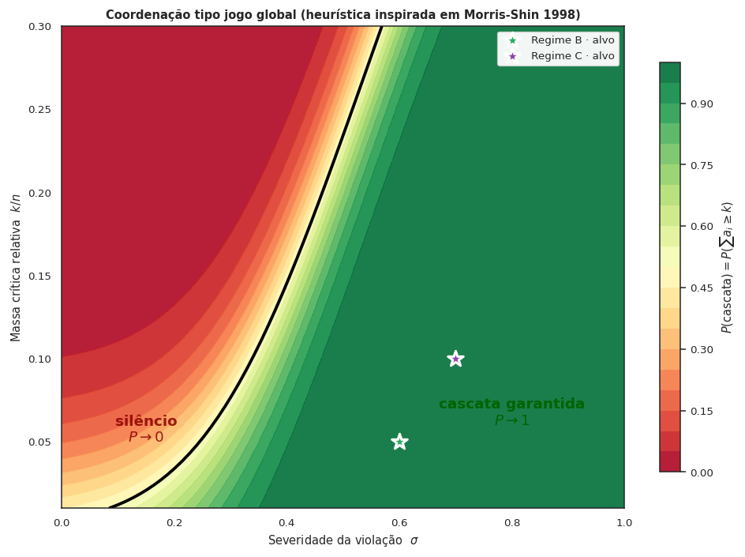

# E se a empresa pagasse para ser delatada?

Esta é a pergunta provocadora por trás de um mecanismo — *Whistleblower-as-a-Service*
(WaaS) — de **denúncia interna recompensada** em antitruste de mercados digitais
brasileiros. O incentivo é desenhado para que, ao ser investigada, **colaborar
saia mais barato para a empresa do que continuar escondendo**.

A página de **[Resultados](resultados.md)** mostra, com saída real de uma
simulação baseada em agentes, que onde o canal WaaS existe as empresas **deixam
de violar** ao longo do tempo — algo que o cenário atual não produz.

{ .figura-empirica }

## Por onde começar

-   **Curioso(a) — público em geral**

    Vá direto à narrativa em linguagem acessível.

    [Ver resultados](resultados.md) · [Glossário](glossario.md)

-   **Formulador(a) de política · jurista**

    Como o mecanismo caberia na lei brasileira; o que muda no Regime B vs. C.

    [Análise institucional](INSTITUTIONAL.md) · [Limitações](limitacoes.md)

-   **Pesquisador(a) · estudante**

    O protocolo do modelo, a API, e o caderno-demo no Colab.

    [Modelo (ODD)](ODD.md) · [API](api.md) · [Como usar](uso.md)

-   **Cético(a) saudável**

    O que ainda **não** está sustentado, e o que pediria uma calibração formal.

    [Limitações](limitacoes.md) · [Crítica x10](critica_x10.md) · [Backlog](DECISIONS.md)

## O problema

Os **programas de leniência** clássicos combatem **cartéis** — combinações entre
empresas concorrentes. Funcionam porque oferecem perdão a quem delatar primeiro:
um conspirador entrega os outros. Em **mercados digitais**, boa parte do abuso é
**unilateral** — uma única empresa grande prejudicando o mercado sozinha. Não há
concorrente-cúmplice para delatar. Quem realmente sabe o que acontece são os
**próprios funcionários**.

## A ideia: *Whistleblower-as-a-Service*

Em vez de esperar a fiscalização descobrir tudo sozinha, o mecanismo cria um
incentivo financeiro para o **denunciante interno**. A peça central é uma
**inversão de incentivo**: a empresa, ao ser investigada, ganha um **desconto na
multa** se ressarcir as vítimas — e pode usar a recompensa paga aos denunciantes
como parte desse ressarcimento. **Quando o desconto excede a recompensa, virou
negócio para a empresa colaborar.**

{ .figura-conceitual }

## Três cenários ("regimes")

| Regime | Recompensa ao denunciante interno? | Como seria implementado |
|--------|------------------------------------|-------------------------|
| **A** — hoje | Não | situação atual: sem canal de incentivo individual |
| **B** — via Resolução | Sim | nova resolução do CADE complementar à 21/2018, **sem mudar a lei** |
| **C** — via Lei | Sim | extensão da Lei 13.608/2018 — mais robusto; exige o Congresso |

A página [Análise institucional](INSTITUTIONAL.md) detalha como o **Art. 12 da
Resolução CADE nº 21/2018** sustenta o Regime B, e por que esse caminho tem
**limites estruturais** (reserva de lei, Art. 22, I, da Constituição) que só o
Regime C ultrapassa.

## A tese, em termos técnicos

O mecanismo **inverte a função-utilidade da conformidade**: em vez de minimizar
$p \cdot S$ (probabilidade de detecção × sanção), a empresa passa a maximizar
$D - W$ — o desconto $D$ no Termo de Compromisso de Cessação (TCC) menos a
recompensa total $W$ paga aos denunciantes. A condição $D > W$ (chamamos
**IC-F\***) é satisfazível no Art. 12 da Resolução 21/2018, sustentando
implementação por via infralegal (Regime B).

A coordenação dos denunciantes tem **limiar de massa crítica**: abaixo dele,
silêncio; acima, cascata de revelação.

{ .figura-conceitual }

!!! warning "Estado do projeto"
    **Artigo em elaboração**. Vários resultados são direcionais e algumas
    proposições seguem como conjecturas explícitas — ver
    **[Limitações](limitacoes.md)** (em linguagem acessível) ou o
    [backlog técnico](DECISIONS.md). **Não citar como resultado final.**

## Como citar e como rodar

- **Reproduzir em ~1 minuto**: [caderno-demo no Colab](https://colab.research.google.com/github/freirelucas/waas-antitrust/blob/main/notebooks/WaaS_demo.ipynb).
- **Citação estruturada**: [`CITATION.cff`](https://github.com/freirelucas/waas-antitrust/blob/main/CITATION.cff) (Zenodo via release futura).
- **Licença**: código e documentação sob CC BY-SA 4.0.

<small>

</small>
