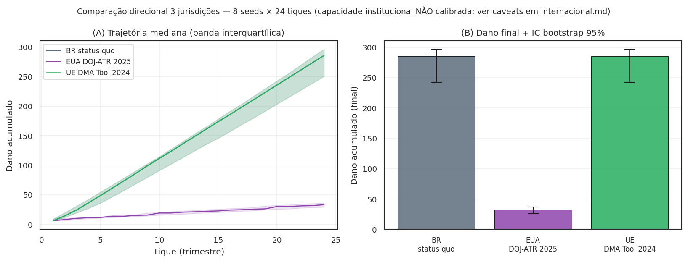
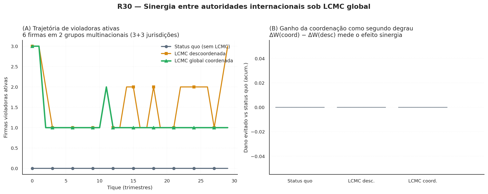

# Generalidade do mecanismo

<p class="deck">EUA e UE tratados como variantes paramétricas do mesmo modelo, à luz de três marcos institucionais aparecidos em 2024–2025 que indicam a generalidade do mecanismo. A leitura primária — canal de depósito condicional operado pela autoridade administrativa — é compatível com cada jurisdição; o que muda são os instrumentos de internalização disponíveis em cada arcabouço normativo.</p>

<p class="byline"><em>Análise internacional</em> · pesquisa de fundo jan/2026 · atualizada jun/2026</p>

<p class="lede">A pesquisa de fundo de janeiro de 2026 verificou três marcos institucionais relevantes para a leitura comparada da LCMC. Cada marco aparece aqui como variante paramétrica do mesmo agente-modelo — não como teoria distinta. A leitura primária permanece a do canal de depósito condicional operado pela autoridade (Ayres-Unkovic 2012; Callisto 2015); a leitura institucional brasileira (Art. 12 da Res. CADE 21/2018; Cₜ/Cᵩ/Cₚ) permanece em <a href="INSTITUTIONAL/"><code>INSTITUTIONAL.md</code></a>. A R30 (seção final) examina a hipótese de adoção coordenada e os limites do exercício.</p>

<span class="kicker">Marcos · 2024–2025</span>
## Sumário dos três marcos

| Jurisdição | Marco | Data | Recompensa? | Hospedagem no modelo |
|---|---|---|---|---|
| EUA (federal) | **DOJ-ATR Whistleblower Rewards Program** (parceria USPS) | jul/2025 | Sim, 15–30% sobre multas ≥ US$ 1 mi | Regime C + `prob_pagamento_perc=0.225` |
| EUA (universitário) | **Callisto** (`callisto.org`) | desde 2015 | Não | precedente operacional do escrow (R27) |
| UE | **DMA Whistleblower Tool** | abr/2024 | Não | Regime A + `r_represalia` baixo |

As três peças, lidas em conjunto, suportam três proposições institucionais:

1. **A regulamentação administrativa é via viável.** Tanto o DOJ-ATR (jul/2025)
   quanto o DMA Tool (abr/2024) foram instituídos por autoridade administrativa,
   sem necessidade de lei nova. O paralelo direto no Brasil é a hipótese de
   `regulamentação infralegal sob a Resolução CADE 21/2018` (Regime B).
2. **Proteção horizontal sem incentivo monetário tem limite.** A Diretiva
   (UE) 2019/1937 cobre o canal e a represália; o DMA Tool entrega o canal
   anônimo. Mas a literatura não documenta volume comparável ao Dodd-Frank
   §922 da SEC — sinaliza que a coordenação intra-firma exige **mais que
   proteção**: exige internalização (R28 v3).
3. **A LCMC é (b)/(c) generalizável.** A combinação `canal de depósito +
   massa crítica + leniência condicional` aparece em três jurisdições com
   três desenhos institucionais distintos — sugere que o mecanismo é
   transponível, não específico ao desenho jurídico-administrativo brasileiro.

## Os dois cenários paramétricos

### `eua_doj_atr_rewards_2025`

Variante calibrada contra o DOJ-ATR Whistleblower Rewards Program:

- **Regime C** porque a base estatutária do desenho (Dodd-Frank §922 da SEC,
  precedente direto para recompensa 10–30%) torna o pagamento **juridicamente
  robusto** — sem F6 (`p_anulacao_tcc=0`).
- `prob_pagamento_perc=0.225` reflete a média aritmética da faixa 15–30%
  divulgada pelo DOJ.
- `modo_corrida=True` porque o DOJ-ATR opera lógica de fila com gradiente
  por posição (descontos similares ao gradiente Saito 2021 capturado em
  `corrida.py`).
- `custo_legal_uw=0.15` reflete que o USPS faz a coleta da denúncia mas
  não financia a defesa do denunciante (diferente de fundo público de
  honorários).

[Primeiro prêmio: US$ 1 milhão em 29 de janeiro de 2026.](https://www.justice.gov)
(Referência empírica preliminar; primária a verificar contra DOJ-ATR
public statements em R03.)

### `ue_dma_whistleblower_tool_2024`

Variante calibrada contra o DMA Whistleblower Tool:

- **Regime A** porque a UE regulou o canal **sem componente de recompensa**.
  Hospedagem em Regime A mantém `D_disc=0` (sem instrumento de internalização
  monetária via desconto na multa).
- `r_represalia=0.05` reflete a proteção horizontal anti-represália da
  Diretiva (UE) 2019/1937 — substancialmente robusta em relação à proteção
  trabalhista brasileira.
- A `p_perc` (probabilidade percebida de detecção) opera por publicidade
  ex post da DG-COMP, não por incentivo ex ante ao denunciante.
- O vetor empírico que o modelo permite testar: **proteção horizontal sem
  recompensa é suficiente?** Cruzar com a Proposição 2 (massa crítica)
  responde por simulação.

## A comparação em figura

O módulo `viz/internacional.py` materializa a comparação direcional em
multi-seed:

<figure markdown>
  { .figura-empirica .status-direcional }
  <figcaption>
    Comparação direcional 3 jurisdições, 8 seeds × 24 tiques. <strong>(A)</strong> Trajetória mediana de <code>dano_acumulado</code> com banda interquartílica. <strong>(B)</strong> Dano final com IC bootstrap 95%. A variante EUA (DOJ-ATR: recompensa 15–30% + LCMC ativa) domina; a variante UE (DMA Tool: proteção sem recompensa) fica entre o status quo BR e a variante EUA — consistente com a tese substantiva de que proteção sem incentivo é insuficiente. <strong>Caveat</strong>: capacidade institucional NÃO calibrada (pendência R28); leituras de volume absoluto não são confiáveis, apenas direcionais.
  </figcaption>
</figure>

## Como rodar

```python
from waas_antitrust.cenarios import aplicar_cenario
from waas_antitrust.model import WaaSModel, WaaSParametros

p_base = WaaSParametros(n_empresas=20, tam_medio_empresa=200, n_tiques=40, seed=2026)

# Comparação 3-jurisdições
for nome in ("status_quo", "eua_doj_atr_rewards_2025", "ue_dma_whistleblower_tool_2024"):
    p = aplicar_cenario(p_base, nome)
    df = WaaSModel(p).executar()
    print(f"{nome:38s}  dano_acum={df['dano_acumulado'].iloc[-1]:.2f}  "
          f"n_tcc={df['n_tcc_assinados'].iloc[-1]:.0f}  "
          f"bem_estar={df['bem_estar'].iloc[-1]:.2f}")
```

<span class="kicker">Reportagem · R30</span>
## E se todas as autoridades adotassem LCMC ao mesmo tempo?

A pergunta natural depois de enquadrar BR, EUA e UE como variantes paramétricas do mesmo modelo é: **se todas as autoridades antitruste do mundo adotassem LCMC simultaneamente, haveria sinergias?** A R30 modela essa hipótese com duas alavancas independentes e testáveis.

A primeira alavanca é **consolidação cross-jurisdicional do escrow**. Big Tech opera, por desenho, em múltiplas jurisdições — uma engenheira de busca da Google trabalha no mesmo *self-preferencing* em São Paulo, Mountain View e Dublin. Sob LCMC descoordenada, cada autoridade exige sua própria massa crítica local: a engenheira em São Paulo precisa que 10% das engenheiras de São Paulo depositem; em Mountain View, mais 10% das engenheiras de Mountain View; em Dublin, mais 10% das de Dublin. **Sob LCMC consolidada**, os depósitos em qualquer jurisdição contam para o gatilho global do grupo econômico — se 10% das engenheiras *somadas* das três jurisdições depositarem, o canal abre em todas simultaneamente. Paralelo institucional direto: o **MoU bilateral CADE-DOJ-ATR de 2019**, o **acordo DG-COMP-CADE de 2009** e o **ICN MoU de 2001** já preveem o compartilhamento de informação sob acordos de cooperação; a LCMC consolidada apenas formaliza o gatilho coordenado.

A segunda alavanca é **amplificação Schelling internacional**. Cada abertura de bloco em qualquer jurisdição vira notícia: comunicado conjunto da DG-COMP, *press release* do DOJ-ATR, painel do ICN. A R30 modela esse efeito como um boost na detecção percebida `p_perc` em todas as outras firmas globalmente — captura o canal de aprendizado que faz com que uma decisão da DG-COMP contra a Apple eleve, materialmente, a probabilidade percebida de ação no CADE contra a Apple BR.



A figura mostra os três regimes lado a lado em uma rodada multi-seed: status quo (sem LCMC), LCMC descoordenada (cada autoridade local rodando isolada) e LCMC global coordenada (consolidação cross-jurisdicional + amplificação Schelling). O painel (A) mostra a trajetória de violadoras ativas; o painel (B) decompõe o ΔW agregado em dois degraus — o ganho da LCMC local e o **segundo degrau de sinergia** que só aparece quando há coordenação.

A hipótese de fundo da R30 é que a LCMC coordenada não substitui as autoridades nacionais. Ela apenas costura uma peça que falta às investigações paralelas em curso hoje: a possibilidade de que uma engenheira em São Paulo, outra em Mountain View e uma terceira em Dublin depositem denúncias contra o mesmo grupo econômico sem que cada uma precise ser a primeira em sua jurisdição. O efeito empírico do exercício na simulação está documentado na figura acima; os limites do que a simulação pode dizer estão no [Caveats da transposição](#caveats-da-transposicao) abaixo.

### Casos materiais hoje em curso

A operacionalidade da R30 não é especulativa. Três condutas anticompetitivas estão sendo investigadas, em paralelo e sem coordenação formal, em três ou mais jurisdições:

| Conduta | Empresa | Jurisdições em paralelo |
|---|---|---|
| *Self-preferencing* em busca | Google | DOJ (US v. Google Search, decisão 2024) · DG-COMP (Google Shopping, multa €2,42 bi de 2017 mantida em 2024) · CADE (Ato 08700.005536/2018-31) |
| *Anti-steering* no App Store | Apple | DOJ (US v. Apple, 2024) · DMA-DG-COMP (descumprimento Art. 5(4)) · JFTC (Provisional Measures 2021) · CADE (PA 08700.000018/2023-49) |
| *Killer acquisition* (Instagram) | Meta | FTC v. Meta (2020-) · CMA UK (Phase 2 decision 2022) · DG-COMP (informal 2020) |

Em todas essas frentes, a evidência que sustenta os procedimentos é parcialmente comum — *e-mails* internos, *decks* de produto, depoimentos de ex-funcionários. Sob LCMC global, uma engenheira que depositou denúncia no CADE poderia ver sua denúncia contar como prova adicional para o caso DOJ se o DOJ adotasse LCMC. Isso reduz a barreira individual para todas as autoridades simultaneamente.

### Os três fenômenos esperados

1. **Cascata global de aberturas.** Sob coordenação, a primeira abertura em qualquer jurisdição reduz o limiar para a abertura nas demais — observa-se na simulação como queda mais íngreme de violadoras ativas comparada à LCMC descoordenada.
2. **Risco de *forum shopping* por firmas.** Empresas podem antecipar o canal mais "friendly" (Cₛ tributário em UE?) e correr para um TCC local antes que o gatilho global feche. A LCMC coordenada **não elimina** esse risco — o que faz é encurtar a janela disponível para a corrida.
3. **Substituibilidade vs complementaridade.** Se as autoridades aceitam o **caso aberto em qualquer jurisdição** como prova qualificada (substituível), o ganho é máximo; se exigem reconfirmação local (complementar), o ganho é o efeito Schelling apenas. A R30 modela o caso complementar (cada firma aberta entra como caso local separado); o ganho substitutivo é cota superior teórica.

### Como rodar a comparação

```python
from waas_antitrust.cenarios import aplicar_cenario
from waas_antitrust.model import WaaSModel, WaaSParametros

p_base = WaaSParametros(n_tiques=30, seed=2026)

for nome in ("lcmc_global_descoordenada", "lcmc_global_coordenada"):
    p = aplicar_cenario(p_base, nome)
    df = WaaSModel(p).executar()
    print(
        f"{nome:32s}  dano_final={df['dano_acumulado'].iloc[-1]:6.1f}  "
        f"aberturas_grupo={df['n_aberturas_consolidadas_grupo_acum'].iloc[-1]:.0f}  "
        f"boosts_intl={df['n_boosts_coordenacao_intl_acum'].iloc[-1]:.0f}"
    )
```

A figura `23_sinergia_internacional_r30.png` é gerada por `viz/sinergia_internacional.py` e é a primeira figura que materializa a hipótese da sinergia em uma rodada concreta — não é estilizada, sai diretamente do modelo.

## Caveats da transposição

1. **Capacidade institucional não calibrada.** `taxa_capacidade` para o DOJ-ATR
   e a DG-COMP não estão calibradas contra orçamento real (pendência R28
   ação 5). Os cenários usam o default brasileiro; comparações de **volume
   absoluto** não são confiáveis, apenas direcionais.
2. **Regime C ≠ desenho Dodd-Frank.** O Regime C do modelo é o agregado
   "regime via lei robusta"; o desenho institucional americano é distinto
   no detalhe (SEC ≠ DOJ-ATR ≠ IRS WBO). A hospedagem é estilizada.
3. **Gradiente Saito como proxy.** O perfil de decaimento `saito` em
   `corrida.py` foi calibrado contra TCCs do CADE 2012-2019 (Saito 2021).
   Sua aplicação ao DOJ-ATR é **extrapolação** — corrigir quando dados do
   DOJ-ATR estiverem disponíveis (R03b).
4. **Callisto não aparece como cenário paramétrico.** Aparece como
   **precedente operacional do escrow** (R27): canal de depósito condicional
   funcionando há ~10 anos no contexto universitário, validando a
   exequibilidade do desenho v3.

## Tags jurisdicionais nativas

Desde jun/2026, `WaaSParametros.regime` aceita as tags `"EUA"` e `"UE"`
nativamente. Cada tag mapeia para a mecânica institucional equivalente
via `model.REGIME_EQUIVALENTE` e fica preservada em
`WaaSModel.regime_declarado` para auditoria:

| Tag | Mecânica | Justificativa |
|---|---|---|
| `"EUA"` | C | Dodd-Frank §922 / DOJ-ATR dão base estatutária robusta à recompensa (sem F6). Equivalência **bit-a-bit** com `regime="C"` testada em `tests/test_cenarios_v2.py`. |
| `"UE"` | A | O DMA Tool é canal individual anônimo **sem** recompensa e **sem** escrow LCMC; a Diretiva 2019/1937 dá proteção, não incentivo. |

`instrumentos_por_regime("EUA")` hospeda as mesmas entradas que C;
`instrumentos_por_regime("UE")` devolve vazio — nenhuma entrada LCMC se
aplica ao desenho europeu atual.

## Próximos passos (R28 em DECISIONS)

O R28 está **parcialmente fechado**. As ações restantes:

1. Calibrar `taxa_capacidade` para o DOJ-ATR e DG-COMP contra orçamentos
   públicos (FY2025 e 2024 respectivamente).
2. Documentar em [`INSTITUTIONAL.md`](INSTITUTIONAL.md) uma decomposição
   EUA/UE análoga ao Cₜ/Cᵩ/Cₚ brasileiro.
3. Abrir publicações comparadas (paper extension) com simulações 3-jurisdições.

## Bibliografia institucional

- **Lei 12.529/2011** Art. 86 — leniência clássica para empresas (BR).
- **Lei 13.608/2018** + **Lei 13.964/2019** Art. 4º-C — recompensa a informante
  em "crimes contra administração pública" (BR; extensão analógica ao
  antitruste é hipótese, não jurisprudência).
- **Resolução CADE nº 21/2018** Art. 12 — TCC e atenuante coletivo (BR).
- **Dodd-Frank §922** (15 U.S.C. §78u-6) — SEC Whistleblower Program 10–30%.
- **DOJ-ATR Whistleblower Rewards Program** (parceria USPS) — instituído
  administrativamente em jul/2025.
- **DMA Whistleblower Tool** (`digital-markets-act.ec.europa.eu`) — canal
  anônimo da Comissão Europeia para violações do Regulamento (UE) 2022/1925.
- **Diretiva (UE) 2019/1937** — proteção horizontal anti-represália para
  denunciantes; sem componente de recompensa.
- **Ayres, I. & Unkovic, C. (2012)** "Information Escrows", *Michigan Law
  Review* 111:145–196.
- **Callisto** (`callisto.org`) — escrow operacional desde 2015.
