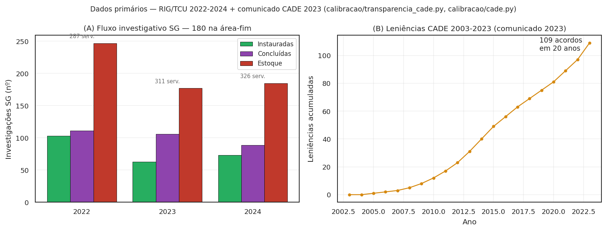
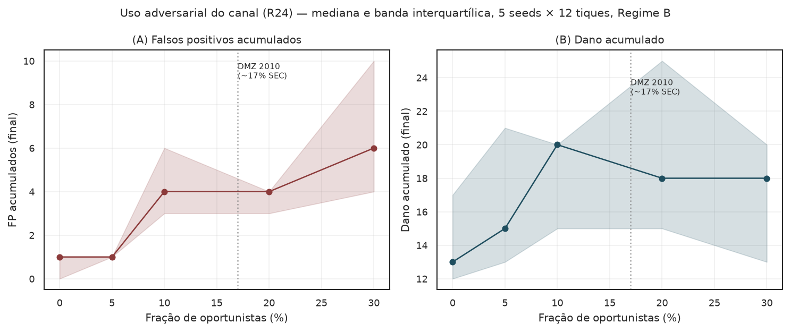

<span class="ato-chip">Ato 4 de 5 · A honestidade</span>

# O que ainda não está sustentado

<p class="sublinha-tese"><em>O reframe não resolve fragilidades — apenas as nomeia melhor; sob a lente Coleman, novas fragilidades aparecem que o framing "empresa paga" ocultava.</em></p>

O Ato 3 fechou com evidência direcional para o canal de dissuasão. Mas seria desonesto parar aí. Este projeto é um **artigo em elaboração**, e existem pontos onde a alegação ainda não tem cobertura — alguns por calibração faltando, outros por escolha teórica que precisa de revisão, outros por restrição estrutural do desenho jurídico. Esta página enumera cada um deles e diz, na medida do possível, **o que faria a alegação sustentar-se**.

A postura é simples: **dizer onde o argumento ainda não fecha é mais útil ao leitor do que esconder a dobra**. O backlog técnico completo está em [Decisões e backlog](DECISIONS.md); o que segue é a versão para humanos.

## A fragilidade jurídica do Regime B é a mais séria

Esta é a charneira que oito revisores externos — convocados na [Crítica x10](critica_x10.md) — apontaram independentemente, e a que mais muda a leitura do projeto. Vale dizer com todas as letras.

O Regime B implementa o WaaS por **resolução do CADE**, sem alterar lei. Tem três vetores de fragilidade:

**(i) A re-caracterização da recompensa como "ressarcimento" é controvertida.** A jurisprudência sobre o Art. 12 da Resolução 21/2018 trata "vítimas" como categoria coletiva (consumidores, concorrentes, erário). O denunciante interno é, dogmaticamente, **testemunha qualificada** — não a coletividade lesada. Re-caracterizar o pagamento como ressarcimento dessas vítimas é construção finalística, e o Judiciário pode rejeitá-la em sede de controle (falsificador F6 do desenho). O modelo torna isto calibrável via `p_anulacao_tcc`.

**(ii) Resolução do CADE não pode impor cláusula contratual padrão.** A camada **Hirschman exit-with-equity** (R07) supõe cláusulas contratuais de vesting acelerado por gatilho de ação coletiva. Por **reserva de lei** (Art. 22, I, da Constituição), matéria contratual padrão e proteção trabalhista são competência exclusiva da União por **lei** — não cabem em resolução infralegal. Logo, R07 só é institucionalmente coerente sob **Regime C**, e o modelo agora reflete isso: o parâmetro `fracao_contratos_acelerados > 0` em Regime A ou B é forçado a 0 com aviso explícito.

**(iii) Há colisão com a leniência clássica.** Se o denunciante interno for **partícipe** da conduta — o engenheiro que codificou o algoritmo, o comercial que operou a exclusividade, o *growth* que instrumentou o *dark pattern* — o caminho institucional adequado é o Art. 86 (leniência clássica), não o WaaS. O Regime B pode criar **arbitragem regulatória** entre os dois canais.

A solução estrutural para os três é o **Regime C** — extensão da Lei 13.608/2018 ao antitruste, via Congresso. Mais robusto, custa voto político. O modelo cobre os dois regimes para deixar a escolha explícita.

## Os números ainda não estão calibrados

A simulação produz direção e magnitude, mas os parâmetros são **plausíveis, não ajustados**. Há três bancos de dados externos contra os quais o modelo precisa ser calibrado antes de qualquer alegação quantitativa:

- **Saito (2021)** — *Termo de Compromisso de Cessação na Lei nº 12.529/11*, CADE/PNUD. Cobre 349 TCCs em 7,5 anos com mediana de desconto. Calibrar $D_{\text{base}}$ contra esse universo é o item número um em R03.
- **DEE/CADE Documentos de Trabalho 003/2022 e 001/2024** — magnitudes de multa, vazão da autoridade, perfil de capacidade.
- **Wiedman & Zhu (2023, *CAR*)** — evidência empírica de redução de fraude após Dodd-Frank §922 nos EUA. Fornece um quarto alvo de calibração via mecanismo análogo (incentivo financeiro ao denunciante interno).

Calibração formal contra esses três alvos está em **R03** — a pendência mais importante do backlog.

### O que a análise de identificabilidade já mostrou (jun/2026)

Antes de otimizar, é preciso saber **o que é otimizável**. A terceira
rodada de R03 (`scripts/identificabilidade_r03.py`, 175 rodadas 1D)
decompôs o aparente conflito entre os alvos em três achados:

1. **Sensibilidade**: o volume de TCC/ano responde a `fracao_violadoras`
   (Δ mediana 1,6), `taxa_capacidade` e `k_rel` (0,8 cada) — e **não
   responde a `rho`** (Δ = 0,000; acurácia afeta precisão, não volume).
   `rho` deve sair da função objetivo de calibração.
2. **O "gap de escala" era artefato de não-normalização**: o alvo de
   47 TCC/ano é do universo CADE inteiro; o modelo simula 20 firmas.
   Invertendo a normalização, o modelo seria consistente com um universo
   de **N\* ≈ 1.567 firmas** sob jurisdição ativa — uma predição
   falsificável contra o número real (pendência empírica; não estimado
   aqui para não inventar dado).
3. **O alvo DMZ (19% de detecção por empregados) é não-identificável por
   construção**: o modelo tem um único canal de detecção (o trabalhador),
   então a fração interna simulada é ~100% e nenhum parâmetro atual a
   move para 19%. O alvo mede composição *entre* canais (auditoria,
   mídia, concorrentes) que o modelo não representa — ele deve sair da
   função objetivo até que canais exógenos de detecção sejam modelados.

A consequência prática: a calibração formal de R03 tem **um alvo
operacional** (volume reescalonado por N\*) e **dois parâmetros
dominantes** (`fracao_violadoras`, `taxa_capacidade`) — problema bem
mais tratável do que a forma original com 3 alvos × 3 parâmetros.

A calibração formal, executada (`scripts/calibrar_formal.py`,
`scipy.optimize.minimize(method="Nelder-Mead")`, 5 seeds): Nelder-Mead
converge em 8 iterações ao ponto ótimo **(0,323; 0,481)**, produzindo
**0,56 TCC/ano simulado** (IC bootstrap 95%: [0,200; 0,900]) contra
alvo normalizado **0,60** — **erro relativo final de 6,65%**. O alvo
está dentro do IC do modelo: a calibração é **consistente com os
dados disponíveis dado o N\* assumido**. O `N★` implícito sobe
levemente para **1.679 firmas** (vs 1.567 da identificabilidade) —
predição falsificável contra o número real de firmas sob jurisdição
ativa do CADE (pendência empírica). Resultados em
`results/calibracao_formal_r03.json`.

Os dados primários contra os quais essa calibração corre estão
visualizados abaixo (RIG/TCU 2022-2024 + comunicado CADE 2023):

<figure markdown>
  { .figura-empirica }
  <figcaption>
    Dados primários da capacidade investigativa real. <strong>(A)</strong> Investigações SG instauradas (63–103/ano), concluídas (89–111/ano) e estoque (177–247) em 2022-2024, com a força de trabalho anotada (287–326 servidores em exercício; 180 na área-fim) — fonte RIG/TCU, parseada em <code>calibracao/transparencia_cade.py</code>. <strong>(B)</strong> Leniências acumuladas 2003-2023: 109 acordos em 20 anos (comunicado CADE 2023). A vazão real é a âncora do reescalonamento de <code>taxa_capacidade</code> (R06) e do alvo de volume (R03).
  </figcaption>
</figure>

## Os pesos do bem-estar são provisórios

O bem-estar social é definido como $-(\text{dano} + \beta \cdot \text{FP} + \gamma \cdot \text{custo recompensa} + \delta_{\text{ex}} \cdot \text{êxodo} - \delta_{\text{mu}} \cdot \text{multa arrecadada}) / w_a$. Os defaults usados nos gráficos — $\beta=1$, $\gamma=0$, $\delta_{\text{ex}}=0{,}5$, $\delta_{\text{mu}}=1$ — são **normativos**, não calibrados. Ancorar cada um requer:

- $\beta$ contra Polinsky-Shavell (custo social do erro tipo I em enforcement);
- $\gamma$ contra a interpretação econômica do desconto como transferência privada (provavelmente $0$);
- $\delta_{\text{ex}}$ contra a literatura de capital humano em transição (custo de substituição + perda transitória de produtividade);
- $\delta_{\text{mu}}$ contra a valoração marginal de receita pública (provavelmente $\approx 1$).

A consolidação está rastreada em **R05**.

## As proposições teóricas seguem em parte como conjecturas

A **Proposição 1** — viabilidade da IC-F\* no ponto-alvo do Regime B — está demonstrada **pontualmente** por teste de regressão, mas as faixas jurídicas do esboço (multa entre 1% e 20% da receita, $D \le 50\%$ da multa) seguem ilustrativas. A Proposição é honesta sobre isso.

A **Proposição 2** — unicidade do equilíbrio de coordenação no limite $\tau \to 0$ do subjogo de Morris-Shin — está implementada em forma fechada no módulo `jogo_global` e verificada numericamente em testes. Mas **não está integrada à dinâmica completa do ABM** (R02a), o **contraste numérico com multiplicidade sob conhecimento comum não foi feito** (R02b), e a unicidade sob heterogeneidade de arquétipos × papéis é **conjectura aberta** (R02c) — Morris-Shin supõe homogeneidade que não temos.

A **Proposição 3** — dominância de bem-estar de B sobre A — está sustentada direcionalmente por simulação multi-seed com CI 95% que não cruza zero. **A prova formal segue como esboço**, não como teorema fechado.

## Fragilidades do bem coletivo (pós-reframe Coleman > Samuelson)

A [Crítica x10 v2](critica_x10_v2.md) acrescentou três fragilidades que
o framing original "empresa paga" ocultava por construção. Sob o reframe
"massa crítica de cooperação interna como capital social com risco de
erosão endógena", elas viram parte do esqueleto epistêmico do projeto.

**(i) Free-riding ainda não é modelado.** Olson 1965 mostra que grupos
sustentam bens coletivos por *interesse perceptível* e *visibilidade
mútua*; em grupos pequenos (5-20 cooperadores na firma típica) o problema
não é sub-provisão, é **sub-iniciação** — ninguém quer ser o 1º. O
decaimento Saito intra-firma é *selective incentive* compatível com
Olson, mas o modelo não distingue custo psicológico do 1º cooperador
($\text{custo}_{k=1}$) do dos demais ($\text{custo}_{k\ge 2}$). Os
imitativos e fairminded sinalizam quando há $\phi_{\text{vizinhos}}$
suficiente — mas nenhum *inicia*. R24 abre o arquétipo
`denunciante_oportunista` (insider acionista, concorrente plantando
informante, chantagem) e o arquétipo Olson explícito como variantes.

**(ii) Tragédia reversa (anti-commons de Heller 1998).** Sobre-denúncia
frívola — direitos de "exclusão por denúncia" fragmentados, levando à
subutilização da estrutura do CADE. Hoje o modelo trata FP como custo
em $\beta$ no bem-estar, mas não captura o fenômeno sistêmico:
trabalhadores podem usar WaaS como ameaça pré-rescisão para extrair
*severance*, transformando o canal em barganha bilateral, não em prova
qualificada. Pendência R24 — **com primeira medição visual**: a varredura
abaixo varre a fração de oportunistas de 0% a 30% (calibração DMZ 2010:
~17% na SEC) e mostra o custo sistêmico em FP e dano.

<figure markdown>
  { .figura-empirica }
  <figcaption>
    Custo sistêmico do uso adversarial (R24), 5 seeds × 12 tiques em Regime B. <strong>(A)</strong> Falsos positivos acumulados crescem com a fração de oportunistas — o canal absorve ruído extrativo. <strong>(B)</strong> Dano acumulado: a dissuasão resiste na faixa DMZ (~17%, linha pontilhada), mas o leitor deve notar que o modelo ainda não representa o uso do canal como barganha bilateral pré-rescisão — esta figura mede apenas o ruído de denúncias frívolas, um subconjunto do fenômeno de Heller.
  </figcaption>
</figure>

**(iii) Erosão endógena por uso instrumental — agora com veredicto
parcial.** Coleman 1990 previu que capital social é destruído pela sua
instrumentalização. No WaaS: após uma rodada bem-sucedida em firma X, a
comunicação informal em outras firmas Y, Z muda de regime — quem antes
comentava livremente passa a auto-censurar (*chilling effect*). A
Proposição 5 candidata formalizava o pior caso: existe
$\alpha_{\text{erosão}}^\star$ tal que, para
$\alpha_{\text{erosão}} > \alpha^\star$, Regime B/C colapsa em A após
$N$ tiques. **A varredura empírica de jun/2026 falsificou a forma
forte**: em grade 10 seeds × 8 alphas × 40 tiques
(`scripts/varredura_alpha_erosao.py`; figura em
[`bem_publico.md`](bem_publico.md)), o dano em Regime B fica ~8× abaixo
do piso A **estável até $\alpha = 0{,}9$** — a dissuasão endógena domina
a erosão no agregado, mesmo com o substrato cooperativo quase zerado.
A **forma fraca** se confirma: o `capital_social_residual` decai
monotonicamente em $\alpha$. A leitura honesta: a objeção de Coleman é
descritivamente correta (o substrato erode), mas, na configuração
testada, **não derruba a ordenação de regimes**. O que ainda pode
reverter o veredicto: erosão propagada por rede inter-firma
(`phi_baseline` ↓ em vizinhas — não modelada) e calibração de
$\alpha$ contra dados reais (R03). Literatura calibradora: Titmuss
1970 *The Gift Relationship*, Frey-Jegen 2001, Bénabou-Tirole 2003.

**Salvaguardas anti-erosão na literatura comparada:** (a) anonimato
forte (IRS Whistleblower Office); (b) recompensa coletiva
(Mussler-Macy 1997); (c) janela curta. Cada uma tem custo de desenho —
anonimato tensiona com fila identificada da LCMC; recompensa coletiva
mata a corrida. A **janela curta** existe agora em dois níveis distintos
no modelo: `janela_temporal_tiques` (R20) opera no nível **agregado** —
prazo após a massa crítica disparar para a fila inter-firma fechar;
`janela_escrow_tiques` (R27-ii) opera no nível **individual** — Δt de
expiração de cada depósito condicional antes de a massa crítica ser
atingida. O filtro anti-erosão individual deixou de ser lacuna de
implementação; **medir empiricamente seu efeito anti-erosão segue
aberto em R26** — o cenário canônico `erosao_coleman_adversarial`
permite varrer o par (`alpha_erosao`, `janela_escrow_tiques`) em busca
da combinação que estabiliza o capital social residual.

## Viabilidade política do Regime C (2024-2027)

A crítica do Cientista Político na x10 v2 trouxe outra honestidade
material: a premissa do projeto de que "Regime C tem custo político mais
alto mas viável" **subestima o custo** no horizonte 2024-2027. PL
2768/2022 (análogo nacional ao DMA) está parado desde 2023; agenda da
Câmara é concentrada em reforma tributária e arcabouço fiscal;
antitruste digital é matéria periférica. Regime C é **provavelmente
infactível** sem crise reputacional grande. Detalhes em
[Viabilidade política do Regime C](viabilidade_regime_c.md).

A consequência: a *advocacy* natural do projeto desloca-se de "convencer
o Congresso" para "convencer o CADE de que B é institucionalmente
defensável até C virar factível" — usando a Lei 12.846/2013 (LAC) Art.
7º VII-VIII como precedente dogmático brasileiro, conforme a nova seção
em [Análise institucional](INSTITUTIONAL.md).

## Cinco decisões normativas em aberto

Há cinco pontos onde a literatura crítica converge mas o autor ainda não decidiu — porque cada decisão **altera Proposições** e exige conversa explícita, não execução automática:

- **R09** — endogeneizar $g_i(t) = \pi \cdot R / (p \cdot S)$ como função do estado, à la Becker. Altera Prop. 3.
- **R10** — IC-F\* completa $W + p_{\text{pago}} \cdot (S - D) < p_{\text{não pago}} \cdot S$. Altera Prop. 1.
- **R11** — modelar Hirschman como elevação de $W_{\text{esperado}}$ em vez de subtração de $g_i$. Altera o microfundamento de R07.
- **R12** — substituir o arquétipo "racional" pela estratégia-limiar $s_i \ge x^*$ do jogo global. Integra Prop. 2 ao ABM e fecha R02a.
- **R13** — distribuição Pareto/lognormal de fatia de mercado (em digital, o dano é cauda longa, não uniforme).

Estão registrados em [DECISIONS.md](DECISIONS.md). Cada um tem origem, autor crítico, e arquivos-alvo.

## Como falsificar cada uma destas limitações em código

A vantagem editorial deste projeto é que **toda limitação aqui listada é endereçável por código aberto** — cada uma tem um parâmetro `WaaSParametros`, um reporter, ou um teste de regressão que materializa o ponto fraco. O leitor cético tem caminho direto para reproduzir o pior caso.

| Limitação | Parâmetro / reporter | Como rodar |
|---|---|---|
| Re-caracterização "ressarcimento" controvertida (F6) | `p_anulacao_tcc` | `WaaSParametros(p_anulacao_tcc=1.0)` ⇒ todo TCC-WaaS anulado ⇒ Regime B colapsa em A |
| Reserva de lei do Regime B sobre vesting | `fracao_contratos_acelerados` | sob Regime A ou B, valor > 0 é forçado a 0 com `UserWarning` |
| Colisão com leniência clássica Art. 86 | `custo_legal_uw` | calibrar custo legal do partícipe; teste em `tests/test_vetores_quebra.py` |
| Pesos do bem-estar não calibrados | `PESOS_BEM_ESTAR` em `sobol/execucao.py` | dict editável; cada peso documentado com literatura calibradora |
| Free-riding / sub-iniciação Olson | arquétipo `oportunista` (R24) | `DISTRIBUICAO_COM_OPORTUNISTAS` em `cenarios.py` |
| Anti-commons (sobre-denúncia frívola) | `taxa_falso_reporte` + `n_tcc_anulados` | cenário `uso_adversarial_oportunista` |
| Erosão Coleman (Proposição 5 candidata) | `alpha_erosao` (R26) | `tests/test_erosao_coleman.py::test_proposicao_5_candidata_direcional` |
| Capacidade institucional CADE (Cient. Pol. v2) | `taxa_capacidade` | cenário `captura_processamento_cade` |
| Viabilidade política Regime C 2024-2027 | n/a | documental ([viabilidade_regime_c.md](viabilidade_regime_c.md)) |

Reproduzir o pior caso da fragilidade F6 (Vetor B):

```python
from waas_antitrust.model import WaaSModel, WaaSParametros

# Configuração "Regime B com Judiciário hostil": todo TCC-WaaS é anulado
m = WaaSModel(WaaSParametros(
    n_empresas=20, n_tiques=40, seed=11, regime="B",
    p_anulacao_tcc=1.0,    # 100% das vezes que a firma assina, é anulado
))
df = m.executar()
print(f"TCCs assinados: {df['n_tcc_assinados'].max()}")
print(f"TCCs anulados: {df['n_tcc_anulados'].max()}")
print(f"Dano acumulado: {df['dano_acumulado'].max()}")
# Resultado esperado: dano ~ Regime A, multa retorna ao erário
```

Reproduzir a Proposição 5 candidata (erosão Coleman):

```python
# Comparar bem-estar sob alpha_erosao=0 vs alpha_erosao=0.5
from waas_antitrust.model import WaaSModel, WaaSParametros

base = dict(n_empresas=20, n_tiques=40, seed=11, regime="B",
            fracao_violadoras=0.7, taxa_observacao=0.6)

df_sem = WaaSModel(WaaSParametros(**base, alpha_erosao=0.0)).executar()
df_com = WaaSModel(WaaSParametros(**base, alpha_erosao=0.5)).executar()

print(f"capital_social final  α=0.0: {df_sem['capital_social_residual'].iloc[-1]:.3f}")
print(f"capital_social final  α=0.5: {df_com['capital_social_residual'].iloc[-1]:.3f}")
print(f"dano_acumulado        α=0.0: {df_sem['dano_acumulado'].max()}")
print(f"dano_acumulado        α=0.5: {df_com['dano_acumulado'].max()}")
# Se Proposição 5 vale, dano sob α=0.5 > dano sob α=0 após N tiques
```

Reproduzir o teste de uso adversarial (oportunistas):

```python
from waas_antitrust.cenarios import aplicar_cenario, lookup_cenario
from waas_antitrust.model import WaaSModel, WaaSParametros

p = aplicar_cenario(
    WaaSParametros(n_empresas=20, n_tiques=40, seed=11),
    "uso_adversarial_oportunista",
)
df = WaaSModel(p).executar()
print(f"falsos positivos acumulados: {df['falsos_positivos_acum'].max()}")
print(f"TCCs anulados: {df['n_tcc_anulados'].max()}")
# 20% de oportunistas ⇒ FP elevado, TCCs anulados crescem
```

Cada uma das nove limitações da tabela acima tem caminho de reprodução em ≤ 10 linhas de Python. Esta é a postura editorial do projeto: **se você acha que o argumento quebra, rode o código que mostra a quebra**.

## O que já está sustentado

Em respeito à simetria, vale dizer o que **não** está nesta lista — o que sobreviveu à pressão da crítica, à reamostragem multi-seed e ao reframe v2:

- **Princípio LCMC separado de instrumento WaaS** (reframe v2): a página [Bem coletivo](bem_publico.md) explicita que a Leniência Condicionada à Massa Crítica pode existir sem pagamento monetário.
- **Inversão de incentivo** ($D > W$ no ponto-alvo) é verificável e tem teste automatizado pontual em `tests/test_vetores_quebra.py`.
- **Dissuasão** (empresas param de violar) é produzida pelo próprio modelo, multi-seed, com CI 95% não cruzando zero — `test_dissuasao_endogena_robusta_a_multi_seed`.
- **Bem-estar substantivo** credita a prevenção (dano evitado), custo de êxodo Hirschman, multa arrecadada pelo erário, e — sob `epsilon_dissuasao_difusa > 0` — externalidade erga omnes (R21/v2.D.1).
- **Coordenação tipo jogo global** tem versão analítica fechada e testada em `jogo_global.py` (limiar único $x^\star$ em $\tau \to 0$). Sob LCMC, o limiar vira família $\{x^\star_k\}$ por posição na fila (Mat A v2).
- **Gating jurídico do R07** está implementado — Regime A/B rejeita `fracao_contratos_acelerados > 0` com `UserWarning` citando Art. 22 I CF.
- **Catálogo de 28 condutas** unilaterais digitais com gradiente 3-níveis Near & Miceli (inclui casos brasileiros: iFood marketplace, Apple anti-steering, e jurisprudência internacional pós-2024).
- **Capital social residual** (R26 Coleman) operacionalizado como reporter; Proposição 5 candidata falsificável em `tests/test_erosao_coleman.py`.
- **Taxonomia declarativa de 5 entradas** (`src/waas_antitrust/instrumentos.py`) — canal base v3 + 4 instrumentos com reservas constitucionais Cₜ/Cᵩ/Cₚ.

<div class="ato-fim" markdown>
**Fim do Ato 4.** A honestidade não destrói o argumento; encurta o caminho para sustentá-lo. Há trabalho de calibração, trabalho jurídico e cinco decisões normativas em aberto. Se você quer ajudar — discordar, calibrar, escrever, criticar — o Ato 5 mostra como.

[Ato 5: Como contribuir →](colaborar.md)
</div>
