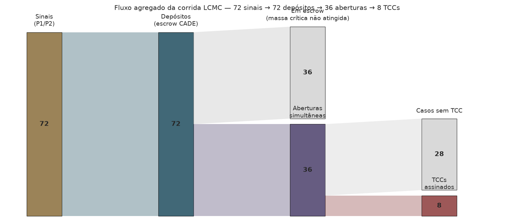
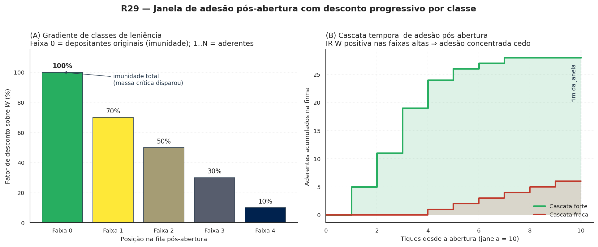

# O mecanismo, em três camadas

<p class="deck">Descrição do mecanismo da LCMC organizada do canal de recepção qualificada para o problema de coordenação que ele resolve, e por último para os instrumentos opcionais de internalização — o instrumento monetário <em>Whistleblower-as-a-Service</em> entre eles.</p>

<p class="byline"><em>Ato 2 de 5</em> · A hipótese · rascunho v0.2.0</p>

<p class="lede">Esta página é organizada de fora para dentro: do mecanismo de recepção qualificada (canal de depósito condicional) para o problema de coordenação que ele resolve, e por fim para os instrumentos incrementais que aumentam adesão sem serem essenciais. A ordem importa: parte da literatura interna do projeto leu, em versões anteriores, o WaaS como sinônimo da LCMC. Não é. O Ato 1 separou os dois conceitos; aqui formalizamos a distinção e detalhamos cada uma das cinco camadas.</p>

<span class="kicker">Camada 1 · Canal</span>
## O canal de depósito condicional

A **Leniência Condicionada à Massa Crítica** (LCMC) é um *information escrow* operado pelo CADE:

> 🔑 **Princípio LCMC — canal de depósito condicional.** O **CADE recebe denúncias com cláusula de abertura condicional**. O trabalhador deposita sua denúncia (texto livre + prova específica) com a condição: *"esta denúncia só é instaurada se houver ≥ `q_min · n_trab` outros depósitos compatíveis do mesmo setor/firma dentro de `Δt` tiques"*. Enquanto o gatilho não é atingido, **a denúncia fica em escrow**: a firma não é notificada, a denúncia não vira processo, a identidade do trabalhador não é revelada. Quando o gatilho é atingido, **todas as denúncias se abrem simultaneamente** — e ninguém foi o primeiro isoladamente.

O mecanismo resolve **diretamente** o problema clássico de Olson (1965): sub-iniciação ("ninguém quer ser o primeiro") é eliminada por construção. A denúncia individual nunca fica exposta sozinha — ou se acopla a outras e se abre coletivamente, ou permanece em escrow indefinidamente. Sem instrumento monetário, sem ressarcimento controverso, sem categoria dogmática nova: apenas **procedimento administrativo de recepção qualificada**, ancorado em Art. 4º II/III da Lei 12.529/2011 c/c Lei 9.784/99.

### Três paralelos para situar a ideia

Quem nunca leu Ayres-Unkovic (formalizadores da ideia em Yale Law School) encontra
**três paralelos** no cotidiano que descrevem a mesma estrutura:

- **Kickstarter**. No Kickstarter, o cartão de crédito do apoiador só é cobrado se
  o projeto atingir a meta de apoiadores; senão, ninguém paga e o projeto não começa.
  É o desenho *all-or-nothing*: ou todos cooperam e o projeto sai, ou ninguém é
  exposto financeiramente. A LCMC aplica o mesmo desenho à denúncia: a denúncia
  individual só "cobra" — vira processo — se outras forem depositadas; senão, nada
  acontece e ninguém aparece.
- **Callisto** ([callisto.org](https://www.callisto.org)). Plataforma americana, em
  operação desde 2015, onde estudantes universitárias registram denúncias de
  assédio. O nome de uma vítima só é revelado se **outra** vítima identificar o
  **mesmo** agressor — coincidência libera; isolamento mantém anonimato. É a prova
  prática de que o desenho funciona em produção, não só em paper.
- **Caixa-cofre operada por terceiro confiável.** Imagine envelopes com denúncias
  entregues a uma caixa-cofre operada por uma instituição neutra — no nosso caso,
  o CADE. Cada envelope vem com a instrução: "abra esta caixa apenas quando houver
  ao menos N envelopes parecidos contra a mesma empresa". A caixa pode esperar
  meses. Quando atinge N, **todos** os envelopes se abrem juntos. Ninguém foi o
  primeiro a se expor.

O nome acadêmico desse desenho é *information escrow* — depósito de informação sob
condição de abertura pré-acordada, com terceiro confiável como custodiante. A
formalização contemporânea está em Ayres & Unkovic (2012), *Information Escrows*,
*Michigan Law Review* vol. 111 p. 145; a aplicação ao antitruste brasileiro com o
CADE como custodiante é a contribuição deste projeto.

Em código, o canal é implementado em duas camadas. **R20 (`modo_corrida`)** registra firmas que atingiram massa crítica agregada — sem rastrear identidade individual do depositante. **R27 (`usar_escrow_explicito`)** carrega o escrow individual no `AutoridadeAgent`: cada sinal vira um depósito identificado, e a abertura simultânea colapsa N depósitos em um caso processual único. O parâmetro `janela_escrow_tiques` é o "Δt" da definição LCMC — quantos tiques um depósito permanece no escrow antes de expirar (default `0` = escrow eterno, leitura Callisto).

```python
# src/waas_antitrust/agents.py — AutoridadeAgent (R27)
class AutoridadeAgent(Agent):
    # ... self.escrow_denuncias: dict[int, list[dict]] = {}

    def depositar_condicional(self, id_empresa, id_trabalhador,
                              qualidade_prova, tique) -> None:
        """Trabalhador deposita denúncia condicional no escrow do CADE."""

    def expirar_depositos_condicionais(self, tique_atual, janela) -> int:
        """Remove depósitos com idade >= janela. janela <= 0 é no-op."""

    def abrir_escrow_se_massa_critica(self, id_empresa, q_min,
                                      n_trabalhadores_firma) -> bool:
        """Abertura simultânea quando massa crítica é atingida."""
```

O `WaaSModel.step()` ativa o caminho v3 via flag opt-in:

```python
# src/waas_antitrust/model.py — fase P2.5b (R27)
if self.usar_escrow_explicito:
    self.autoridade.expirar_depositos_condicionais(
        tique_atual=self.tique, janela=self.janela_escrow_tiques
    )
    for fid in self.trabalhadores_por_empresa:
        empresa = self.empresas[fid]
        self.autoridade.abrir_escrow_se_massa_critica(
            id_empresa=fid,
            q_min=self.q_min_cooperacao_interna,
            n_trabalhadores_firma=empresa.n_trabalhadores,
        )
```

As funções de canal são puras na lógica e idempotentes por tique. **Nada de pagamento entra na conta — o canal opera independentemente de qualquer instrumento monetário.** O cenário canônico `apenas_canal_sem_instrumento` testa exatamente essa propriedade: `W_mult=0`, `D_disc=0`, `usar_escrow_explicito=True`, Regime B.

<figure markdown>
  { .figura-empirica }
  <figcaption>
    Fluxo agregado da corrida LCMC sob <code>cenario_corrida_leniencia</code> com <code>usar_escrow_explicito=True</code> (10 firmas × 120 trabalhadores × 15 ciclos, seed=2026). 72 sinais viraram 36 depósitos condicionais; 7 firmas atingiram massa crítica intra-firma; 36 depósitos se abriram simultaneamente em casos qualificados; 8 firmas optaram pelo TCC com ressarcimento WaaS. A figura é evidência da Proposição 4 (R20) por construção do canal.
  </figcaption>
</figure>

<span class="kicker">Camada 2 · Coordenação</span>
## A coordenação que o canal resolve

O canal não cria cooperação onde não havia; **resolve o jogo de coordenação** que torna a cooperação racionalmente difícil. Olson (1965, *Logic of Collective Action*) mostrou que mesmo em grupos pequenos onde todos sairiam melhor cooperando, cada agente individual prefere esperar: ninguém quer ser o primeiro a arcar com o risco. Granovetter (1978) generalizou via limiares heterogêneos; Centola-Macy (2007) mostraram que contágio complexo exige reforço local.

O escrow muda a estrutura informacional do jogo. Sob canal de depósito condicional:

- O trabalhador **não escolhe entre "denunciar isolado" e "calar"**. Escolhe entre "depositar (com risco zero enquanto não houver coorrespondência)" e "calar".
- Como o depósito **não expõe nada** enquanto o gatilho não é atingido, o custo individual cai a praticamente zero (custo de redigir + depositar).
- Quando há coorrespondência, todos abrem simultaneamente — **a coordenação foi resolvida por agregação institucional**, não por confiança horizontal informal.

Esta diferença é radical em relação à formulação anterior do projeto, que dependia de capital social organizacional (Coleman 1990) sendo *internalizado* pelo regulador. Sob o canal correto, o regulador **não precisa** que o capital social pré-exista: a coordenação acontece via depósito paralelo no canal, sem necessidade de comunicação horizontal entre os depositantes.

R26 (erosão endógena Coleman) segue válido apenas como sub-caso — se o CADE publica taxas agregadas de depósito no canal, pode haver leak parcial que afeta a comunicação informal subsequente. Mas o **caso geral é independente** desse risco.

<figure markdown>
{ .figura-conceitual }
<figcaption>Heurística do jogo global (Morris-Shin 1998). Probabilidade de cascata cooperativa em função do ruído e da massa crítica relativa; as três zonas marcadas correspondem aos regimes A, B e C.</figcaption>
</figure>

### A peça empírica: gradiente Saito (2021)

Quando há recompensa (instrumento monetário ativo, **incremental ao canal**), a LCMC distribui o atenuante por posição na fila usando o **gradiente empírico Saito**, extraído de 349 TCCs CADE 2012-2019:

| Posição na fila inter-firma | Desconto $D_{\text{Saito}}$ |
|---|---|
| 1ª | 43,43% |
| 2ª | 34,51% |
| 3ª | 20,22% |
| 4ª | 17,99% |
| 5ª | 16,77% |
| ≥ 9ª | 15,00% (piso Tribunal) |

O mesmo gradiente, normalizado por $D_{\text{Saito}}(1) = 43{,}43\%$, calibra a fila intra-firma sob `modo_corrida=True` — quem coopera em posição 1 dentro da firma recebe 100% da recompensa; em posição 2, 79,5%; em posição 3, 46,6%. A escolha *não é arbitrária*: o mesmo dado empírico do CADE calibra duas escalas.

<span class="kicker">Camada 3 · Incrementos</span>
## Os cinco instrumentos incrementais

A LCMC funciona **sem nenhum** dos instrumentos abaixo — o canal sozinho resolve a coordenação. Os instrumentos aumentam a *probabilidade de adesão* ao canal, oferecendo benefício ao depositante. Cada um tem reserva constitucional distinta e pode ser adotado isoladamente ou em combinação.

Sob a LCMC, o **substrato cooperativo** é o que importa. Mas a cooperação custa caro para cada trabalhador individualmente — risco de represália, custo legal, desvio da carreira. Cinco instrumentos podem compensar esse custo (cada um com reserva constitucional diferente):

| Instrumento | Direção do pagamento | Reserva constitucional · regime |
|---|---|---|
| 💰 **WaaS — recompensa via TCC** | Firma → trabalhador; pagamento entra como atenuante. Aplicação direta da IC-F\* (Camada 3) | Art. 22 I; regime B ou C |
| 🚪 **Hirschman — vesting acelerado** | Firma → trabalhador via equity; cláusula contratual padrão; ameaça crível de êxodo coletivo dissuade em P0 e amplia IC-F\* em P3 | Art. 22 I; regime Cₜ |
| 🧾 **Crédito tributário** | Estado → trabalhador via renúncia fiscal; análogo limitado ao IRS Whistleblower (26 U.S.C. §7623) | LC + LRF; regime Cᵩ (R22 stub) |
| ⚖️ **Leniência criminal individual** | Estado → trabalhador via imunidade penal; não-persecução do partícipe cooperador | Art. 5º XXXIX penal estrita; regime Cₚ (R23 stub) |
| 🤝 **Nenhum pagamento — só reconhecimento** | LCMC pura. Substrato cooperativo internalizado por dever de ofício (boa fé Lei 9.784/99) sem instrumento monetário | Cenários canônicos: `apenas_massa_critica_observavel` (sinal sem canal, Regime A) e `apenas_canal_sem_instrumento` (canal explícito CADE sem pagamento, Regime B + `usar_escrow_explicito=True`) |

O catálogo declarativo das **5 entradas** — o canal base (sem pagamento) + os 4 instrumentos monetários — está em `src/waas_antitrust/instrumentos.py`:

```python
from waas_antitrust.instrumentos import INSTRUMENTOS, instrumentos_por_regime

# Quais entradas cabem em cada regime?
for nome in ("A", "B", "C", "Cᵩ", "Cₚ"):
    disponiveis = instrumentos_por_regime(nome)
    print(f"  Regime {nome:3s}: {[i.nome for i in disponiveis]}")
# A : []
# B : ['canal_deposito_condicional', 'recompensa_tcc_waas']
# C : ['canal_deposito_condicional', 'recompensa_tcc_waas',
#       'vesting_acelerado_hirschman']
# Cᵩ: + 'credito_tributario_denunciante'
# Cₚ: + 'leniencia_criminal_individual'
```

<span class="kicker">Camada 4 · Aritmética</span>
## A IC-F\* sob instrumento WaaS

> **Quando esta camada se aplica.** A próxima seção é específica do
> **instrumento WaaS** — o único que envolve a firma pagando o trabalhador
> diretamente, *depois* que o canal abriu e o procedimento foi instaurado.
> Para os outros instrumentos, a aritmética é diferente (Hirschman tem
> `custo_exodo_esperado` em vez de `W`, por exemplo). Para a configuração
> "canal sem instrumento", esta camada **não se aplica**.

A pergunta natural, e a primeira que aparece quando alguém ouve o WaaS pela primeira vez, é uma versão mais educada de **"você é ingênuo?"**:

> Basta a empresa se recusar a pagar os denunciantes e ainda assim pegar o desconto para tudo ruir, não?

A resposta está nas três subseções que seguem: **4.1 a escolha em prosa; 4.2 a fórmula da IC-F\*; 4.3 um exemplo numérico em R$ 1 bi de receita.** Com três pontos (sub-§ 4.4-4.6) onde o argumento pode quebrar.

### 4.1 A escolha da firma, em uma frase

A firma já foi denunciada — o gatilho de massa crítica disparou, o caso vai ao CADE. A partir daí, ela escolhe entre três caminhos. Em todos eles, paga **alguma coisa**; a diferença é a soma.

1. **Assinar um TCC com ressarcimento WaaS** — paga a recompensa $W$ aos denunciantes e ganha o desconto cheio $D_{\text{total}}$ no acordo.
2. **Assinar um TCC clássico** — não paga $W$, mas obtém apenas o desconto comum $D_{\text{base}}$ que o Art. 85 da Lei 12.529/2011 já oferece em qualquer TCC.
3. **Não assinar nada** — enfrenta a sanção cheia $S$, com a probabilidade de condenação que a investigação produz.

A diferença entre os dois primeiros — entre o TCC-WaaS e o TCC clássico — é a peça que sustenta o argumento. Não é o desconto **total** $D_{\text{total}}$ que move a firma a pagar a recompensa; é o **incremento** que o canal WaaS oferece sobre o que a firma teria de qualquer jeito.

<div class="pull-quote" markdown>
A firma paga os denunciantes não porque ganha um desconto. Paga porque ganha um desconto <strong>maior</strong> do que conseguiria sem isso — e maior o suficiente para cobrir a recompensa, com folga.
</div>

### 4.2 A IC-F\*, em prosa antes da fórmula

A condição que define quando a firma escolhe pagar tem nome em economia institucional: **incentive compatibility da firma** — escrita aqui como **IC-F\***. Em prosa direta:

> A firma paga a recompensa $W$ se, e somente se, o **incremento** de desconto que o canal WaaS oferece for maior que a recompensa.

Em fórmula, com $S$ sendo a sanção esperada e $D_{\text{base}}$ o desconto que o TCC clássico já garante:

$$
W < D_{\text{extra}} \quad \text{onde} \quad D_{\text{extra}} = D_{\text{total}} - D_{\text{base}} = (D_{\text{disc}} - D_{\text{disc, base}}) \cdot S
$$

A versão simplificada $W < D_{\text{total}}$ — usada nos artigos teóricos de leniência clássica — só funciona se assumirmos $D_{\text{base}} = 0$. Quando o TCC clássico **já** dá desconto, ignorar isso é overclaim. O modelo computacional incorpora a forma correta (parâmetro `D_disc_base_tcc` em `WaaSParametros`).

#### A IC-F\* no código

A função que decide se a firma paga está em `model.py` (Phase P3). Em pseudocódigo (omitindo a camada Hirschman e a corrida LCMC):

```python
# src/waas_antitrust/model.py — fase P3, decisão da firma sob instrumento WaaS
S = sancao_esperada(empresa)                       # sanção cheia (R$)
D_total = self.params.D_disc * S                   # desconto TCC-WaaS
D_base = self.params.D_disc_base_tcc * S           # desconto TCC clássico (Art. 85)
D_extra = max(0.0, D_total - D_base)               # incremento que o WaaS oferece

W_total = sum(self._W_esperado(t.w_a) for t in disparados)  # recompensa total

# IC-F* simplificada (default; modo histórico):
empresa.pagou_denunciantes = D_extra > W_total

# IC-F* ampliada por Hirschman (R07):
custo_exodo = hirschman.custo_exodo_esperado(...)
empresa.pagou_denunciantes = (D_extra + custo_exodo) > W_total
```

Sob `modo_corrida=True` (LCMC + WaaS), a fórmula muda — $D_{\text{total}}$ deixa de ser constante e passa a depender da posição da firma na fila inter-firma:

```python
# src/waas_antitrust/model.py — fase P3 sob modo_corrida
from waas_antitrust.corrida import decaimento_D, decaimento_W

pos_firma = empresa.posicao_fila_leniencia
d_frac = decaimento_D(pos_firma, perfil="saito")  # 1ª=0,4343; 2ª=0,3451; ...
D_total = d_frac * S

W_total = sum(decaimento_W(t.posicao_corrida_interna, W_base, "saito")
              for t in disparados)
```

A diferença entre o caminho histórico e o caminho LCMC fica explícita: no histórico, todo trabalhador recebe `W_base`; sob LCMC, a recompensa decai com a posição na fila intra-firma, e o desconto da firma decai com a posição inter-firma. **Duas filas, um gradiente empírico**.

### 4.3 Uma firma, R$ 1 bilhão de receita, 30 minutos com a calculadora

Aritmética é o tipo de coisa que parece dura até virar familiar. Aqui está com nomes em reais.

Imagine uma firma com receita afetada $R = \text{R\$}\,1$ bilhão e severidade da conduta $\sigma = 0{,}5$ (no meio da escala). O CADE pratica multas-base na faixa de 0,1% a 20% da receita; usamos 5% como referência conservadora, e escalamos por $(1+\sigma)$:

$$
S = 0{,}05 \cdot R \cdot (1 + \sigma) = 0{,}05 \cdot 1\,000 \cdot 1{,}5 = \text{R\$}\,75\text{ milhões}.
$$

O desconto total a que ela teria direito num TCC com ressarcimento WaaS é, digamos, 30% — alinhado com o que o Art. 12 permite combinando com o Art. 85:

$$
D_{\text{total}} = 0{,}30 \cdot S = \text{R\$}\,22{,}5\text{ milhões}.
$$

O desconto que ela teria **mesmo sem WaaS**, só com o TCC clássico, é o que precisamos calibrar contra os dados de Saito (2021). Para este exemplo, usamos uma estimativa intermediária — 10%:

$$
D_{\text{base}} = 0{,}10 \cdot S = \text{R\$}\,7{,}5\text{ milhões}.
$$

<div class="numero-callout" markdown>
<span class="valor">R$ 15 milhões</span>
<span class="legenda">O incremento $D_{\text{extra}}$ — exatamente quanto a firma ganha **a mais** ao escolher o caminho WaaS em vez do TCC clássico. É contra este número, não contra os R$ 22,5 milhões totais, que a recompensa total $W$ tem de ser menor para a firma pagar.</span>
</div>

Agora o outro lado. Suponha que 10 denunciantes internos atingiram a massa crítica. Cada um receberia uma recompensa de 1,5 salários anuais — calibrada para satisfazer a participação do trabalhador (IR-W), inclusive cobrindo o custo legal individual. Com $w_a = \text{R\$}\,180\,000$ e $W_{\text{indiv}} = 1{,}5 \cdot w_a$:

$$
W = 10 \cdot 1{,}5 \cdot 180\,000 = \text{R\$}\,2{,}7\text{ milhões}.
$$

A IC-F\* fica satisfeita com folga ampla:

<div class="numero-callout" markdown>
<span class="valor">R$ 12,3 milhões</span>
<span class="legenda">A margem que sobra na conta da firma quando ela escolhe o caminho WaaS. É o **preço** que o mecanismo extrai do bolso da empresa investigada e devolve ao bolso dos trabalhadores que falaram — uma transferência privada com efeito de prevenção pública.</span>
</div>

Tudo isso depende, evidentemente, de quanto $D_{\text{base}}$ realmente é na prática do CADE. Quando esse número aproxima-se de $D_{\text{total}}$, a margem encolhe. Quando ultrapassa, o mecanismo **deixa de funcionar** — e este é o primeiro dos três vetores que cobrimos a seguir.

<figure markdown>
{ .figura-conceitual }
<figcaption>Inversão da função-utilidade da firma sob o instrumento WaaS. Painel A — ganho líquido com e sem o TCC com ressarcimento. Painel B — margem $D_{\text{extra}} - W$ em função da fatia de mercado, com o ponto-alvo $W = 1{,}5 \cdot w_a$ e $D = 30\%$ da sanção base assinalado.</figcaption>
</figure>

### 4.4 Os três vetores de quebra — onde o argumento pode mesmo ruir

#### Vetor A: e se o TCC clássico já der desconto suficiente?

Este é o cético que diz "basta a empresa não pagar e pegar o desconto". A versão tecnicamente correta da crítica é: se $D_{\text{base}}$ já cobre uma fração significativa de $D_{\text{total}}$, a margem $D_{\text{extra}}$ encolhe e a IC-F\* deixa de motivar o pagamento.

O **desenho jurídico** se sustenta porque o Art. 12 da Res. 21/2018 é explícito ao tratar o ressarcimento das vítimas como **acréscimo** ao desconto genérico. A magnitude desse acréscimo é discricionária — depende da prática do CADE em cada caso. A calibração empírica desse parâmetro é precisamente o que falta em **R03** (calibração formal contra Saito 2021).

O **modelo** torna isto explícito: o parâmetro `D_disc_base_tcc` em `WaaSParametros` permite simular qualquer valor de $D_{\text{base}}$, inclusive o pior caso em que $D_{\text{base}} = D_{\text{total}}$. Quando isso acontece, $D_{\text{extra}} = 0$, ninguém paga a recompensa, e o contador `n_firmas_optaram_tcc_classico` registra a quebra. Testes em `tests/test_vetores_quebra.py` cobrem o caso direcionalmente.

#### Vetor B: e se o Judiciário anular o TCC?

A re-caracterização da recompensa como "ressarcimento das vítimas" é uma construção jurídico-finalística. O Judiciário pode rejeitá-la — e a recusa pode vir anos depois do TCC ter sido assinado, **anulando-o retroativamente**. Quando isso acontece, a empresa perde o desconto e a multa cheia retorna como crédito ao erário.

Este é precisamente o **falsificador F6** declarado no desenho. A defesa institucional contra ele é dupla. Em primeiro lugar, o Regime C — extensão da Lei 13.608/2018 via Congresso — elimina a controvérsia legal, custando voto político. Em segundo, mesmo em Regime B, o risco de anulação é uma propriedade do desenho que precisa ser dimensionada, não escondida.

O **modelo** torna esse risco calibrável via `p_anulacao_tcc`. Em P4, todo TCC assinado é sorteado contra essa probabilidade; quando anulado, o contador `n_tcc_anulados` registra, a multa cheia volta ao erário, e o sistema perde a coordenação que o mecanismo construía. Em testes, $p_{\text{anulação}}$ alta faz o Regime B convergir para o Regime A — um falsificador quantitativo, não verbal.

#### Vetor C: e os advogados dos denunciantes?

Esta é uma crítica que custumeiramente passa em branco e merece resposta direta. **Sim**, o denunciante terá custos legais: advogado para reivindicar a recompensa, defesa em eventual ação trabalhista por represália, e — em hipótese pior — defesa criminal se for caracterizado como **partícipe** da conduta (a colisão dura com o Art. 86 da Lei 12.529/2011, território de leniência clássica).

Três cenários institucionais são possíveis, e implicam calibrações diferentes:

1. **O denunciante paga.** Eleva o piso da IR-W — a recompensa precisa ser maior para compensar. Estimativas conservadoras no Brasil colocariam o custo legal entre **10% e 50% de um salário anual**.
2. **A empresa cobre via TCC.** Análogo ao programa Dodd-Frank §922 da SEC americana, em que o pagamento bruto pode incluir margem para honorários do advogado do denunciante. Requer cláusula explícita na proposta de TCC e aprovação do CADE.
3. **O Estado financia via fundo.** Análogo ao IRS Whistleblower Office. Exige lei (Regime C) e dotação orçamentária — politicamente custoso, mas estruturalmente robusto.

O **modelo** torna isto calibrável via `custo_legal_uw` (em unidades de $w_a$). O parâmetro entra na IR-W do arquétipo "racional" — quando o custo legal é alto, a recompensa $W$ precisa subir para o trabalhador racional ainda denunciar.

## O break-even ético coletivo (R16)

Até aqui o argumento foi inteiramente financeiro — IC-F\* da firma, IR-W
do trabalhador, contas em reais. Mas há uma intuição forte que a versão
puramente racional não captura: **a partir de uma certa massa crítica,
algo muda na lógica individual**. O trabalhador que vê dez colegas falando
não decide pelo mesmo cálculo de quem está sozinho.

O modelo agora incorpora isso explicitamente, baseado em **Torsell (2026,
*Theory and Decision*)** e na teoria de inequity aversion de **Fehr &
Schmidt (1999)**. Um quinto arquétipo — `"fairminded"` — entra ao lado dos
quatro de Hokamp-Pickhardt (ético, imitativo, racional, aleatório). O FM
agente computa o payoff racional clássico **e** adiciona um prêmio ético
proporcional à fração de pares já sinalizando:

$$
\text{ganho}_{\text{FM}} = W_{\text{efetivo}} + \alpha \cdot \phi_{\text{vizinhos}} \cdot w_a - \text{custos}
$$

onde $\phi_{\text{vizinhos}}$ é a fração de vizinhos da rede intra-firma
que sinalizaram no tique anterior, e $\alpha$ é o peso da inequity
aversion (parâmetro `peso_inequity_aversion`).

**A consequência emergente é o break-even ético**: enquanto $\phi$ é
baixa, FM se comporta como racional puro; quando $\phi$ ultrapassa um
limiar tácito, o prêmio ético inverte o sinal da decisão — calar passa a
ser desigualdade moral mais custosa do que falar. Não é hardcoded; é
propriedade emergente do mesmo agente Fehr-Schmidt que a literatura usa
em jogos de barganha.

O resultado central de Torsell (2026) — que FM **proliferaria** em
populações HE+FM sob qualquer dinâmica payoff-monotone, com aprendizado
intra-geracional via *fictitious play* — sugere que o canal ético não é
uma curiosidade marginal; pode ser **a peça dominante** quando a massa
crítica se forma. Modelar isto endogenamente é o trabalho de R16, e o
catálogo de [cenários normativos](#) (R17) já oferece presets que ativam
o canal.

<span class="kicker">Camada 5 · Cascata</span>
## Janela de adesão pós-abertura com desconto progressivo (R29)

A LCMC clássica resolve o problema de quem dá o primeiro passo: ninguém é o primeiro, porque o canal espera todos. Mas quando a massa crítica é atingida e o bloco se abre, sobra ainda **uma decisão aberta para o resto dos trabalhadores da firma**: o que fazer com quem viu a conduta mas não depositou a tempo? A regra R29 oferece a esses retardatários **uma janela de dez tiques para aderir à classe dos lenientes** com desconto decrescente por ordem de chegada — uma versão pós-coordenação da fila clássica do Art. 86 da Lei nº 12.529/2011.

A lógica é direta. No instante da abertura, os depositantes originais — aqueles que dispararam a massa crítica — ficam na **faixa 0**: imunidade total. Pelos próximos `janela_adesao_pos_abertura` tiques (default 10), trabalhadores da mesma firma que ainda não cooperaram podem aderir: o primeiro entra na faixa 1, o segundo na faixa 2, e assim por diante. Cada faixa tem um fator de desconto sobre a recompensa `W`, descrito pela tupla `descontos_faixas_adesao` (default `(1.0, 0.7, 0.5, 0.3, 0.1)`). Quem aderiu na posição 0 (junto com os originais) recebe 100% de `W`; quem aderiu em quinta posição em diante recebe 10% — o piso. Quem não aderiu até o fim da janela permanece no escrow comum e está sujeito à expiração R27-ii.



Em prosa: a R29 transforma a abertura do bloco em **evento Schelling reverso**. No instante zero, a firma já sabe que vai ser notificada — não há mais dúvida sobre o gatilho. Mas para cada trabalhador que tinha hesitado, agora há uma escolha clara: aderir já (e levar desconto alto) ou esperar (e ver o desconto cair tique a tique). É o mesmo dispositivo da fila clássica de leniência operado **dentro da firma já aberta**, sem precisar de outro cartel para servir de gatilho.

O efeito jogo-teórico é dois: (i) a janela aumenta a captação de prova — mais trabalhadores cooperam, qualidade média da prova sobe; (ii) cria pressão antecipatória sobre quem está pensando em depositar para o canal em primeiro lugar. Mesmo quem prefere "esperar para ver" tem incentivo para depositar antes da abertura, porque saber-se na faixa 0 vale mais do que apostar em entrar na faixa 1 depois.

Em código, a regra é uma fase nova P2.5c entre a abertura do escrow e a decisão da firma (P3). Sob `janela_adesao_pos_abertura = 0` (default), a fase é no-op e o modelo se comporta exatamente como antes — compat estrita.

```python
# src/waas_antitrust/model.py — fase P2.5c
if self.usar_escrow_explicito and self.janela_adesao_pos_abertura > 0:
    self.autoridade.processar_adesao_pos_abertura(
        tique_atual=self.tique,
        janela=self.janela_adesao_pos_abertura,
        descontos=self.descontos_faixas_adesao,
        trabalhadores_por_empresa=self.trabalhadores_por_empresa,
        W_max=self._W_esperado(1.0),
        custo_represalia=self.r_represalia,
    )
```

A decisão individual de aderir é a IR-W projetada para a faixa: o trabalhador entra se `fator_desconto[k] × W_max > custo_represalia × w_a`. Como o fator decai, há uma posição $k^*$ a partir da qual ninguém adere mais — corte endógeno do que originalmente seria uma cauda infinita. Os reporters `n_aderentes_pos_abertura_acum` e `n_blocos_em_janela_adesao_acum` ficam expostos no `DataFrame` resultado, como qualquer outro estado do modelo. O cenário canônico `cascata_adesao_progressiva` ativa a regra com a parametrização default; o caderno [Brincar in-browser](brincar.md) tem o slider "Janela de adesão R29" para ajustar o $\Delta t$ ao vivo.

## A corrida que faltava (R20)

A leniência clássica funciona porque cria uma **corrida temporal** entre cúmplices: quem entrega primeiro escapa da multa, e cada conspirador, sabendo disso, antecipa-se ao outro. O **WaaS na sua forma original não tinha esta corrida**: o gatilho de massa crítica era binário (`k` denunciantes ⇒ a firma é notificada), o desconto da firma era constante na IC-F\*, a recompensa do trabalhador era constante na IR-W. A delação era um *ato*, não uma *corrida*.

Sob o moat dos mercados digitais, a corrida clássica entre firmas **não tem onde acontecer** — a conduta é unilateral, sem cúmplice externo. A única corrida possível é **intra-firma**: entre os funcionários que viram a conduta. A LCMC institucionaliza isso e acopla a uma segunda corrida — **inter-firma** — calibrando ambas pelo mesmo gradiente Saito.

### Corrida intra-firma (entre trabalhadores)

Dentro de cada firma, cada cooperador entra em uma `FilaInternaCooperacao` na ordem em que sinaliza. A recompensa decai com a posição $k$:

$$
W_i(k) = W_\text{base} \cdot f_W(k) \quad \text{onde} \quad f_W(k) = \frac{D_\text{Saito}(k)}{D_\text{Saito}(1)}
$$

Numericamente:

| Posição $k$ | $D_\text{Saito}(k)$ | $f_W(k)$ |
|---|---|---|
| 1ª | 43,43% | 1,000 |
| 2ª | 34,51% | 0,795 |
| 3ª | 20,22% | 0,466 |
| 4ª | 17,99% | 0,414 |
| ≥ 9ª | 15,00% (piso Tribunal/CADE) | 0,345 |

A consequência: o trabalhador racional que **espera** ver vários colegas falarem antes de falar recebe fração pequena da recompensa. Quem fala primeiro recebe o cheque cheio. A IR-W deixa de ser um limiar absoluto e vira um *jogo de ordem* — exatamente o que torna a corrida estável em leniência clássica, transposto para o microcosmo intra-firma.

### Corrida inter-firma (entre firmas)

A primeira firma a satisfazer o gatilho de **massa crítica interna** ($n_\text{cooperadores} \ge q_\text{min} \cdot n_\text{trabalhadores}$, com $q_\text{min}$ default $= 10\%$, calibrável por conduta via `N_ATORES_PRIMARIOS_NECESSARIOS`) entra na `FilaLeniencia` global em posição 1. A segunda em posição 2. E assim por diante.

A IC-F\* deixa de comparar $W$ contra $D_\text{extra}$ constante e passa a comparar contra:

$$
D_\text{total}(\text{pos}_\text{firma}) = D_\text{Saito}(\text{pos}_\text{firma}) \cdot S
$$

Para a 1ª firma, $D_\text{total}(1) \approx 43\% \cdot S$ — IC-F\* generosa, satisfeita com folga ampla. Para a 4ª, $D_\text{total}(4) \approx 18\% \cdot S$ — a margem encolhe. Para a ≥ 9ª (ou nenhuma cooperação interna), cai ao piso de 15% e a margem pode inverter.

### Consequência teórica: Proposição 1 ganha número de firmas

A Proposição 1 original ("existem parâmetros em que IC-F\* é satisfeita") se transforma:

> **Prop. 1 (LCMC).** Sob os parâmetros do ponto-alvo, **existe número finito $n^\star$ de firmas** que satisfazem a IC-F\* na fila inter-firma. Firmas que chegam em posição $> n^\star$ não cobrem $W$ com $D_\text{total}(\text{pos})$.

Esta versão é mais forte: não diz só que "existe equilíbrio cooperativo", diz **quantas firmas correm**. A corrida ganha precisão.

### Dois canais de feedback acoplam as corridas

A acoplagem entre corrida intra-firma e inter-firma se dá por dois canais:

1. **`p_perc` global** — quando uma firma atinge massa crítica e é notificada, a percepção de detecção em todas as outras firmas sobe (canal Schelling, choque `caso_paradigmatico` endogenizado). A trabalhadora em outra firma recalcula sua expectativa de posição final.
2. **`W` esperado individual** — trabalhadores observando a corrida em curso (`phi_vizinhos` estendido para vizinhos inter-firma) ajustam expectativa de posição final na fila. Quem chega tarde sabe que recebe menos.

A janela temporal `janela_temporal_tiques` (default 4) limita quanto tempo a firma tem para fechar o gatilho. Se nenhuma firma atinge $q_\text{min}$ na janela, todas perdem o benefício LCMC e recaem em TCC clássico — o **Vetor D (corrida vazia)** documentado em `tests/test_vetores_quebra.py`.

### Saito como ancoragem normativa

A escolha do gradiente $f_W$ não é arbitrária do autor — é o mesmo dado empírico que o CADE já usa para a fila clássica entre conspiradores. Reusá-lo para a fila intra-firma é a **tese substantiva da LCMC**: o microcosmo interno deve replicar a lógica de fila que o macrocosmo (CADE) já pratica.

O caveat declarado em `corrida.py`: Saito reporta médias por **cartel**, não por conduta unilateral. A transposição é proxy, justificada como ponto de partida calibrável, não como verdade empírica fechada. O CADE ainda não publica TCCs de conduta unilateral decompostos por posição (pendência E04 + R03b).

## Cenários normativos como variantes paramétricas (R17)

Uma das primeiras objeções honestas a um modelo deste tipo é "**e se
mudar a lei?**". A resposta tradicional — escrever um parágrafo no paper
descrevendo a alteração — não é boa o suficiente. A versão deste projeto
trata cada alteração normativa como um **cenário comparável**: um conjunto
nomeado de sobrescritas de parâmetros, executável e reportável.

O catálogo (módulo `waas_antitrust.cenarios`) contém **26 cenários
canônicos**. A tabela abaixo lista os 9 que cobrem a malha institucional
brasileira inicial; os outros 10 (reframe v2, generalidade EUA/UE,
canal puro, erosão Coleman) estão em [`modelo_abm.md`](modelo_abm.md) §5.

| Cenário | Hipótese institucional |
|---|---|
| `status_quo` | Brasil hoje — sem canal de incentivo individual. |
| `resolucao_pura` | Regime B — Art. 12 da Res. 21/2018; F6 calibrado em 10%. |
| `resolucao_mais_portaria_mte` | Regime B + portaria MTE com proteção trabalhista reforçada — `r_represalia` cai a 8%, `custo_legal` a 15%. |
| `lei_waas_pura` | Regime C — Lei 13.608/2018 estendida; F6 = 0. |
| `lei_waas_com_fundo_honorarios` | Regime C + fundo público para honorários (análogo IRS Whistleblower Office). |
| `lei_waas_com_vesting_padrao` | Regime C + cláusula padrão de vesting acelerado (Hirschman R07 universal); haircut IRPF+INSS realista. |
| `mercado_digital_br_pareto` | Regime C com fatia de mercado distribuída em Pareto (α=1,16) — reflete moat de plataformas dominantes (iFood, Mercado Livre, Apple/Google). |
| `cenario_sancao_dura` | Regime C + multa por descumprimento de TCC = 2× sanção base (R18). |
| **`cenario_corrida_leniencia`** | **LCMC plena** — Regime C + `modo_corrida=True` + `q_min=10%` + janela 4 tiques + decaimento Saito. Ativa as duas corridas acopladas (intra-firma + inter-firma) descritas em "A corrida que faltava". |
| **`apenas_canal_sem_instrumento`** | **Canal puro (R27-i)** — Regime B + `usar_escrow_explicito=True` + `W_mult=0` + `D_disc=0`. Isola o canal: testa se sozinho carrega o mecanismo. |
| **`erosao_coleman_adversarial`** | **Falsificação R26** — `resolucao_pura` + `alpha_erosao=0.5`. Operacionaliza a Proposição 5 candidata (instrumentalizar denúncia destrói o substrato cooperativo). |

Cada cenário roda como uma chamada de função:

```python
from waas_antitrust import cenarios
from waas_antitrust.model import WaaSModel, WaaSParametros

base = WaaSParametros(n_empresas=20, n_tiques=40, seed=42)
for nome in cenarios.listar_cenarios():
    params = cenarios.aplicar_cenario(base, nome)
    df = WaaSModel(params).executar()
    print(nome, df["dano_acumulado"].max())
```

Comparar regimes vira **trabalho computacional reprodutível**, não
exercício retórico.

## Os outros três incentivos compatíveis

Além da IC-F\* da firma, o desenho precisa satisfazer simultaneamente:

| Sigla | Quem | Condição | Onde no modelo |
|---|---|---|---|
| **IR-W** | trabalhador | $W \ge \text{custo esperado de represália} + \text{custo legal}$ | `agents.py::decidir_sinal` (arquétipo racional) |
| **IC-T** | trabalhador | $W$ deve compensar penalidade por falso reporte | `agents.py` (mesma função, parcela $F_{\text{falso}}$) |
| **IC-F\*** | firma | $W < D_{\text{extra}}$ (vide acima) | `model.py` (P3) |

A camada **Hirschman exit-with-equity** (R07) acrescenta um quarto incentivo opcional, válido apenas sob Regime C: cláusulas contratuais de vesting acelerado por gatilho de ação coletiva. Quando ativas, ampliam a IC-F\* para $W < D_{\text{extra}} + \text{custo de êxodo coletivo}$ — a firma também ganha por **não perder capital humano**, e isso ajuda a fechar o cálculo em casos marginais.

Sob LCMC (R20, `modo_corrida=True`), as quatro condições ICs ganham dimensão de posição na fila — a IR-W vira $W_\text{base} \cdot f_W(k) \ge \text{custos}$ (decrescente com a ordem de cooperação intra-firma) e a IC-F\* vira $W_\text{total} < D_\text{Saito}(\text{pos}_\text{firma}) \cdot S$ (decrescente com a ordem de chegada inter-firma). É a mesma estrutura econômica; a corrida apenas torna explícito o gradiente.

## O que ainda pode ruir mesmo assim

Há pendências que o modelo, sozinho, não resolve. Estão rastreadas em [Decisões e backlog](DECISIONS.md), e a lista curta é:

- **R03** — calibração formal contra Saito (2021), DEE/CADE (2022, 2024), Wiedman & Zhu (2023, Dodd-Frank §922). Em particular, $D_{\text{base}}$ precisa de mediana empírica brasileira.
- **R09** — endogeneizar $g_i(t)$ (atratividade de violar como função do estado). Hoje é sorteio uniforme estático.
- **R10** — IC-F\* completa $W + p_{\text{pago}} \cdot (S - D) < p_{\text{não pago}} \cdot S$, em vez da forma simplificada.
- **R13** — distribuição Pareto/lognormal de fatia de mercado (hoje uniforme; em digital, o dano é cauda longa).

A página de [Limitações](limitacoes.md) sintetiza isso em linguagem acessível; a [Crítica x10](critica_x10.md) detalha o que oito revisores externos apontaram.

<div class="ato-fim" markdown>
**Fim do Ato 2.** Temos um desenho — com fórmula, exemplo numérico e três vetores de quebra calibráveis. Mas até aqui é tudo papel e equação. **Será que funciona em simulação?** O Ato 3 mostra o que acontece quando rodamos o modelo nos três regimes, em 20 firmas, ao longo de 40 trimestres.

[Ato 3: Resultados →](resultados.md)
</div>
