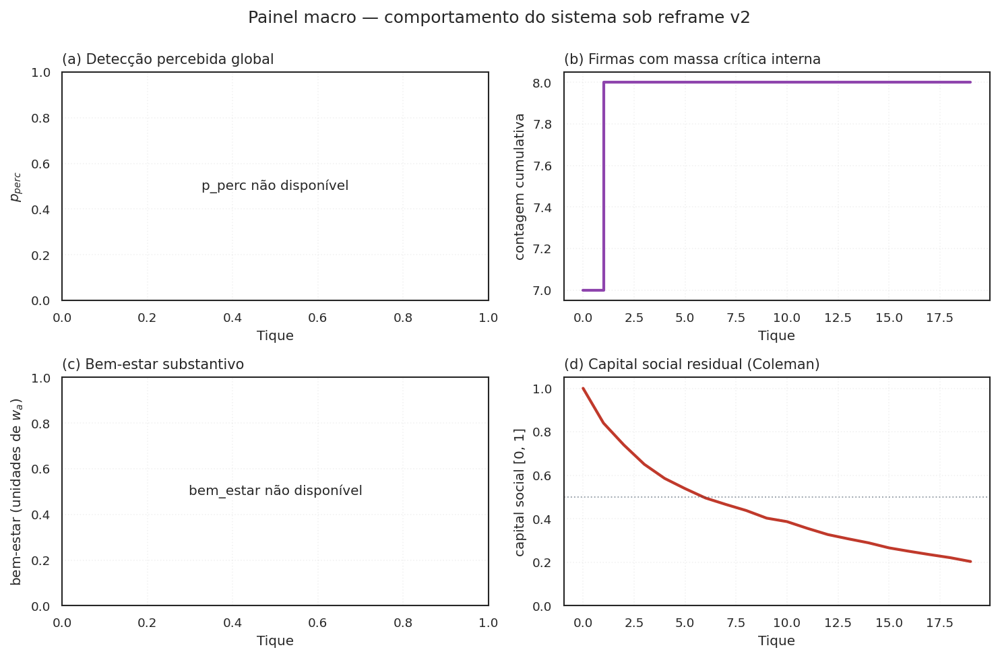
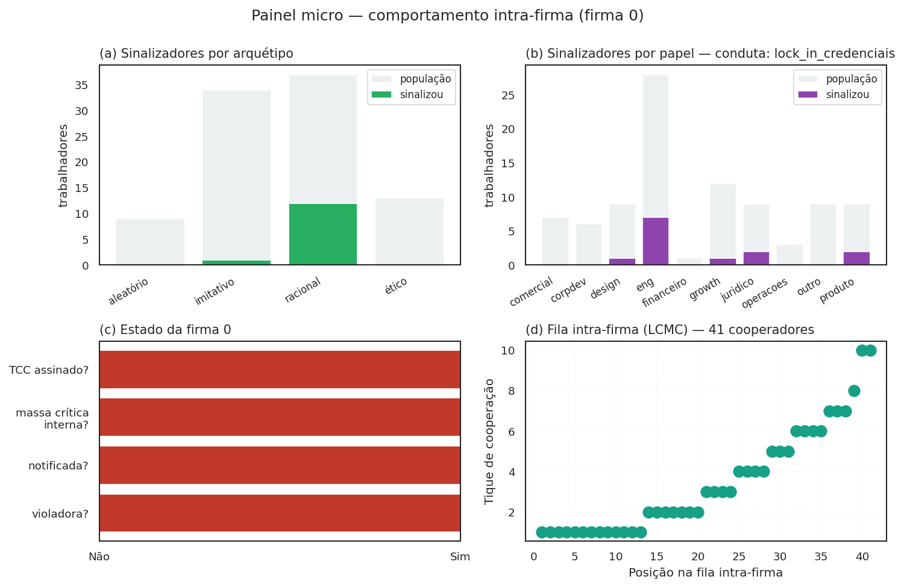

# Modelagem multiagente

Esta página consolida, em um único lugar, **como o modelo é composto agente
a agente**: classes, estados, decisões, microfundamentos, acoplamentos. É
complemento técnico ao [Ato 2 (mecanismo)](mecanismo.md) e ao
[protocolo ODD](ODD.md) — aqui o foco está na *arquitetura computacional*
da simulação, não na intuição econômica nem na descrição padrão JASSS.

A simulação roda em **Mesa 3.x**, com três classes de agente, uma rede
intra-firma em **NetworkX** (Watts-Strogatz pequeno-mundo) e topologia
inter-firma implícita (acoplamento por `p_perc` global). Tudo opt-in
pode ser ligado/desligado por flag em `WaaSParametros` — backward compat é
invariante de projeto.

## As três classes canônicas de agente

| Classe | Cardinalidade típica | Decisão central | Arquivo |
|---|---|---|---|
| `TrabalhadorAgent` | $N_\text{empresas} \times \overline{n}_\text{firm}$ (centenas a milhares) | sinalizar ou calar | `src/waas_antitrust/agents.py:24` |
| `EmpresaAgent` | $N_\text{empresas}$ (dezenas) | pagar recompensa ou não | `src/waas_antitrust/agents.py:206` |
| `AutoridadeAgent` | 1 (CADE) | aceitar caso (capacidade κ, acurácia ρ) | `src/waas_antitrust/agents.py:273` |

A escolha de manter três classes — não cinco, não duas — é deliberada e
documentada em `docs/ODD.md` §1.2. Outros papéis institucionais (VC
investidor, advogado, Tribunal CADE) ficam capturados como **parâmetros**
ou **canais financeiros**, não como agentes próprios — ver §"O que **não**
é agente, e por quê" abaixo.

## TrabalhadorAgent — o core comportamental

O trabalhador é o agente mais rico. Combina cinco arquétipos
comportamentais, heterogeneidade individual e (sob `modo_corrida=True`)
uma posição em fila de cooperação interna.

### Cinco arquétipos comportamentais

Baseados em **Hokamp & Pickhardt (2010)** + extensão **fairminded** de
**Torsell (2026)** com utilidade Fehr-Schmidt (1999):

| Arquétipo | Regra de decisão | Quando domina o resultado |
|---|---|---|
| `ético` | sinaliza se severidade percebida ≥ limiar pessoal | violações severas e visíveis |
| `imitativo` | sinaliza se fração de vizinhos sinalizadores ≥ 30% | fase de cascata após break-even |
| `racional` | ponderação custo-benefício explícita: IR-W e IC-T | regimes B/C com `W` calibrado |
| `aleatório` | ruído uniforme com probabilidade $\eta$ | piso de exploração / robustez a seed |
| `fairminded` (R16) | racional + prêmio ético proporcional à fração de pares sinalizando | break-even ético coletivo emergente |

A distribuição default é Hokamp-Pickhardt clássica (15/35/40/10/0 — sem
fairminded); o preset `DISTRIBUICAO_COM_FAIRMINDED` (10/30/30/10/20)
ativa o quinto arquétipo. Trocar a distribuição é a alavanca normativa
mais direta para explorar "o que aconteceria se a população fosse mais
ética/imitativa/racional/fairminded".

### Estado individual (R14 — heterogeneidade explícita)

Além do arquétipo, cada trabalhador carrega:

```
papel                      : str   (eng, produto, design, growth, comercial,
                                     juridico, corpdev, operacoes, financeiro, outro)
anos_carreira              : float (exponencial; média 2-4 anos típico em tech BR)
fracao_vested_individual   : float (cliff 1y, linear até 4y; R07/R11)
tolerancia_represalia      : float (multiplicador ~N(1, 0.15) sob R14 ativo)
historico_observou         : int   (memória de observação acumulada)
status                     : str   ("ativo" | "ex_funcionario" — R19/Eurace@Unibi)
posicao_corrida_interna    : int?  (1-indexed; preenchido em P1 sob modo_corrida)
tique_cooperou             : int?  (tique em que sinalizou pela primeira vez)
```

A heterogeneidade não é decorativa — sob `sigma_tolerancia_represalia > 0`,
o limiar individual de IR-W passa a ter dispersão, o que muda a velocidade
da cascata de contágio complexo (Centola-Macy 2007).

### Heurística de observação (R08 — conduta × papel)

Em P1, cada trabalhador amostra um sinal ruidoso $s_i = \sigma_\text{firma} + \varepsilon_i$
e decide se "observou" a conduta. A probabilidade de observar depende do par
(papel, conduta) via gradiente 3-níveis (**Near & Miceli 1985**):

$$
P_\text{observar}(i) = \tau_\text{base} \cdot \text{obs}(\text{papel}_i, \text{conduta}_\text{firma})
$$

| Posição na rede de cumplicidade | Peso |
|---|---|
| ator primário (executa a conduta) | $1{,}0$ |
| ator adjacente (vê o efeito imediato) | $0{,}5$ |
| distal (sem vetor estável de observação) | $0{,}1$ |

Sob a tese do moat, o catálogo de 28 condutas em `condutas.py` declara
explicitamente quais papéis são primários/adjacentes para cada conduta —
ver `N_ATORES_PRIMARIOS_NECESSARIOS` em `condutas.py` para a calibração
do gatilho de massa crítica por conduta.

### Decisão de sinalização (P1)

A função `decidir_sinal(...)` em `agents.py` é o coração comportamental.
Cada arquétipo aplica sua regra; os arquétipos `racional` e `fairminded`
podem opcionalmente usar o limiar do jogo global (R02a, Morris-Shin):

$$
s_i \ge x^\star(b, c, k, \tau) \quad \text{onde} \quad b = \frac{W_\text{esperado}}{w_a},\; c = r \cdot \text{tol} \cdot 2
$$

A flag `usar_x_estrela_no_racional: bool = False` ativa o limiar. Default
preserva o caminho histórico.

## EmpresaAgent — a IC-F\* ampliada

A firma carrega:

```
sigma                      : float  (severidade da conduta)
fatia_mercado              : float  (uniforme ou Pareto sob R13a)
R_receita                  : float  (Brasscom 2024: ~R$ 1B para tech BR média)
eh_violadora               : bool   (sorteio P0; R01 endogeneiza via g_i)
g_violacao                 : float  (atratividade Becker; estática hoje — R09 endogeneiza)
cultura_compliance         : float  (R14: ∈ [0,1], modula σ efetiva)
n_denuncias_acum           : int    (memória)
conduta_potencial          : str    (uma das 28 do catálogo)
tem_clausula_acelerada     : bool   (R07: Hirschman exit-with-equity ativo?)
posicao_fila_leniencia     : int?   (R20: 1-indexed; preenchida em P2.5)
tique_atingiu_massa_critica: int?   (R20: para janela temporal)
massa_critica_interna_satisfeita: bool  (gating LCMC)
```

### IC-F\* em três formas, dependendo dos flags

**Forma simplificada (default histórica)**:

$$W < D_\text{extra} \quad \text{onde} \quad D_\text{extra} = (D_\text{disc} - D_\text{disc, base}) \cdot S$$

**Forma + Hirschman (R07)**:

$$W < D_\text{extra} + \text{custo\_exodo\_coletivo}$$

**Forma LCMC (R20, `modo_corrida=True`)**:

$$W_\text{total}(\vec{k}) < D_\text{Saito}(\text{pos}_\text{firma}) \cdot S$$

onde $\vec{k}$ é o vetor de posições dos trabalhadores cooperadores e
$W_\text{total} = \sum_i W_\text{base} \cdot f_W(k_i)$ com
$f_W(k) = D_\text{Saito}(k)/D_\text{Saito}(1)$.

## AutoridadeAgent — capacidade κ e acurácia ρ

O CADE entra como um único agente com:

```
kappa_capacidade        : int    (R06: 180 servidores área-fim 2024)
rho_acuracia            : float  (sensível à qualidade da prova)
prioridade_digital      : float  (R14: ∈ [0,1], eleva ρ na P4)
```

A função em P4 é simples: dada uma lista de casos disparados, aceita até
$\kappa$ casos por tique e classifica cada um como verdadeiro/falso
positivo com probabilidade $\rho$ ajustada pela qualidade da prova. A
calibração contra os RIGs CADE 2022-2024 (R06) ancora $\kappa$ em
patamares realistas (não nas centenas idealizadas que o modelo de
2024 supunha).

## A topologia: rede intra-firma e acoplamento inter-firma

### Rede intra-firma (Watts-Strogatz pequeno-mundo)

Cada empresa carrega seu próprio grafo $G_f$ (NetworkX), tipicamente:

- $n$ = tamanho da firma (default $\bar{n} = 80$, calibrar contra
  Brasscom + RAIS por subsidiária — E01)
- $k$ = grau médio (default $k = \lceil 0{,}02 \cdot n \rceil$, mas
  trocar por mistura de **ego networks Burt 2004** + **organograma
  intra-firma** seria mais defensável — D03)
- $p$ = probabilidade de rewiring (default $0{,}1$, pequeno-mundo
  clássico)

O imitativo e o fairminded consomem `phi_vizinhos` neste grafo. Mudar
$k$ ou $p$ é a alavanca direta para explorar o efeito da topologia na
velocidade da cascata.

### Acoplamento inter-firma (campo Schelling)

Não há grafo explícito entre firmas. O acoplamento se dá por dois canais:

1. **`p_perc` global** — quando uma firma é notificada, a percepção de
   detecção sobe em todas as firmas (canal de conhecimento comum). É o
   ponto onde **R20/LCMC** entrega o feedback mais forte: cada
   notificação de massa crítica torna a próxima firma mais propensa a
   correr.
2. **Choques exógenos discretos (R19, Eurace@Unibi)** — catálogos
   `CHOQUES_TECH_2022_2024`, `CHOQUES_CASO_PARADIGMATICO_IFOOD_2023` etc.
   aplicam pulsos no início de `step()` quando o tique bate o gatilho.

A ausência de grafo inter-firma é simplificação proposital. Quando a
calibração for mais formal, R03 sugere migrar para um grafo bipartite
firma × VC investidor (proxy de homofilia de financiamento) — pendência
em [`DECISIONS.md`](DECISIONS.md), D03.

## O step() em fases

Mesa 3.x usa `Model.step()` para coordenar a evolução. A sequência
canônica em `WaaSModel.step()`:

```
P0  · dissuasão endógena + camada Hirschman preventiva (R01, R07)
P1  · trabalhadores observam (papel × conduta) e decidem sinal
P2  · agregador conta sinais na rede intra-firma; dispara se ≥ k
P2.5· (sob modo_corrida=True) registra firma em FilaLeniencia se atingiu
      massa crítica interna; atribui posicao_fila_leniencia
P3  · empresa decide pagar via IC-F* (simplificada / Hirschman / LCMC)
P4  · autoridade recebe caso, aplica capacidade κ e acurácia ρ
P5  · coleta de estado (reporters)
```

A inserção da **Phase P2.5** (R20) é o ponto de articulação entre o
modelo histórico e a LCMC. Foi feita opt-in para não comprometer testes
de regressão de fases anteriores.

## Reporters e observabilidade do modelo

Cada `model.executar()` retorna um `pandas.DataFrame` com uma linha por
tique e as seguintes colunas canônicas (não exaustivo):

| Coluna | O que mede | Quando aparece |
|---|---|---|
| `n_sinais` | trabalhadores que sinalizaram nesse tique | sempre |
| `n_firmas_violadoras_ativas` | firmas com `eh_violadora=True` no momento | sempre |
| `dano_acumulado` | $\sum_t \sum_f \mathbb{1}[\text{viola}]$ | sempre (R01) |
| `dano_economico_acum` | dano ponderado por fatia de mercado | sempre (R05) |
| `bem_estar` | $-(\text{dano} + \beta \cdot \text{FP} + \gamma \cdot W - \delta \cdot \text{multa})$ | sempre (R05) |
| `n_tcc_anulados` | quebras judiciais do TCC | R15 ativo |
| `n_firmas_optaram_tcc_classico` | firmas que pegaram só $D_\text{base}$ | R15 ativo |
| `n_firmas_quebraram_tcc` | firmas que descumpriram após assinar | R18 ativo |
| `multa_descumprimento_acum` | sanção catastrófica acumulada | R18 ativo |
| `n_firmas_sob_ameaca_exodo` | firmas com IC-F\* ampliada por Hirschman | R07 ativo |
| `custo_exodo_acum` | valor presente do êxodo previsto | R07 ativo |
| `n_firmas_atingiram_massa_critica_interna` | gatilho LCMC disparado | R20, `modo_corrida=True` |
| `custo_recompensa_corrida_acum` | $W_\text{total}$ na fila intra-firma | R20, `modo_corrida=True` |

A análise downstream (figuras, paper, Sobol) consome estes reporters
sem precisar entrar nos agentes — a separação **simulação ↔ análise**
é estrita.

## O que **não** é agente, e por quê

A escolha de não criar agentes para certos atores institucionais é uma
decisão sensível e está documentada aqui em vez de espalhada por outros
documentos.

| Ator | Por que não é agente | Onde fica capturado |
|---|---|---|
| **VC investidor** | até v0.1 o jogo investor-startup era considerado fora do escopo do canal whistleblower; a tese do moat (R20) torna a expectativa de moat do VC um *candidato* a parâmetro. **Pendência em pesquisa de fundo no momento desta edição** — ver Bloco D1 nas decisões abertas. | hoje: implícito em `g_violacao` (atratividade); proposto: parâmetro `grau_alavancagem_vc` na firma |
| **Empreendedor / startup-alvo** | em mercados de moat, a startup raramente sobrevive ao incumbente sem ser adquirida (killer acquisition) ou expulsa (predação); modelar como agente próprio acoplaria demais o paper a outra literatura | hoje: implícito na conduta `killer_acquisitions`; proposto: parâmetro `prob_aceitar_killer_offer` |
| **Advogado do denunciante** | colapsado em intermediário transparente — entra como `custo_legal_uw` na IR-W do racional | parâmetro `custo_legal_uw` em `WaaSParametros` |
| **Tribunal CADE (recurso administrativo)** | não modelado; a fila de leniência para na decisão da SG | hoje: aproximada via `p_anulacao_tcc` e `decaimento_D(≥9ª) = 15%` (média Tribunal Saito) |
| **Judiciário (anulação)** | falsificador F6 levado a parâmetro de simulação | parâmetro `p_anulacao_tcc` em `WaaSParametros` |
| **MPT / TST** | não modelado direto | parâmetros `r_represalia` e `custo_legal_uw` capturam o canal |
| **Sociedade civil / mídia** | choque exógeno tipo `caso_paradigmatico` (R19) aproxima | catálogo `CHOQUES_CASO_PARADIGMATICO_IFOOD_2023` |
| **Algoritmo / IA generativa** | tratado como *meio* da conduta, não como agente | conduta `tying_ia_generativa` em `condutas.py` |

A regra heurística: **só vira agente o que precisa decidir em loop com
o resto do sistema**. Atores que entram/saem do estado uma vez por
tique ou cuja função é puramente coletora são capturados como parâmetros
ou reporters.

### Decisões abertas sobre escopo de agentes

Há um par de pendências relevantes para a próxima rodada de
refinamento:

- **VC investidor como agente?** A discussão sobre `grau_alavancagem_vc`,
  `multiplo_liquidacao_preferencia` e jogo VC-startup-incumbente está
  em pesquisa de fundo no momento desta edição. Se a recomendação for
  positiva, abre-se eventualmente um módulo `mercado_corporativo.py` com
  uma quarta classe (`InvestidorVCAgent`?) e uma topologia bipartite
  firma × VC. Decisão registrada em [`DECISIONS.md`](DECISIONS.md) sob
  D-VC (a abrir).
- **Killer acquisitions como jogo, não conduta?** Hoje
  `killer_acquisitions` e `reverse_killer_shelving` são entradas do
  catálogo `condutas.py`. Promover ao status de *jogo estratégico* (3
  jogadores: incumbente, startup, VC; + denunciante interno como 4º)
  exigiria modelar a IC do empreendedor, a IC do VC e a IC do
  incumbente como sistema acoplado. Decisão também em D-KA (a abrir).
- **Comportamento individual mais fino (Big Five / Dark Triad /
  Fehr-Schmidt α/β individual).** O arquétipo `fairminded` já abre a
  porta para preferências de fairness; o **`oportunista` (R24, reframe v2)**
  abre a porta para personalidades extrativas. Generalização futura
  seria parametrizar α individual e introduzir traços de personalidade
  como modulador da observabilidade e da inclinação a denunciar.
  Decisão em D-PERS (a abrir).

### Status atualizado pós-reframe v2

A classe `TrabalhadorAgent` agora tem **seis arquétipos** (ético,
imitativo, racional, aleatório, fairminded, oportunista). A classe
`EmpresaAgent` ganhou os reporters `valor_dissuasao_difusa_acum`
(externalidade erga omnes, v2.D.1) e `capital_social_residual` (R26
Coleman); o segundo é controlado pelo parâmetro `alpha_erosao`
(default 0 = sem erosão).

Novos módulos vinculados ao modelo de agentes:
- `instrumentos.py` (R21 + Eco A v2): taxonomia declarativa dos 4
  instrumentos de internalização (WaaS, Hirschman, tributário stub,
  criminal stub) com reservas constitucionais Cₜ/Cᵩ/Cₚ.
- `viz/painel_macro.py` e `viz/painel_micro.py` (Designer v2): telas
  de simulação 2×2 macro (sistema agregado) e micro (uma firma) —
  ver figuras 06 e 07 no site.
- `viz/cascata.py` e `viz/erosao.py` (Designer v2): figuras conceitual
  e empírica do fenômeno emergente (4 e 5 no site).

Esses três pontos são a parte da pesquisa de fundo em curso no momento
desta edição.

## Como inspecionar o estado interno em uma simulação

Para depurar ou validar o comportamento dos agentes em uma execução
específica, o caminho canônico é:

```python
from waas_antitrust.model import WaaSModel, WaaSParametros

m = WaaSModel(WaaSParametros(n_empresas=4, tam_medio_empresa=40,
                             n_tiques=5, seed=42, regime="B"))
df = m.executar()

# Trabalhadores de uma firma específica
ws = m.trabalhadores_por_empresa[0]
for t in ws[:5]:
    print(t.arquetipo, t.papel, t.observou, t.sinaliza_agora,
          getattr(t, "posicao_corrida_interna", None))

# Estado da empresa
for e in m.empresas:
    print(e.eh_violadora, e.conduta_potencial,
          getattr(e, "posicao_fila_leniencia", None))
```

As classes em `agents.py` não escondem estado privado — os atributos
são *namedtuple-like* públicos. Convenção do projeto: **inspeção
direta** é preferível a métodos getter; agentes são objetos de dados +
uma decisão.

## Tela de simulação — painel macro

O módulo `viz/painel_macro.py` produz uma tela 2×2 com as quatro
trajetórias-chave do sistema:

<figure markdown>
  { .figura-empirica }
  <figcaption>
    Painel macro 2×2. <strong>(a)</strong> detecção percebida global <code>p_perc</code> (sinal Schelling — sobe com cada notificação). <strong>(b)</strong> firmas que atingiram massa crítica interna ao longo do tempo (LCMC R20). <strong>(c)</strong> bem-estar substantivo <code>-(dano + β·FP + γ·custo + δ_ex·exodo − δ_mu·multa)/w_a</code>. <strong>(d)</strong> capital social residual sob risco de erosão Coleman (R26, com <code>alpha_erosao=0.2</code>).
  </figcaption>
</figure>

A leitura sob reframe: as quatro trajetórias contam a história inteira do
mecanismo em uma única visualização. (a) e (b) são o **lado positivo** —
detecção sobe, massa crítica forma. (c) é o **saldo agregado**. (d) é a
**fragilidade Coleman** — quanto do substrato de capital social ainda
existe ao final do horizonte. Quando alpha_erosao é alto, (d) decresce
abaixo de 0,5 e (b) eventualmente para de crescer — a Proposição 5
candidata se materializa visualmente.

## Tela de simulação — painel micro

Complementar ao macro: o módulo `viz/painel_micro.py` foca em UMA firma
específica e mostra o que acontece dentro dela.

<figure markdown>
  { .figura-empirica }
  <figcaption>
    Painel micro 2×2 da firma 0. <strong>(a)</strong> trabalhadores que sinalizaram por arquétipo (ético, imitativo, racional, aleatório, fairminded, oportunista). <strong>(b)</strong> trabalhadores que sinalizaram por papel funcional (eng, produto, design, etc.) — observabilidade depende de papel × conduta. <strong>(c)</strong> estado da firma em quatro flags (violadora, notificada, massa crítica interna, TCC assinado). <strong>(d)</strong> fila intra-firma sob LCMC — cada ponto é uma posição de cooperação no tique em que foi registrada.
  </figcaption>
</figure>

Útil para depurar **por que** uma firma específica forma (ou não) massa
crítica: as distribuições de arquétipo e papel em (a) e (b) explicam,
junto com a conduta_potencial da firma, se as ICs individuais permitem
ou não a cascata.

## Onde olhar a seguir

- [Ato 2 (mecanismo)](mecanismo.md) — a intuição econômica das ICs e
  a corrida que faltava (R20).
- [Protocolo ODD](ODD.md) — descrição padrão JASSS, com as três
  Proposições e seus esboços de prova (mais a reformulação sob LCMC).
- [Decisões e backlog](DECISIONS.md) — R09-R11 reformulados como mais
  acionáveis sob LCMC; R20 macroconceito; D-VC, D-KA, D-PERS abertas
  conforme a pesquisa de fundo retorne.
- [Referências](REFERENCES.md) — todas as fontes primárias que
  sustentam cada classe de agente.
