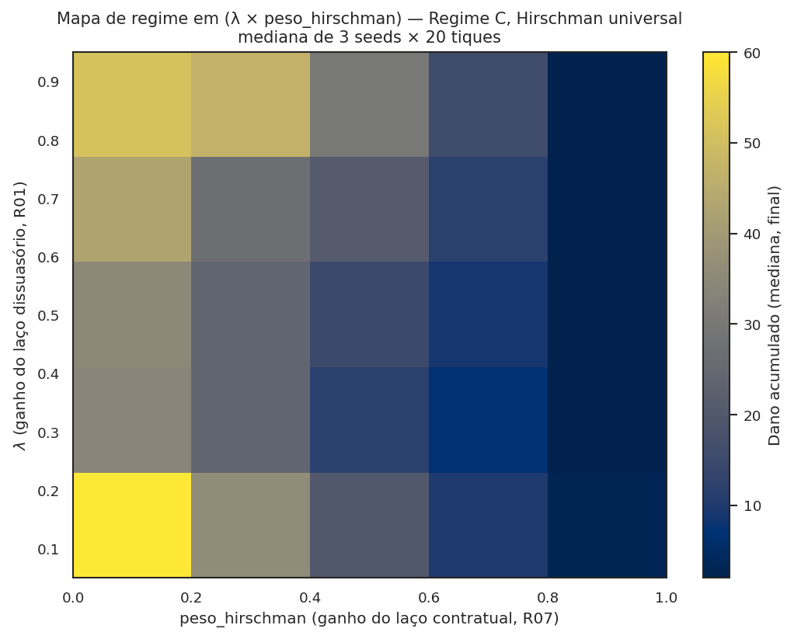

# O modelo ABM em detalhe

<p class="deck">Referência completa do modelo baseado em agentes (Mesa 3.x) que sustenta a LCMC: três classes de agente, cinquenta e poucos parâmetros expostos, 385 testes verdes, comportamento histórico preservado por design por trás de cada parâmetro novo (opt-in via <em>flag</em>).</p>

| § | Seção | O que tem |
|---|---|---|
| [§1](#1-o-que-este-modelo-e) | O que este modelo é | Definição operacional + remissão à trajetória |
| [§2](#2-anatomia-rapida) | Anatomia rápida | Três classes, fases P0-P5 e reporters |
| [§3](#3-tabela-completa-de-parametros-waasparametros) | Tabela de parâmetros | `WaaSParametros` linha a linha, com defaults |
| [§4](#4-como-alterar-parametros-manipulabilidade-7-receitas) | Como alterar parâmetros | Tabela de flags opt-in + 7 receitas Python |
| [§5](#5-atalho-cenarios-canonicos-23) | 27 cenários canônicos | `aplicar_cenario(base, nome)` sem configuração manual |
| [§6](#6-a-saida-do-modelo-38-reporters) | 38 reporters | As colunas do DataFrame agrupadas por categoria |
| [§7](#7-cookbook-reprodutivel-6-receitas-avancadas) | Cookbook avançado | Calibração, varreduras paramétricas, multi-seed |
| [§8](#8-postura-epistemica) | Postura epistêmica | Compatibilidade retroativa estrita; opt-in por flag |

Esta é a aba dedicada ao **modelo computacional**: o que ele simula, como se lê a saída e como se altera o comportamento ajustando parâmetros. Para a discussão conceitual das três classes (Trabalhador, Empresa, Autoridade) e a justificativa do que **não** é agente, ver [Modelagem multiagente](modelagem_multiagente.md). Para o protocolo ODD formal (Grimm et al. 2010), ver [Modelo (ODD)](ODD.md).

## 1. O que este modelo é

O modelo simula o comportamento de **trabalhadores, empresas e uma autoridade antitruste** ao longo de trimestres ("tiques") sob diferentes regimes institucionais. Em cada tique, cada trabalhador observa parcialmente uma conduta potencialmente anticompetitiva da sua empresa e decide se sinaliza ou silencia, segundo o arquétipo (ético, imitativo, racional, *fairminded* ou oportunista) e a percepção de recompensa e represália. Quando a massa crítica de sinalizações é atingida dentro de uma firma, a autoridade pode abrir o procedimento; a firma escolhe entre seguir adiante (e absorver a sanção esperada) ou propor um acordo de cessação. O bem-estar agregado é medido como o oposto do dano social acumulado, com correções por falsos positivos.

O mecanismo de interesse é a **Leniência Condicionada à Massa Crítica (LCMC)** — um canal de depósito condicional (*information escrow*; Ayres & Unkovic, *Mich. L. Rev.* 111, 2012; análogo prático em [callisto.org](https://www.callisto.org), em operação desde 2015) operado pela autoridade. Trabalhadores depositam denúncias que permanecem seladas até que uma fração mínima `q_min · n` de colegas da mesma firma também tenha depositado. Quando o gatilho é atingido, todas as denúncias daquela firma se abrem simultaneamente — eliminando, por construção, o problema clássico de "ninguém quer ser o primeiro" (Olson 1965). Sobre o canal podem ser acoplados, opcionalmente, instrumentos de internalização: recompensa via TCC (o instrumento *Whistleblower-as-a-Service*, WaaS), vesting acelerado à la Hirschman, crédito tributário ou leniência criminal individual. O canal sozinho — sem nenhum desses acoplamentos — resolve a coordenação; os instrumentos amplificam a taxa de adesão.

> **Nota sobre nomenclatura.** O pacote Python chama-se `waas_antitrust` por
> motivos históricos do projeto. A mecânica implementada é a da LCMC: a
> Fase P2 do `step()` é o gatilho de massa crítica intra-firma e, sob
> `usar_escrow_explicito=True`, a Fase P2.5 carrega o escrow no
> `AutoridadeAgent`. A reescrita semântica do nome do pacote é dívida
> técnica registrada em [decisões e backlog](DECISIONS.md).

## 2. Anatomia rápida

### Três classes de agente

- **`TrabalhadorAgent`** (`agents.py:24`) — agente rico, 13 métodos. Decide se sinaliza por uma de 6 regras (arquétipos): ético, imitativo, racional, aleatório, fairminded (R16), oportunista (R24). Estado: arquétipo, papel funcional, w_a (salário anual), anos de carreira, tolerância a represália, histórico de observação, status (ativo / ex-funcionário sob R19), posição na fila intra-firma sob LCMC.
- **`EmpresaAgent`** (`agents.py:206`) — agente reagente, 3 métodos. Tem `eh_violadora`, `conduta_potencial` (uma das 28 do catálogo), fatia de mercado, severidade, cultura de conformidade, posição na fila inter-firma sob LCMC.
- **`AutoridadeAgent`** (`agents.py:273`) — agente único (CADE), com capacidade κ, acurácia ρ, prioridade digital opcional. Sob R27 futuro, será o portador do escrow de denúncias condicionais.

A rede intra-firma é **Watts-Strogatz pequeno-mundo** (NetworkX); a rede inter-firma é **implícita** (acoplamento por `p_perc` global, canal Schelling).

### Estrutura de `step()` em 6 fases

```
P0  → dissuasão endógena (R01): atualiza p_perc, re-decide quem viola.
      Camada Hirschman preventiva (R07) reduz g_i se firma tem cláusula.
P1  → cada trabalhador observa s_i = σ + ε_i; decide a_i ∈ {0, 1} pela
      regra do seu arquétipo. Opt-in: usar_x_estrela_no_racional (R02a).
P2  → agregador conta Σ a_i na rede intra-firma; firma é notificada se ≥ k.
P2.5→ (opt-in modo_corrida) registra firma na FilaLeniencia se atingiu
      q_min × n_trab; atribui posicao_fila_leniencia (LCMC, R20).
P3  → empresa decide pagar denunciantes via IC-F*; ramos: (a) simplificada;
      (b) + Hirschman (D+exodo > W); (c) + LCMC (decaimento Saito).
P4  → autoridade recebe casos (capacidade κ); aplica acurácia ρ; sorteia
      anulação se p_anulacao_tcc > 0 (Vetor B/F6).
P5  → coleta de estado (38 reporters → DataFrame).
```

Sob a tese corrigida v3, o `AutoridadeAgent` carrega explicitamente o escrow (R27, `usar_escrow_explicito=True`) e a expiração individual de cada depósito (R27-ii, `janela_escrow_tiques`). O caminho histórico (default `False`) preserva o escrow implícito em P2.5 — comportamento bit-a-bit idêntico.

### 38 reporters em 3 categorias semânticas

Os 38 reporters do `DataCollector` agrupam-se em:

- **Massa crítica** (substrato LCMC): `n_sinais`, `n_empresas_notif`, `n_firmas_atingiram_massa_critica_interna`, `n_violadoras_ativas`, `dano_acumulado`, `dano_economico_acum`, `valor_dissuasao_difusa_acum`, `capital_social_residual`, `hhi`.
- **Instrumentos** (uso dos cinco): `n_tcc_assinados`, `n_pagou`, `custo_recompensa_acum`, `custo_exodo_acum`, `custo_recompensa_corrida_acum`, `n_firmas_sob_ameaca_exodo`, `n_ex_funcionarios`.
- **Robustez** (vetores de quebra): `n_tcc_anulados`, `n_firmas_optaram_tcc_classico`, `n_firmas_quebraram_tcc`, `multa_arrecadada_acum`, `multa_descumprimento_acum`, `n_choques_*_aplicados`.

A primeira categoria é o que importa para a tese central sob v3.

## 3. Tabela completa de parâmetros (`WaaSParametros`)

Tabela exaustiva agrupada por **função semântica**. Todos os parâmetros são keyword arguments em `WaaSParametros(...)`. Defaults preservam backward compat estrita — mexer em um parâmetro **não** altera nenhum outro.

### 3.1 Tamanho do sistema

| Parâmetro | Tipo | Default | Faixa típica | O que controla |
|---|---|---|---|---|
| `n_empresas` | int | 20 | 4–100 | número de firmas simuladas (~CADE Brasil: 20-50) |
| `tam_medio_empresa` | int | 500 | 30–5 000 | trabalhadores por firma (~big tech BR média) |
| `n_tiques` | int | 40 | 5–100 | horizonte (1 tique = 1 trimestre; 40 = 10 anos) |
| `seed` | int | 42 | qualquer | semente RNG (multi-seed para CI) |

### 3.2 Mecanismo central (canal + instrumento WaaS)

| Parâmetro | Tipo | Default | Faixa | Função |
|---|---|---|---|---|
| `regime` | str | `"B"` | `"A"`/`"B"`/`"C"` | regime jurídico (A=status quo; B=Resolução; C=Lei) |
| `W_mult` | float | 1.5 | 0.5–5 | recompensa em múltiplos de salário anual |
| `k_rel` | float | 0.05 | 0.01–0.2 | massa crítica como fração de trabalhadores |
| `D_disc` | float | 0.30 | 0.1–0.5 | desconto total no TCC-WaaS |
| `D_disc_base_tcc` | float | 0.0 | 0.0–0.4 | desconto que o TCC clássico (Art. 85) já oferece (**Vetor A**) |
| `p_anulacao_tcc` | float | 0.0 | 0.0–1.0 | probabilidade de anulação judicial (**Vetor B / F6**) |
| `rho` | float | 0.7 | 0.5–0.95 | acurácia base da autoridade |
| `taxa_capacidade` | float | 0.5 | 0.1–1.0 | fração processável por tique (gargalo CADE) |
| `r_represalia` | float | 0.15 | 0.05–0.3 | probabilidade de represália |
| `F_falso` | float | 1.0 | 0.5–2.0 | penalidade por falso reporte (em w_a) |
| `densidade` | float | 0.10 | 0.02–0.3 | densidade Watts-Strogatz (rewiring) |
| `custo_legal_uw` | float | 0.0 | 0.0–0.5 | custo legal individual (**Vetor C**) |

### 3.3 LCMC e modo corrida (R20)

| Parâmetro | Tipo | Default | Faixa | Função |
|---|---|---|---|---|
| `modo_corrida` | bool | `False` | `True`/`False` | ativa Phase P2.5 + decaimento Saito |
| `q_min_cooperacao_interna` | float | 0.10 | 0.05–0.30 | fração mínima de cooperadores para massa crítica |
| `janela_temporal_tiques` | int | 4 | 2–10 | janela após massa crítica disparar |
| `perfil_decaimento` | str | `"saito"` | `"saito"` | perfil do gradiente (única opção implementada) |

### 3.4 Comportamentais (P0/P1)

| Parâmetro | Tipo | Default | Faixa | Função |
|---|---|---|---|---|
| `taxa_observacao` | float | 0.20 | 0.05–0.6 | probabilidade base de observar conduta |
| `taxa_falso_reporte` | float | 0.02 | 0.0–0.2 | probabilidade de reporte errôneo (R04) |
| `tau_ruido` | float | 0.10 | 0.05–0.5 | desvio-padrão do ruído ε_i no sinal privado |
| `sigma_etico` | float | 0.5 | 0.2–0.9 | limiar do arquétipo "ético" |
| `eta_aleatorio` | float | 0.05 | 0.0–0.2 | probabilidade do arquétipo "aleatório" |
| `peso_inequity_aversion` | float | 0.0 | 0.0–3.0 | α do Fehr-Schmidt no fairminded (R16) |
| `distribuicao_arquetipos` | dict\|None | `None` | dict somando 1.0 | dist. dos 6 arquétipos (None = Hokamp-Pickhardt clássica) |
| `distribuicao_papeis` | dict\|None | `None` | dict somando 1.0 | dist. dos 10 papéis (None = `BIGTECH_MADURA`) |

### 3.5 Vetores de quebra adicionais (R15 / R18)

| Parâmetro | Tipo | Default | Faixa | Função |
|---|---|---|---|---|
| `prob_pagamento_perc` | float | 1.0 | 0.5–1.0 | prob. percebida de firma pagar (**Vetor D / R18**) |
| `multa_descumprimento_tcc` | float | 0.0 | 0.0–3.0 | multa adicional se firma descumprir TCC |
| `p_descumprimento_tcc` | float | 0.0 | 0.0–0.5 | prob. de descumprimento pós-assinatura |

### 3.6 Hirschman exit-with-equity (R07)

| Parâmetro | Tipo | Default | Faixa | Função |
|---|---|---|---|---|
| `fracao_contratos_acelerados` | float | 0.0 | 0.0–1.0 | fração de firmas com cláusula (forçado a 0 em A/B) |
| `peso_hirschman` | float | 0.3 | 0.0–1.0 | peso do exit-threat no g_i preventivo |
| `valor_equity_por_funcionario_uw` | float | 0.5 | 0.2–1.5 | equity por trabalhador (em w_a; YC ref) |
| `fator_substituicao_uw` | float | 0.5 | 0.3–1.0 | custo recrutamento/onboarding (w_a) |
| `fracao_nao_vested` | float | 0.5 | 0.3–0.8 | fração não-vested (vesting 4y/1y cliff) |
| `aliquota_tributaria_vesting` | float | 0.0 | 0.0–0.5 | haircut IRPF+INSS no vesting BR |

### 3.7 Reframe v2/v3 (Eco B + Coleman)

| Parâmetro | Tipo | Default | Faixa | Função |
|---|---|---|---|---|
| `alpha_erosao` | float | 0.0 | 0.0–1.0 | erosão Coleman por uso instrumental (**Vetor E / R26**) |

### 3.8 R02a (jogo global no racional)

| Parâmetro | Tipo | Default | Função |
|---|---|---|---|
| `usar_x_estrela_no_racional` | bool | `False` | substitui IR-W por limiar `x*` Morris-Shin |

### 3.9 Choques exógenos (R19, Eurace@Unibi)

| Parâmetro | Tipo | Default | Função |
|---|---|---|---|
| `choques` | tuple | `()` | lista de `Choque(tique, tipo, magnitude)` |
| `fator_represalia_ex_funcionario` | float | 0.2 | multiplicador de r para ex-funcionários |

### 3.10 Heterogeneidade R14

| Parâmetro | Tipo | Default | Função |
|---|---|---|---|
| `peso_cultura_compliance` | float | 0.0 | ω em σ_ef = σ·(1 − ω·cultura) |
| `sigma_tolerancia_represalia` | float | 0.0 | desvio-padrão de tol_represalia (0 = homogêneo) |
| `prioridade_digital_autoridade` | float | 0.0 | eleva ρ da autoridade |
| `media_anos_carreira` | float | 3.0 | média da exponencial de anos_carreira |

### 3.11 Distribuição de fatia de mercado (R13a)

| Parâmetro | Tipo | Default | Faixa | Função |
|---|---|---|---|---|
| `distribuicao_fatia_mercado` | str | `"uniforme"` | `"uniforme"`/`"pareto"`/`"lognormal"` | dist. de fatias |
| `alpha_pareto` | float | 1.16 | 1.0–2.0 | parâmetro Pareto (1.16 = regra 80/20) |
| `sigma_lognormal` | float | 1.0 | 0.5–2.0 | parâmetro lognormal |

### 3.12 Calibração externa

| Parâmetro | Tipo | Default | Fonte |
|---|---|---|---|
| `w_a_base` | float | 180 000.0 | Brasscom 2024 |
| `R_por_trabalhador` | float | 1 500 000.0 | Brasscom 2024 |
| `p_deteccao_prior` | float | 0.15 | DEE/CADE proxy |
| `lambda_expectativa` | float | 0.3 | expectativa adaptativa (R01) |
| `alpha_beta_binomial` | float | 1.0 | prior Beta(α=1, β=5) — Mat A x10 v1 |
| `beta_beta_binomial` | float | 5.0 | idem |
| `fracao_violadoras` | float | 0.30 | calibrar contra Saito (R03) |
| `delta_leniencia` | float | 0.5 | parâmetro auxiliar — desuso |

## 4. Como alterar parâmetros — manipulabilidade + 7 receitas

### 4.0 Manipulabilidade — opt-in flags em uma tabela

Toda extensão do modelo entrou via flag opt-in com **default que
preserva o comportamento histórico bit-a-bit**. A tabela documenta o
que cada flag faz, o que é preciso para ativá-la, e qual figura do
site visualiza o efeito:

| Flag (`WaaSParametros`) | Default | O que ativa | Visualização |
|---|---|---|---|
| `regime` | `"B"` | A, B, C, EUA, UE (tags R28 resolvem em `regime_declarado`) | 12, 13, 18 |
| `modo_corrida` | `False` | LCMC (R20): fila inter-firma + gradiente Saito intra-firma | 11 |
| `q_min_cooperacao_interna` | `0.10` | fração mínima de cooperadores p/ massa crítica intra-firma | 04, 11 |
| `janela_temporal_tiques` | `4` | janela após massa crítica para fila inter-firma fechar | — |
| `usar_escrow_explicito` | `False` | R27: `AutoridadeAgent.escrow_denuncias` ativo | 11, 18 |
| `janela_escrow_tiques` | `0` | Δt de expiração do depósito condicional (0 = eterno) | — |
| `usar_x_estrela_no_racional` | `False` | R02a: arquétipo racional decide via `x*` do jogo global | 09 |
| `alpha_erosao` | `0.0` | R26 Coleman: erosão do capital social residual | 05, 08, 10 |
| `peso_inequity_aversion` | `0.0` | R16 fairminded ativo (Fehr-Schmidt) | — |
| `peso_hirschman` | `0.3` | R07: desconto preventivo `g_i` pelo êxodo (Regime C) | 19 |
| `fracao_contratos_acelerados` | `0.0` | R07: vesting universal (forçado p/ 0 em A/B por reserva de lei) | — |
| `prob_pagamento_perc` | `1.0` | R18: probabilidade percebida de a firma pagar W | 13 |
| `p_descumprimento_tcc` | `0.0` | R18: prob. de a firma quebrar o TCC | — |
| `multa_descumprimento_tcc` | `0.0` | R18: sanção catastrófica adicional | — |
| `D_disc_base_tcc` | `0.0` | R15 Vetor A: desconto que TCC clássico já dá | 16 |
| `p_anulacao_tcc` | `0.0` | R15 Vetor B / F6: prob. de anulação judicial | 16 |
| `custo_legal_uw` | `0.0` | R15 Vetor C: custo legal individual do denunciante | 16 |
| `taxa_falso_reporte` | `0.02` | R04: prob. de reporte errôneo/malicioso | 15 |
| `distribuicao_arquetipos` | `None` | preset c/ `oportunista` (R24) ou `fairminded` (R16) | 15, 18 |
| `distribuicao_papeis` | `None` | `BIGTECH_MADURA` / `MARKETPLACE_BR` (R08, E05) | 17 |
| `distribuicao_fatia_mercado` | `"uniforme"` | `"pareto"` com `alpha_pareto` (R13a) | — |
| `choques` | `()` | catálogos de `choques.py` (R19) — layoff, paradigmático, CADE | — |
| `prioridade_digital` | `0.0` | R14 autoridade: especialização em mercados digitais | — |

Convenção: cada extensão tem (i) flag em `WaaSParametros` com default
"desligado"; (ii) teste de regressão que verifica equivalência bit-a-bit
com o caminho histórico; (iii) reporter novo no DataCollector quando
introduz estado observável. **Backward compat estrita auditada por
teste**, não documentada por boa-fé.

### 4.1 Mínimo viável

```python
from waas_antitrust.model import WaaSModel, WaaSParametros

params = WaaSParametros(n_empresas=20, n_tiques=40, seed=42, regime="B")
df = WaaSModel(params).executar()
print(df[["tique", "n_sinais", "n_violadoras_ativas", "dano_acumulado"]].tail())
```

### 4.2 Forçar o Vetor A (TCC clássico já dá desconto)

```python
# D_extra = D_disc − D_disc_base_tcc = 0.30 − 0.28 = 0.02 ⇒ IC-F* quase nunca satisfeita
m = WaaSModel(WaaSParametros(
    n_empresas=20, n_tiques=40, seed=11, regime="B",
    D_disc=0.30,
    D_disc_base_tcc=0.28,
))
df = m.executar()
print(f"Firmas que escolheram TCC clássico: {df['n_firmas_optaram_tcc_classico'].max()}")
```

### 4.3 Ativar LCMC com modo_corrida (R20)

```python
# Cenário canônico via catálogo (mais fácil)
from waas_antitrust.cenarios import aplicar_cenario

p = aplicar_cenario(
    WaaSParametros(n_empresas=20, n_tiques=40, seed=11),
    "cenario_corrida_leniencia",
)
df = WaaSModel(p).executar()
print(f"Firmas que atingiram massa crítica interna: "
      f"{df['n_firmas_atingiram_massa_critica_interna'].max()}")

# Ou manualmente:
m = WaaSModel(WaaSParametros(
    n_empresas=20, n_tiques=40, seed=11, regime="C",
    modo_corrida=True,
    q_min_cooperacao_interna=0.10,
    janela_temporal_tiques=4,
    perfil_decaimento="saito",
))
df = m.executar()
```

### 4.4 Cenário com 20% de oportunistas (R24)

```python
from waas_antitrust.cenarios import DISTRIBUICAO_COM_OPORTUNISTAS

m = WaaSModel(WaaSParametros(
    n_empresas=20, n_tiques=40, seed=11, regime="B",
    distribuicao_arquetipos=DISTRIBUICAO_COM_OPORTUNISTAS,
    taxa_falso_reporte=0.15,
))
df = m.executar()
print(f"Falsos positivos acumulados: {df['falsos_positivos_acum'].max()}")
print(f"TCCs anulados: {df['n_tcc_anulados'].max()}")
```

### 4.5 Erosão Coleman (R26) — Proposição 5 candidata

```python
# Varredura de alpha_erosao em 4 valores
for alpha in (0.0, 0.1, 0.3, 0.7):
    m = WaaSModel(WaaSParametros(
        n_empresas=20, n_tiques=40, seed=11, regime="B",
        fracao_violadoras=0.7, taxa_observacao=0.6,
        alpha_erosao=alpha,
    ))
    df = m.executar()
    final = df["capital_social_residual"].iloc[-1]
    dano = df["dano_acumulado"].max()
    print(f"α={alpha:.1f}: capital_social_final={final:.3f}, dano={dano}")
```

### 4.6 Choques exógenos (R19) — layoffs tech 2022-2026

Hoje há **cinco catálogos canônicos** em `choques.py`. As ondas tech estão divididas por causalidade:

```python
from waas_antitrust.choques import (
    CHOQUES_TECH_2022_2024,                # cíclica: overhiring + juros
    CHOQUES_TECH_2024_2025_AI_RESTRUCTURING,  # estrutural: IA-eficiência
)

# Comparar dois regimes de choque sob mesmo seed
for nome, catalogo in [
    ("cíclico", CHOQUES_TECH_2022_2024),
    ("AI-estrutural", CHOQUES_TECH_2024_2025_AI_RESTRUCTURING),
]:
    m = WaaSModel(WaaSParametros(
        n_empresas=20, n_tiques=40, seed=11, regime="B",
        choques=catalogo,
    ))
    df = m.executar()
    print(f"{nome:13s}: ex-funcionários={df['n_ex_funcionarios'].iloc[-1]}, "
          f"sinais={df['n_sinais'].sum()}")
```

Pesquisa de fundo (2026): 2022-2024 foi causalidade **cíclica** (overhiring pandêmico + aperto monetário); 2024-2025 é **estrutural** (IA-eficiência: ~40% das vagas eliminadas não são reabertas — AlixPartners 2025). O campo `causa_declarada` distingue as duas eras em `Choque`.

### 4.7 Customizar `distribuicao_arquetipos` arbitrária

```python
# 50% ético, 50% racional — população idealmente cooperativa
populacao_ideal = {
    "ético": 0.50,
    "imitativo": 0.0,
    "racional": 0.50,
    "aleatório": 0.0,
    "fairminded": 0.0,
    "oportunista": 0.0,
}
m = WaaSModel(WaaSParametros(
    n_empresas=20, n_tiques=40, seed=11, regime="B",
    distribuicao_arquetipos=populacao_ideal,
))
df = m.executar()
```

A soma do dict precisa ser 1.0 (não validado em runtime, mas o `rng.choice` quebra silenciosamente se não for).

## 5. Atalho: cenários canônicos (23)

Em vez de configurar parâmetros manualmente, use `aplicar_cenario(base, nome)`:

```python
from waas_antitrust.cenarios import listar_cenarios, aplicar_cenario

for nome in listar_cenarios():
    print(f"  {nome}")
```

Os 22 cenários disponíveis (cada um é um conjunto pré-configurado de sobrescritas):

| Cenário | Eixo |
|---|---|
| `status_quo` | Regime A puro |
| `resolucao_pura` | Regime B (Res. CADE) |
| `resolucao_mais_portaria_mte` | B + portaria MTE |
| `lei_waas_pura` | Regime C |
| `lei_waas_com_fundo_honorarios` | C + fundo público de honorários |
| `lei_waas_com_vesting_padrao` | C + Hirschman (R07) |
| `mercado_digital_br_pareto` | C + fatia Pareto α=1.16 |
| `cenario_sancao_dura` | C + multa catastrófica (R18) |
| `cenario_corrida_leniencia` | C + LCMC plena (R20) |
| `apenas_massa_critica_observavel` | A + dispara notificada sem instrumento (Vetor F7) |
| `dois_instrumentos_acoplados` | C + WaaS + Hirschman + LCMC |
| `credito_tributario_puro` | C + crédito tributário (R22 stub) |
| `leniencia_criminal_individual` | C + leniência criminal (R23 stub) |
| `captura_processamento_cade` | B + `taxa_capacidade=0.10` (gargalo CADE) |
| `uso_adversarial_oportunista` | B + 20% oportunistas (R24) |
| `eua_doj_atr_rewards_2025` | Variante EUA — Regime C + faixa 15–30% (R28) |
| `ue_dma_whistleblower_tool_2024` | Variante UE — Regime A + proteção horizontal sem recompensa (R28) |
| `apenas_canal_sem_instrumento` | Canal puro (R27-i) — Regime B + `usar_escrow_explicito=True`, sem instrumento monetário |
| `erosao_coleman_adversarial` | Falsificação R26 — `resolucao_pura` + `alpha_erosao=0.5` |
| `cascata_adesao_progressiva` | Cascata R29 — Regime B + escrow explícito + `janela_adesao_pos_abertura=10` + faixas 100/70/50/30/10% |
| `lcmc_global_coordenada` | LCMC global R30 — 6 firmas em 2 grupos multinacionais + `usar_escrow_consolidado_grupo=True` + `coordenacao_internacional=0.6` |
| `lcmc_global_descoordenada` | Contrafactual R30 — mesma topologia mas sem consolidação nem amplificação Schelling |

## 6. A saída do modelo — 38 reporters

Após `model.executar()`, o `DataFrame` tem **uma linha por tique** e 38 colunas. Tabela resumida:

| Reporter | Tipo | Categoria | Quando relevante |
|---|---|---|---|
| `tique` | int | meta | sempre |
| `n_sinais` | int | massa crítica | sempre |
| `n_empresas_notif` | int | massa crítica | regimes B/C |
| `n_violadoras_ativas` | int | massa crítica | sempre |
| `dano_acumulado` | int | massa crítica | sempre |
| `dano_economico_acum` | float | massa crítica | sob `distribuicao_fatia_mercado≠"uniforme"` |
| `vp_tique`, `fp_tique`, `fn_tique` | int | massa crítica | sempre |
| `verdadeiros_positivos_acum` | int | massa crítica | sempre |
| `falsos_positivos_acum` | int | massa crítica | sempre |
| `falsos_negativos_acum` | int | massa crítica | sempre |
| `n_firmas_atingiram_massa_critica_interna` | int | massa crítica | sob `modo_corrida=True` |
| `valor_dissuasao_difusa_acum` | float | massa crítica | sob `epsilon_dissuasao_difusa>0` |
| `capital_social_residual` | float | massa crítica | sob `alpha_erosao>0` |
| `hhi` | float | massa crítica | concentração de mercado |
| `n_tcc_assinados` | int | instrumentos | regimes B/C |
| `n_pagou` | int | instrumentos | regimes B/C |
| `custo_recompensa_acum` | float | instrumentos | regimes B/C |
| `custo_exodo_acum` | float | instrumentos | sob `fracao_contratos_acelerados>0` |
| `custo_recompensa_corrida_acum` | float | instrumentos | sob `modo_corrida=True` |
| `n_firmas_sob_ameaca_exodo` | int | instrumentos | sob Hirschman ativo |
| `n_ex_funcionarios` | int | instrumentos | sob choques layoff |
| `n_tcc_anulados` | int | robustez | sob `p_anulacao_tcc>0` (Vetor B) |
| `n_firmas_optaram_tcc_classico` | int | robustez | sob `D_disc_base_tcc>0` (Vetor A) |
| `n_firmas_quebraram_tcc` | int | robustez | sob `p_descumprimento_tcc>0` |
| `multa_arrecadada_acum` | float | robustez | regimes B/C |
| `multa_descumprimento_acum` | float | robustez | sob R18 ativo |
| `n_choques_layoff_aplicados` | int | robustez | sob R19 |
| `n_choques_paradigmaticos_aplicados` | int | robustez | sob R19 |
| `regime` | str | meta | sempre |

## 7. Cookbook reprodutível — 6 receitas avançadas

### Receita 1: reproduzir a figura 03 do site

```bash
python scripts/gerar_figura_dissuasao.py
# saída em figuras/03_dissuasao_bem_estar.png
```

### Receita 2: multi-seed CI da Proposição 3

```python
from waas_antitrust.robustez import bootstrap_ci
from waas_antitrust.model import WaaSModel, WaaSParametros

def dano_em(regime, seed):
    p = WaaSParametros(n_empresas=20, n_tiques=40, seed=seed, regime=regime)
    return int(WaaSModel(p).executar()["dano_acumulado"].max())

seeds = list(range(12))
diferencas = [dano_em("A", s) - dano_em("B", s) for s in seeds]
ci_low, ci_high = bootstrap_ci(diferencas, n_bootstrap=2000, alpha=0.05, seed=42)
print(f"CI 95% de dano(A) − dano(B): [{ci_low:.1f}, {ci_high:.1f}]")
assert ci_low > 0, "Proposição 3 quebrou — abra issue!"
```

### Receita 3: inspecionar uma firma específica

```python
m = WaaSModel(WaaSParametros(
    n_empresas=4, n_tiques=10, seed=23, regime="B",
    modo_corrida=True, fracao_violadoras=0.8, taxa_observacao=0.6,
))
m.executar()

# Trabalhadores
for t in m.trabalhadores_por_empresa[0][:5]:
    print(f"  {t.arquetipo:13s} papel={t.papel:9s} "
          f"observou={t.observou} pos_corrida={t.posicao_corrida_interna}")

# Empresa
e = m.empresas[0]
print(f"firma 0: viola={e.eh_violadora}, conduta={e.conduta_potencial}, "
      f"TCC={e.tcc_assinado}, massa_crítica_satisfeita="
      f"{e.massa_critica_interna_satisfeita}")
```

### Receita 4: calibrar contra dados externos

Edite `src/waas_antitrust/calibracao/saito.py` com sua mediana de TCCs preferida, mantendo fonte primária no docstring. Depois:

```bash
python scripts/calibrar.py --metrica dano_acumulado --seeds 12
# saída: resultados de grid search contra 3 alvos do ODD
```

### Receita 5: varredura Sobol custom

```python
from waas_antitrust.sobol import PROBLEMA_SOBOL_8D, executar_varredura
from waas_antitrust.sobol.analise import calcular_indices_replicado

# Pequena (validação)
df = executar_varredura(n_base=64, regime="B", n_replicas=5)
indices = calcular_indices_replicado(df, PROBLEMA_SOBOL_8D, metrica="bem_estar")
print(indices)

# Paper-grade (várias horas)
# $ waas-sobol --n-base 1024 --jobs -1 --out results/sobol_full.parquet
```

### Receita 6: mapa de regime em (λ × peso_hirschman) — resposta ao Mat A

Os dois laços de retroalimentação do modelo — dissuasório (λ, R01) e
contratual (peso_hirschman, R07) — poderiam, em tese, produzir
bifurcações no acoplamento. O mapa empírico varre a grade e diagnostica:

```bash
python scripts/mapa_lambda_hirschman.py --grade 5 --seeds 11 23 37
# grava results/mapa_lambda_hirschman.parquet + docs/img/19_mapa_lambda_hirschman.png
```

<figure markdown>
  { .figura-empirica }
  <figcaption>
    Mapa de regime em (λ × peso_hirschman), Regime C com Hirschman universal, mediana de 3 seeds × 20 tiques. O dano decai monotonicamente em AMBOS os eixos — os dois laços são substitutos parciais — e o laço contratual domina: <code>peso_hirschman ≥ 0,8</code> zera o dano para qualquer λ. Sem evidência de transição abrupta nesta resolução (salto máximo entre células vizinhas = 26 contra amplitude total 58): o mapa empírico não acusa bifurcação; a análise formal (autovalores do jacobiano) segue como trabalho futuro.
  </figcaption>
</figure>

## 8. Postura epistêmica

O modelo está em **fase de polimento pré-submissão**, não em desenvolvimento de feature nova. Backward compat estrita é invariante; opt-in via flag é regra. R27 (refator semântico do canal) está aberto para sub-rodada futura, mas **não bloqueia o uso atual** — o que está implementado mecanicamente corresponde à tese v3 corretamente.

Para abrir o capô: comece pelo arquivo `src/waas_antitrust/model.py` (~840 linhas, navegável); a sequência `WaaSParametros` → `__init__` → `step()` cobre 80% do que importa. Para entender as decisões individuais, vá a `src/waas_antitrust/agents.py::TrabalhadorAgent.decidir_sinal` (~100 linhas, 6 branches por arquétipo).

**O modelo é falsificável por construção.** Toda alegação tem reporter associado; todo reporter tem teste; todo teste roda em ≤ 25s. Se você roda e a conclusão quebra, abra uma issue com o output. Isto é exatamente o que o projeto precisa.
