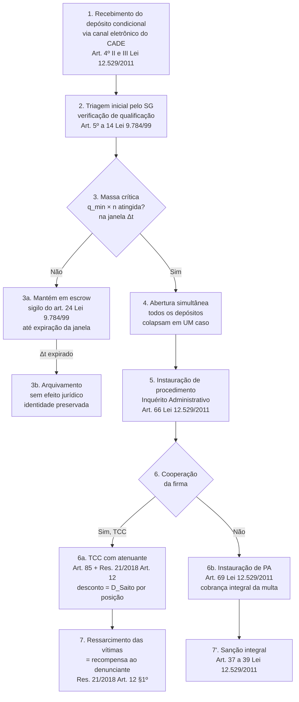

# Procedimento administrativo do canal de depósito condicional

Página para a persona **operacional** do CADE — quem instaura procedimento, gerencia
fila de prioridade, articula sigilo. O foco aqui não é a tese substantiva (essa está
em [`INSTITUTIONAL.md`](INSTITUTIONAL.md)), mas o **fluxo processual nominal**
sob a Resolução 21/2018 vigente.

!!! warning "Status: proposta acadêmica, não-vinculante"
    Este fluxograma é uma **proposta de organização processual** sustentada na Lei
    12.529/2011 + Lei 9.784/99 + Resolução CADE 21/2018, **não** documento
    institucional. A redação formal de uma resolução complementar é decisão do CADE,
    não do autor.

---

## O fluxograma em sete etapas

---

## Cada etapa em três linhas

### 1. Recebimento do depósito condicional

**Quem entrega**: trabalhador da firma sob suposta violação, individualmente.
**Forma**: canal eletrônico do CADE (procedimento administrativo eletrônico autorizado
pela Lei 9.784/99, Art. 22, §3º). **Conteúdo**: identificação do trabalhador, descrição
da conduta, indicação de papéis-co-autores (não obrigatória), prova preliminar.

### 2. Triagem inicial pelo SG

**Quem analisa**: servidor da Superintendência Geral (área-fim, 180 servidores em 2024
segundo RIG/TCU). **O que verifica**: qualificação prima facie (existe conduta
potencialmente anticompetitiva descrita?), competência do CADE (mercado afetado?),
ausência de manifesta improcedência. **O que não faz**: investigação substantiva — o
depósito ainda está em escrow.

### 3. Massa crítica e janela temporal

**Gatilho**: a fração $q_{\min}\cdot n$ de trabalhadores da mesma firma deposita
denúncias compatíveis dentro da janela $\Delta t$ (parâmetros `q_min_cooperacao_interna`
e `janela_escrow_tiques` no modelo). **Default sugerido**: $q_{\min} = 10\%$, $\Delta t$
= 4 trimestres. **Calibração**: ver [`modelo_abm.md` §3.3](modelo_abm.md#33-lcmc-e-modo-corrida-r20).

#### 3a. Permanência em escrow

Antes do gatilho, depósitos permanecem **selados**. Sigilo coberto pelo Art. 24 da Lei
9.784/99 (que admite reserva quando o interesse público o exigir). A identidade do
depositante **não** é revelada à firma — análogo Callisto.

#### 3b. Arquivamento por expiração da janela

Depósitos que não atingem massa crítica em $\Delta t$ são **arquivados sem efeito
jurídico**. Não geram inquérito; não notificam a firma; preservam identidade.
Reporter no modelo: `n_depositos_expirados_acum`.

### 4. Abertura simultânea

Quando o gatilho dispara, **todos** os depósitos da firma se abrem **simultaneamente**
e colapsam em um único caso de prova qualificada (qualidade média dos depósitos como
medida de robustez). Análogo Kickstarter (*all-or-nothing*). Reporter no modelo:
`n_aberturas_simultaneas_acum`.

### 5. Instauração de procedimento

Sob a abertura, o SG instaura **Inquérito Administrativo** com base nos elementos
colhidos pelos depósitos — Art. 66 da Lei 12.529/2011. A firma é notificada;
os trabalhadores depositantes recebem **status de fonte qualificada** (não
testemunha, não delator clássico — terceiro qualificado pelo procedimento).

### 6. Decisão da firma

A firma decide entre cooperar (assinar TCC) e enfrentar PA cheio.

#### 6a. TCC com atenuante (Res. 21/2018 Art. 12)

A firma assina TCC com **ressarcimento extrajudicial das vítimas** (Art. 12, §1º
da Resolução 21/2018). O desconto sobre a contribuição pecuniária segue o gradiente
Saito por posição (`_D_BASE_TCC` calibrado em 0,15 — média Tribunal). A **recompensa
ao trabalhador** entra na contabilidade do TCC como **ressarcimento da pessoa
qualificada que viabilizou a detecção** — re-caracterização juridicamente
controvertida (Vetor B / F6) mas sustentável sob LAC 12.846/2013 Art. 7º VII-VIII
como precedente.

#### 6b. Instauração de PA

Se a firma não coopera, o SG instaura **Processo Administrativo** (Art. 69 da Lei
12.529/2011) com base nos elementos do inquérito. Sanção integral; multa pode
chegar a 20% da receita (Art. 37); ressarcimento das vítimas (incluindo trabalhadores
depositantes) corre paralelamente.

### 7. Ressarcimento das vítimas

No caminho 6a, o **valor pago ao trabalhador** é o "ressarcimento das vítimas" do
Art. 12 §1º. Não é "recompensa" no sentido da Lei 13.608/2018 (cuja Art. 4º-C §3º
restringe a "crimes contra a administração pública") — é re-caracterização sob a
moldura da Resolução 21/2018, da prerrogativa de cálculo do TCC do Art. 85.

No caminho 6b/7', a multa é arrecadada pelo erário; o trabalhador não recebe
ressarcimento direto do TCC mas pode ser fonte de ação judicial trabalhista por
represália (Lei 13.608 Art. 4º-A).

---

## Sigilo e proteção do depositante

| Etapa | Quem sabe | Base normativa |
|---|---|---|
| 1-3 (depósito + escrow) | Apenas servidor de triagem do SG | Lei 9.784/99 Art. 24 (sigilo por interesse público) |
| 4 (abertura) | SG + Tribunal CADE | Lei 12.529 Art. 66 + Res. 21/2018 |
| 5 (instauração) | + firma notificada (sem identificar depositantes individuais) | Lei 12.529 Art. 70 |
| 6-7 (TCC ou PA) | + firma com acesso ao acervo probatório | Lei 12.529 Art. 70 §3º (defesa) |

**Risco residual**: identidade do depositante pode ser inferível pelo conteúdo
substantivo da denúncia (papel + conduta + período). Anonimato total exige R24 — uso
de criptografia ou escrow descentralizado — e sai do escopo desta proposta.

---

## Estimativa de carga sobre o SG

Calibração R03 do modelo (ver [`formulario.md` §3](formulario.md)):
ponto ótimo produz **0,56 TCC/ano** simulado em 20 firmas — equivalente a
**~47 TCC/ano** no universo CADE inteiro de **~1.679 firmas** (predição falsificável).

Comparando com o fluxo real do SG em 2024 (RIG/TCU): 73 investigações instauradas, 89
concluídas, 185 em estoque, 180 servidores na área-fim. **Sob a calibração assumida,
o canal proposto entrega ~47 TCC/ano adicionais sem exigir aumento proporcional
de pessoal** — porque a triagem inicial (etapa 2) é leve e a maior parte do trabalho
substantivo cai sobre o caminho 6a (TCC), mais barato que o PA cheio.

**Caveat**: esta estimativa depende de $N^\star = 1\,679$ assumido. Se o universo
real for materialmente diferente, o ponto ótimo migra. Sensibilidade exige rodada
adicional do `scripts/calibrar_formal.py --n-universo X` por DEE/CADE.

---

## Próximos passos para uma implementação real

Lista das ações que estão **fora do escopo deste projeto acadêmico**, mas que
seriam necessárias para uma implementação institucional concreta:

1. **Redação formal de Resolução complementar à 21/2018** — anexo regulatório
   articulado por artigo. O projeto não fornece (ver
   [`limitacoes.md`](limitacoes.md) sobre risco institucional de o autor
   propor texto vinculante).
2. **Calibração de $q_{\min}$ e $\Delta t$ por conduta** — `q_min_cooperacao_interna`
   uniforme em 10% é proxy; condutas distintas (auto-preferência, *killer
   acquisition*, *self-dealing*) podem exigir $q_{\min}$ heterogêneo (R20 fase 7).
3. **Plataforma de recepção** — sistema de informação seguro (criptografia em repouso e
   em trânsito) com auditoria não-reversível. Padrão sugerido: análogo Callisto
   (`callisto.org`) que é open-source.
4. **Articulação com órgãos correlatos** — MPF (criminalização da conduta), MPT
   (proteção trabalhista), TST (jurisprudência sobre represália), DPU (assistência
   jurídica ao depositante). R25 em `DECISIONS.md`.
5. **Pesquisa empírica de capacidade institucional** — RIG/TCU mostra 180
   servidores área-fim em 2024; a expansão do canal pode exigir realocação. R06 em
   `DECISIONS.md`.

---

## Bibliografia normativa

- Lei nº 12.529/2011 (Sistema Brasileiro de Defesa da Concorrência) — Arts. 4º, 9º,
  37–39, 66, 69, 70, 85, 86.
- Lei nº 9.784/1999 (Processo administrativo federal) — Arts. 5º a 14, 22 §3º, 24.
- Resolução CADE nº 21/2018 (TCC) — Art. 12.
- Lei nº 12.846/2013 (Lei Anticorrupção) — Art. 7º VII-VIII (precedente de programa
  de integridade como atenuante).
- Lei nº 13.608/2018 com redação da Lei nº 13.964/2019 — Arts. 4º-A a 4º-C
  (recompensa em "crimes contra a administração pública").
