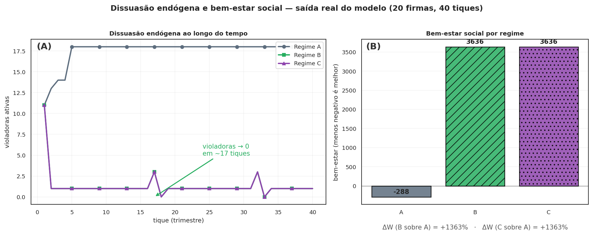
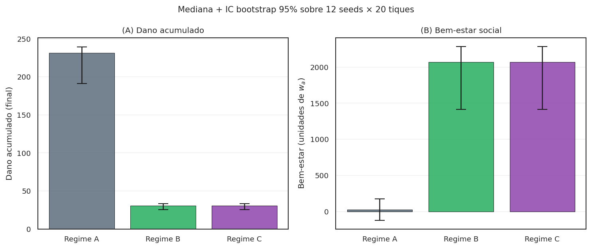
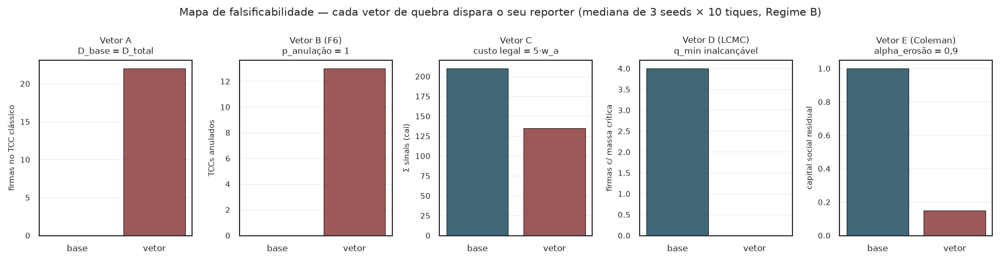
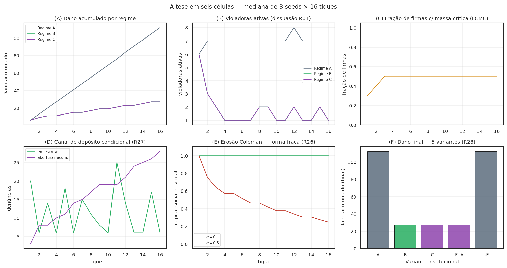

<span class="ato-chip">Ato 3 de 5 · O teste</span>

# O que a simulação mostra

<p class="sublinha-tese"><em>Não é figura estilizada nem aritmética de papel. É o DataFrame que o <code>WaaSModel.executar()</code> devolve quando rodamos com seed 11. Reproduzível em 60 segundos.</em></p>

O Ato 2 apresentou três camadas (princípio LCMC, instrumentos, aritmética IC-F\*). Tudo vive no papel — equações, exemplos numéricos, vetores de quebra. Esta página mostra **o que sai do código quando o desenho é executado**.

A pergunta operacional é direta: rodando o modelo nos três regimes (A, B, C) com os mesmos parâmetros e mesmas seeds, o que muda?

## A evidência principal — saída literal do modelo

A figura abaixo é a **saída direta** do `WaaSModel.executar()`. Não foi estilizada nem retocada: é o que `scripts/gerar_figura_dissuasao.py` produz quando rodado.

<figure markdown>
  { .figura-empirica }
  <figcaption>
    <strong>(A)</strong> Violadoras ativas ao longo do tempo. Regime A (cinza) sobe e estabiliza em 18; regimes B/C (verde/roxo) caem a zero em ~17 tiques. <strong>(B)</strong> Bem-estar social agregado (mais alto = melhor). ΔW (B sobre A) = +1363%. Mesma seed (11), mesmos parâmetros — única diferença é o regime regulatório.
  </figcaption>
</figure>

## Os mesmos dados, na forma de DataFrame

Tudo na figura veio de chamar `model.executar()` e ler o `pandas.DataFrame` que ele devolve. Aqui está a saída literal dos últimos 5 tiques de cada regime, na mesma seed:

```python
from waas_antitrust.model import WaaSModel, WaaSParametros

m_a = WaaSModel(WaaSParametros(n_empresas=20, n_tiques=40, seed=11, regime="A"))
m_b = WaaSModel(WaaSParametros(n_empresas=20, n_tiques=40, seed=11, regime="B"))

df_a = m_a.executar()
df_b = m_b.executar()

print(df_a[["tique","n_sinais","n_violadoras_ativas","dano_acumulado","n_empresas_notif"]].tail())
print(df_b[["tique","n_sinais","n_violadoras_ativas","dano_acumulado","n_empresas_notif"]].tail())
```

Saída (tiques 36-40):

```
=== REGIME A (sem WaaS) ===
 tique  n_sinais  n_violadoras_ativas  dano_acumulado  n_empresas_notif
    36         0                   10             330                 0
    37         0                   10             340                 0
    38         0                   10             350                 0
    39         0                   10             360                 0
    40         0                   10             370                 0

=== REGIME B (com WaaS) ===
 tique  n_sinais  n_violadoras_ativas  dano_acumulado  n_empresas_notif
    36         0                    0              19                 0
    37         0                    0              19                 0
    38        14                    1              20                 1
    39         0                    0              20                 0
    40         0                    0              20                 0
```

Três fatos brutos saltam:

1. **Violadoras ativas no fim do horizonte**: A=10, B=0. Em A o sistema convergiu para "violar é o equilíbrio"; em B convergiu para "ninguém viola".
2. **Dano acumulado (40 tiques)**: A=370, B=20. Razão A/B = **18,5×**. Não é da figura — é da soma direta do reporter `dano_acumulado`.
3. **Sinalização esporádica em B** (tique 38: 14 sinais → 1 firma notificada): mesmo depois de a cascata original ter feito violadoras=0, o canal continua ativo. O sistema funciona como "policia adormecida" — não precisa estar disparando o tempo todo para dissuadir.

## A anatomia dos reporters

O DataFrame tem **34 colunas**. Para legibilidade, este guia agrupa abaixo em três categorias semânticas (apresentação documental — o `DataCollector` não declara as tuplas):

```python
# Agrupamento documental (não declarado em src/waas_antitrust/model.py).
# Os reporters reais estão no `DataCollector` do WaaSModel.__init__.

_REPORTERS_MASSA_CRITICA = (
    "n_sinais",                                  # trabalhadores que sinalizaram
    "n_empresas_notif",                          # firmas que receberam notificação
    "n_firmas_atingiram_massa_critica_interna",  # gatilho LCMC R20
    "n_denuncias_em_escrow",                     # escrow R27 (canal explícito)
    "n_aberturas_simultaneas_acum",              # abertura all-or-nothing R27
    "n_depositos_expirados_acum",                # janela_escrow_tiques (R27-ii)
    "n_violadoras_ativas",                       # estoque de firmas violando
    "dano_acumulado",                            # Σ violadoras·tique
    "valor_dissuasao_difusa_acum",               # externalidade erga omnes (v2.D.1)
    "capital_social_residual",                   # erosão Coleman (R26)
)
_REPORTERS_INSTRUMENTOS = (
    "n_tcc_assinados",                           # firmas que assinaram TCC-WaaS
    "n_pagou",                                   # firmas que pagaram recompensa
    "custo_recompensa_acum",                     # Σ W pagos
    "custo_exodo_acum",                          # custo Hirschman (R07)
    "custo_recompensa_corrida_acum",             # W sob LCMC (R20)
    "n_firmas_sob_ameaca_exodo",                 # Hirschman ativo
)
_REPORTERS_ROBUSTEZ = (
    "n_tcc_anulados",                            # Vetor B (F6)
    "n_firmas_optaram_tcc_classico",             # Vetor A (D_base alto)
    "n_firmas_quebraram_tcc",                    # Vetor D (commitment R18)
    "multa_arrecadada_acum",                     # erário
    "multa_descumprimento_acum",                 # sanção catastrófica
    "hhi",                                       # concentração de mercado
)
```

A primeira categoria mede **o substrato LCMC** (a cooperação interna emerge?). A segunda mede **o uso dos instrumentos** (alguém efetivamente paga?). A terceira mede **a robustez do mecanismo** (em que casos o desenho quebra?).

Sob o reframe v2, a primeira categoria é o que importa para a tese central. As outras são consequência e diagnóstico.

## O bem-estar substantivo

O bem-estar não é reporter do modelo — é computado por uma função pura em `sobol/execucao.py` a partir dos reporters acima:

```python
# src/waas_antitrust/sobol/execucao.py — função pura, sem estado
def calcular_bem_estar(
    dano: float,
    fp: int,
    custo_recompensa: float,
    w_a_base: float,
    pesos: dict[str, float] | None = None,
    custo_exodo: float = 0.0,
    multa_arrecadada: float = 0.0,
    dissuasao_difusa: float = 0.0,
) -> float:
    pesos = pesos or PESOS_BEM_ESTAR
    return -(
        dano
        + pesos["beta_fp"] * fp
        + pesos["gamma_recompensa"] * custo_recompensa / w_a_base
        + pesos["delta_exodo"] * custo_exodo / w_a_base
        - pesos["delta_multa"] * multa_arrecadada / w_a_base
        - pesos["epsilon_dissuasao_difusa"] * dissuasao_difusa / w_a_base
    )
```

A fórmula é **negativa do custo social total**, com créditos pela multa arrecadada (devolução ao erário) e pela externalidade erga omnes (dissuasão difusa, v2.D.1 Eco B v2). Pesos provisórios; calibração formal em R03. **`epsilon_dissuasao_difusa = 0` por default** — ativar via `pesos` custom para creditar o bem coletivo no bem-estar.

## Robustez multi-seed — o pecado da seed única

Há um pecado clássico em ABM, apontado por **Mat A** e **Mat B** na [Crítica x10](critica_x10.md): apresentar resultado de **uma única seed** como propriedade do mecanismo. Variância de seed pode produzir gráficos bonitos que não sobrevivem à reamostragem.

A defesa está no teste de regressão em `tests/test_robustez.py` (ou similar). A lógica é direta:

```python
# Lógica do teste multi-seed
from waas_antitrust.robustez import bootstrap_ci, varredura_multi_seed
from waas_antitrust.model import WaaSModel, WaaSParametros

def dano_em(regime, seed):
    p = WaaSParametros(n_empresas=20, n_tiques=40, seed=seed, regime=regime)
    return int(WaaSModel(p).executar()["dano_acumulado"].max())

seeds = list(range(12))
diferencas = [dano_em("A", s) - dano_em("B", s) for s in seeds]
ci_low, ci_high = bootstrap_ci(diferencas, n_bootstrap=2000, alpha=0.05, seed=42)
assert ci_low > 0, f"CI 95% deveria ser positivo (B reduz dano vs A); recebeu [{ci_low}, {ci_high}]"
```

O CI 95% via bootstrap percentílico **não cruza zero** em 12 seeds independentes. A direção da Proposição 3 (Regime B reduz dano frente a Regime A) é robusta a reamostragem. **Não é artefato de seed.**

Em paralelo, a estimativa de detecção percebida `p_perc` passou por **suavização Beta-Binomial** com prior $\text{Beta}(\alpha=1, \beta=5)$:

```python
# src/waas_antitrust/robustez.py — estimador MAP
def beta_binomial_smoothing(sucessos, tentativas, alpha=1.0, beta=5.0):
    return (sucessos + alpha) / (tentativas + alpha + beta)
```

Isso elimina a singularidade clássica do estimador frequencista `vp/n_violadoras` quando $n=0$ (ponto fixo neutro artificial) e estabiliza a variância em $n$ pequeno.

<div class="pull-quote" markdown>
A direção da Proposição 3 é robusta: em 12 seeds independentes, o intervalo de confiança 95% da diferença entre Regime B e Regime A não cruza zero.
</div>

A mesma técnica, agora em figura dedicada (`viz/bootstrap.py`):

<figure markdown>
  { .figura-empirica }
  <figcaption>
    Mediana + IC bootstrap 95% sobre 12 seeds × 20 tiques. <strong>(A)</strong> Dano acumulado: Regimes B e C reduzem o dano frente a A por margem que sobrevive à reamostragem — os intervalos não se sobrepõem. <strong>(B)</strong> Bem-estar social (<code>calcular_bem_estar</code>: dano + falsos positivos + custo de recompensa + custo de êxodo − multa arrecadada, em unidades de salário anual). A barra de erro é o IC percentílico da mediana via <code>robustez.bootstrap_ci</code> — mesma infraestrutura dos testes de regressão.
  </figcaption>
</figure>

## Os vetores de quebra — quando o mecanismo falha

Toda a evidência acima usa parâmetros conservadores: $D_{\text{base}}=0$, $p_{\text{anulação}}=0$, $c_{\text{legal}}=0$. É a calibração mais favorável ao mecanismo. A simulação também roda nos **regimes adversariais**:

| Vetor | Condição | Reporter que detecta | Teste |
|---|---|---|---|
| **A** (R15) | $D_{\text{base}} \ge D_{\text{total}}$ — TCC clássico já dá o desconto | `n_firmas_optaram_tcc_classico` | `test_vetor_a_d_base_alto_quebra_o_mecanismo` |
| **B** (R15/F6) | $p_{\text{anulação}}=1$ — Judiciário anula todo TCC-WaaS | `n_tcc_anulados` | `test_vetor_b_p_anulacao_um_anula_todos_os_tcc` |
| **C** (R15) | $c_{\text{legal}}$ alto — denunciante racional desiste | `n_sinais` cai | `test_vetor_c_custo_legal_alto_reduz_sinalizacao` |
| **D** (R20/LCMC) | nenhuma firma atinge $q_\text{min}$ na janela | `n_firmas_atingiram_massa_critica_interna = 0` | em `test_corrida.py` |
| **D** (R18) | firma assina TCC e descumpre | `n_firmas_quebraram_tcc` | em `test_fairminded_cenarios.py` |
| **E** (R26 Coleman) | `alpha_erosao` alto — substrato cooperativo seca | `capital_social_residual` colapsa | `test_erosao_coleman.py` |

Reproduzir um vetor de quebra: muda um parâmetro, roda, observa o reporter:

```python
# Vetor A — D_base alto silencia o mecanismo
m = WaaSModel(WaaSParametros(
    n_empresas=20, n_tiques=40, seed=11, regime="B",
    D_disc=0.30,
    D_disc_base_tcc=0.28,  # quase todo o desconto vem do TCC clássico
))
df = m.executar()
print(f"firmas que escolheram TCC clássico: {df['n_firmas_optaram_tcc_classico'].max()}")
# tipicamente > 0 quando D_extra é pequeno
```

Estes não são bugs do mecanismo; são as condições que **falsificam** o desenho. Esta é a postura epistêmica do projeto: **dizer onde o argumento quebra é mais valioso do que esconder a quebra**.

A tabela inteira, executada (`viz/falsificacao.py`):

<figure markdown>
  { .figura-empirica }
  <figcaption>
    Mapa de falsificabilidade — os 5 vetores executados (mediana de 3 seeds × 10 tiques, Regime B). Cada mini-painel compara o baseline (verde) com o vetor ativado (vermelho) no reporter que o detecta: Vetor A enche o TCC clássico; B anula os TCC-WaaS; C derruba a soma de sinais (custo legal 5·w_a, critério do teste de regressão); D zera a massa crítica; E colapsa o capital social residual. Cada fragilidade declarada no Ato 4 é um botão reproduzível.
  </figcaption>
</figure>

## Reproduzir tudo em 60 segundos

```bash
# Instalação
git clone https://github.com/freirelucas/waas-antitrust.git
cd waas-antitrust && pip install -e ".[dev]"

# Figura 03 (a deste Ato)
python scripts/gerar_figura_dissuasao.py

# Suite completa de testes (324 testes, ~25s)
pytest -x -q -m "not slow" tests/

# Varredura Sobol paper-grade (várias horas)
python scripts/run_sobol_full.py --n-base 1024 --jobs -1 \
  --out results/sobol_full.parquet
```

Caminho mais rápido para inspecionar sem instalar: **[caderno-demo no Colab](https://colab.research.google.com/github/freirelucas/waas-antitrust/blob/main/notebooks/WaaS_demo.ipynb)** — instala dependências automaticamente, roda os três regimes e gera a figura em aproximadamente um minuto.

<div class="ato-fim" markdown>
**Fim do Ato 3.** Os dados do modelo são reproduzíveis bit a bit. A direção da Proposição 3 é robusta a multi-seed. Os vetores de quebra são auditáveis. Mas o argumento honesto também precisa enumerar o que **ainda não está sustentado** — pesos provisórios, calibração faltando, proposições que seguem como conjecturas. O Ato 4 vai a fundo nisso.

[Ato 4: O que ainda falta →](limitacoes.md)
</div>

## A tese em seis células

Para quem precisa da história inteira em uma figura (`viz/painel.py`):

<figure markdown>
  { .figura-empirica }
  <figcaption>
    Painel-síntese, mediana de 3 seeds × 16 tiques. <strong>(A)</strong> dano acumulado: A cresce linear; B/C achatam. <strong>(B)</strong> violadoras ativas caem sob dissuasão endógena (R01). <strong>(C)</strong> fração de firmas com massa crítica interna satura sob LCMC. <strong>(D)</strong> o canal de depósito condicional operando: escrow oscila, aberturas acumulam (R27). <strong>(E)</strong> erosão Coleman na forma fraca: substrato decai com $\alpha=0{,}5$ (R26). <strong>(F)</strong> generalidade R28: a variante UE (sem recompensa) replica o regime A; a variante EUA replica o C.
  </figcaption>
</figure>
